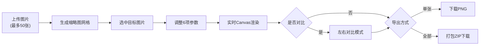

## 1. 产品概述

轻量级网页端图像色彩调整与批量预览工具，面向摄影师和设计师，支持批量上传图片、实时参数调整、多图同步预览与导出。

- 核心价值：解决RAW格式照片批量调色时缺乏轻量级网页工具的痛点，提供快速预览、实时微调、批量导出的一体化工作流
- 目标用户：摄影师、设计师、图片处理从业者

## 2. 核心功能

### 2.1 功能模块

1. **图片上传与管理**：支持批量上传、缩略图网格展示、单张删除
2. **参数实时调整**：6个滑块（曝光、色温、对比度、饱和度、高光、阴影）实时控制
3. **批量预览与对比**：缩略图同步标记、左右对比模式、可拖拽分割线
4. **导出功能**：单张PNG导出、全部图片ZIP打包导出

### 2.2 页面详情

| 页面名称 | 模块名称 | 功能描述 |
|-----------|-------------|---------------------|
| 主应用页 | 缩略图列表 | 左侧300px宽栏，展示上传图片缩略图网格（4列/行），支持选中高亮、删除、"调整中"水印标记 |
| 主应用页 | 主预览区 | 右侧上部70%区域，展示当前选中图片的Canvas实时渲染效果，支持鼠标悬停放大镜和左右对比模式 |
| 主应用页 | 调整面板 | 右侧下部30%区域，6个参数滑块，拖拽实时更新，支持滑块轨道动态变色 |
| 主应用页 | 导出控制区 | 导出当前单张、导出全部ZIP，带加载动画和进度条 |

## 3. 核心流程

用户上传图片 → 选择目标图片 → 调整参数（实时预览）→ 对比效果（可选）→ 导出单张或全部

## 4. 用户界面设计

### 4.1 设计风格

- **主色调**：背景#1A1A2E，面板#16213E，文字#E0E0E0，强调色#00B4D8到#0077B6渐变
- **按钮风格**：圆角矩形（border-radius: 6px），主按钮渐变背景，悬停提亮10%，点击缩放0.95
- **字体**：无衬线字体，层次分明
- **布局**：左右分栏（左300px缩略图，右编辑+预览），桌面端优先
- **动画**：微交互过渡0.2s，滑块拇指拖拽放大发光，选中缩略图缩放高亮

### 4.2 页面设计概览

| 页面名称 | 模块名称 | UI元素 |
|-----------|-------------|-------------|
| 主应用页 | 缩略图列表 | 深色背景#16213E、4列CSS Grid、150px正方形卡片、圆角8px、悬停放大1.05+阴影、选中蓝色2px边框+淡蓝背景#E3F2FD、删除按钮 |
| 主应用页 | 主预览区 | Canvas画布居中、自适应容器、鼠标悬停2x放大镜、左右对比时可拖拽分割线 |
| 主应用页 | 调整面板 | 6个滑块组（间距12px）、标签左对齐、轨道6px高圆角3px、圆形拇指18px#00B4D8、拖拽时22px+外发光、轨道颜色随值变化 |
| 主应用页 | 导出控制区 | 渐变按钮组、加载旋转圆点动画、渐变进度条+百分比文字 |

### 4.3 响应式设计

- 桌面端（>768px）：左右分栏布局
- 移动端（≤768px）：左栏折叠为抽屉菜单，汉堡按钮触发滑入动画（0.3s）
- 触摸优化：滑块拇指可点击区域增大，按钮最小44x44px
