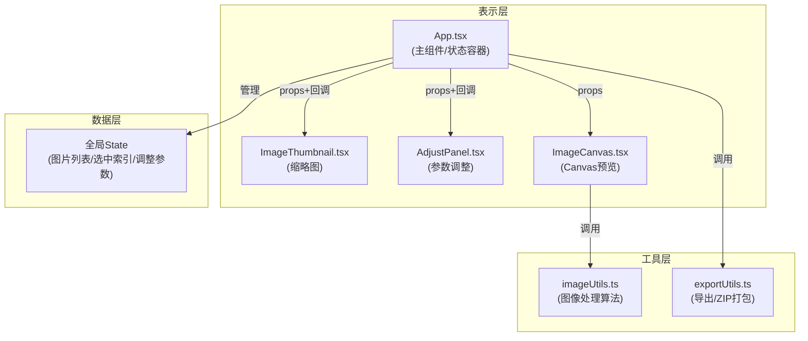

## 1. 架构设计

纯前端应用，采用React组件化架构，状态集中管理，Canvas API负责图像实时渲染。



## 2. 技术描述

- **前端框架**：React 18 + TypeScript 5 + Vite 5
- **状态管理**：React useState/useReducer（轻量级，无需额外库）
- **图像处理**：HTML5 Canvas API + ImageData像素级操作
- **打包导出**：JSZip库（ZIP打包）+ file-saver（文件下载）
- **样式方案**：原生CSS + CSS Modules（按组件组织）
- **初始化工具**：Vite create模板

## 3. 文件结构与调用关系

| 文件路径 | 职责 | 调用/依赖关系 |
|----------|------|--------------|
| `src/App.tsx` | 主组件，全局状态管理（图片列表、选中索引、调整参数），布局编排 | 调用 ImageThumbnail、AdjustPanel、ImageCanvas；使用 imageUtils、exportUtils |
| `src/components/ImageThumbnail.tsx` | 缩略图展示、选中状态、删除按钮、"调整中"水印 | 接收 props: url, selected, adjusting, onSelect, onDelete |
| `src/components/AdjustPanel.tsx` | 6个参数滑块，实时onChange回调，轨道动态变色 | 接收 props: adjustments, onChange, 导出回调 |
| `src/components/ImageCanvas.tsx` | Canvas渲染调整后图像、放大镜效果、左右对比分割线 | 接收 props: imageUrl, adjustments, compareMode；调用 imageUtils |
| `src/utils/imageUtils.ts` | 像素级调整算法（曝光/色温/对比度等），Canvas渲染辅助函数 | 纯函数工具，无外部依赖 |
| `src/utils/exportUtils.ts` | 单张PNG导出、JSZip批量打包、进度回调 | 依赖 jszip、file-saver |
| `src/main.tsx` | 应用入口，挂载App到DOM | 依赖 App.tsx |
| `src/App.css` | 全局布局、深色主题变量 | - |
| `src/components/*.css` | 各组件样式（CSS Modules） | - |

**数据流向**：
用户操作滑块 → AdjustPanel.onChange → App更新adjustments状态 → 传递给ImageCanvas重绘 + ImageThumbnail标记"调整中"
用户上传/删除 → App更新images数组 → 重新渲染缩略图网格
用户点击导出 → App调用exportUtils → 处理Canvas数据 → 触发下载

## 4. 数据模型

### 4.1 核心类型定义

```typescript
interface ImageItem {
  id: string;
  file: File;
  url: string;          // ObjectURL
  name: string;
  width: number;
  height: number;
}

interface Adjustments {
  exposure: number;     // -100 ~ 100, 默认 0
  temperature: number;  // -100(冷蓝) ~ 100(暖黄), 默认 0
  contrast: number;     // 0 ~ 200, 默认 100
  saturation: number;   // 0 ~ 200, 默认 100
  highlights: number;   // -100 ~ 100, 默认 0
  shadows: number;      // -100 ~ 100, 默认 0
}

interface ExportProgress {
  current: number;
  total: number;
  percent: number;
}
```

## 5. 性能优化策略

| 优化点 | 方案 |
|--------|------|
| Canvas渲染速度 | 使用 requestAnimationFrame 节流，避免每像素运算冗余，预计算查找表(LUT) |
| 缩略图性能 | 缩略图使用离屏Canvas渲染150x150尺寸缓存，避免全尺寸重绘 |
| 滑块响应 | 拖拽中使用低分辨率预览，松开后再渲染全尺寸；使用 useRef 避免闭包陷阱 |
| 批量导出 | 使用 Web Worker 或分块异步处理，避免阻塞UI；显示进度条 |
| 内存管理 | 及时 revokeObjectURL 释放图片URL，删除图片时清理相关缓存 |
