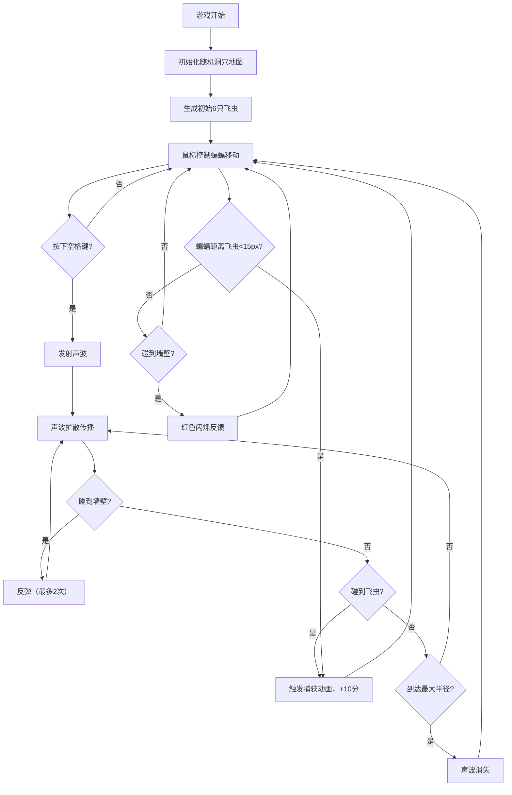

## 1. 产品概述
本产品是一款基于声波反弹定位原理的2D蝙蝠飞行模拟器游戏。玩家操控蝙蝠在黑暗洞穴中通过发射声波并接收回波来感知环境，躲避障碍物并捕捉飞虫。
- 核心玩法：鼠标控制蝙蝠飞行，空格键发射声波，利用声波反弹探测洞穴环境，捕捉飞虫获取分数
- 目标用户：休闲游戏爱好者、对声波定位原理感兴趣的玩家

## 2. 核心功能

### 2.1 功能模块
1. **游戏主场景**：全屏Canvas游戏画面，随机生成的洞穴地形
2. **蝙蝠控制系统**：鼠标控制蝙蝠位置，翅膀动态摆动效果
3. **声波发射与回波系统**：空格键发射声波，支持墙壁反弹、飞虫检测
4. **飞虫AI系统**：飞虫随机移动，自动被声波捕捉或近距离捕获
5. **HUD显示系统**：得分、存活时间、声波数量、雷达图
6. **特效系统**：屏幕闪烁、粒子爆发、碰撞反馈

### 2.2 页面详情
| 页面名称 | 模块名称 | 功能描述 |
|-----------|-------------|---------------------|
| 游戏主页面 | 洞穴场景 | 随机生成的不规则洞穴地形，包含顶部/底部边界曲线、钟乳石、石笋 |
| 游戏主页面 | 蝙蝠角色 | 倒三角形蝙蝠，鼠标控制位置，翅膀正弦波摆动，速度影响摆动频率 |
| 游戏主页面 | 声波系统 | 圆形扩散声波，白色半透明圆环，最多3个同时存在，支持2次墙壁反弹 |
| 游戏主页面 | 飞虫系统 | 绿色菱形飞虫，随机移动，最多8只，声波或近距离可捕获 |
| 游戏主页面 | HUD界面 | 左上角得分/时间、右上角声波数量、蝙蝠旁雷达图 |
| 游戏主页面 | 特效反馈 | 声波发射白色闪框、捕获绿色粒子、撞墙红色闪烁 |

## 3. 核心流程
玩家进入游戏后，鼠标控制蝙蝠在洞穴中飞行，通过空格键发射声波探测环境。声波遇到墙壁反弹，遇到飞虫则触发捕获并加分。蝙蝠需要躲避墙壁（撞墙触发红色闪烁），存活时间越长得分越高。

## 4. 用户界面设计

### 4.1 设计风格
- **主色调**：深蓝渐变背景（#0A0A1A 到 #1A1A2A），洞穴墙壁 #4A5A6A，钟乳石 #3A4A5A
- **强调色**：白色（蝙蝠、声波、HUD）、绿色（飞虫）、红色（碰撞警告）
- **视觉风格**：低多边形风格，线条清晰，色彩对比鲜明，极简UX
- **动画风格**：翅膀正弦波摆动、声波渐变扩散、粒子爆发效果

### 4.2 页面设计概述
| 页面名称 | 模块名称 | UI元素 |
|-----------|-------------|-------------|
| 游戏主页面 | 背景 | 全屏黑色外背景，Canvas居中显示，Canvas内深蓝垂直渐变 |
| 游戏主页面 | 洞穴边界 | 3px宽不规则曲线，#4A5A6A，Catmull-Rom样条生成 |
| 游戏主页面 | 钟乳石/石笋 | 等腰三角形，底边20-30px，高30-60px，#3A4A5A |
| 游戏主页面 | 蝙蝠 | 倒三角形，翼展40px，白色，翅膀上下摆动 |
| 游戏主页面 | 声波 | 白色半透明圆环，描边2px，透明度0.6渐变到0 |
| 游戏主页面 | 飞虫 | 绿色菱形，边长6px |
| 游戏主页面 | HUD-左上角 | 得分文字（白色）、存活时间（秒） |
| 游戏主页面 | HUD-右上角 | 3个白色小圆点表示可用声波数 |
| 游戏主页面 | HUD-雷达 | 蝙蝠左上角半径30px圆形雷达，半透明黑色底，墙壁轮廓+绿色飞虫点 |
| 游戏主页面 | 特效 | 声波发射白色闪框（100ms，透明度0.2）、捕获绿色粒子（10个，300ms）、撞墙红色蝙蝠闪烁（150ms） |

### 4.3 响应性
- 桌面端全屏Canvas显示，居中布局
- Canvas采用固定逻辑分辨率，自适应屏幕大小
- 鼠标操作优化，不涉及触控

## 5. 性能要求
- 游戏主循环稳定60FPS
- 声波碰撞检测使用8x8空间分区网格，每帧计算量控制在2ms以内
- 飞虫AI优化：距离蝙蝠200px以内每帧更新，其余每500ms更新一次
