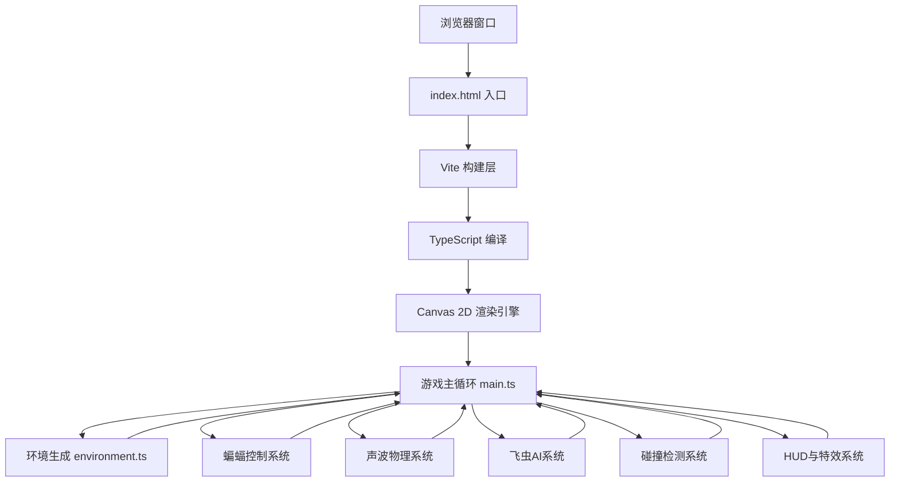

## 1. 架构设计



## 2. 技术描述
- **前端**：TypeScript（严格模式） + HTML5 Canvas 2D + Vite
- **构建工具**：Vite（轻量级快速构建）
- **包管理**：npm
- **无后端**：纯前端游戏，无服务端依赖
- **无数据库**：游戏状态内存存储

## 3. 项目文件结构

| 文件路径 | 用途 |
|-------|---------|
| /package.json | 项目依赖配置（typescript、vite），启动脚本 |
| /index.html | 入口HTML，全屏Canvas容器 |
| /vite.config.js | Vite构建配置 |
| /tsconfig.json | TypeScript严格模式配置，包含DOM类型 |
| /src/main.ts | 游戏主循环，核心逻辑：场景初始化、蝙蝠控制、声波发射与回波检测、飞虫AI、碰撞检测、HUD渲染 |
| /src/environment.ts | 随机洞穴地图生成：边界曲线（Catmull-Rom样条）、钟乳石/石笋、飞虫出生点 |

## 4. 核心数据模型

### 4.1 类型定义

```typescript
// 坐标点
interface Point {
  x: number;
  y: number;
}

// 蝙蝠状态
interface Bat {
  x: number;
  y: number;
  wingPhase: number;      // 翅膀摆动相位
  wingFrequency: number;  // 摆动频率 Hz
  isHit: boolean;         // 是否撞墙
  hitTimer: number;       // 撞墙闪烁计时器
}

// 声波
interface SoundWave {
  x: number;
  y: number;
  radius: number;
  maxRadius: number;
  bounceCount: number;    // 已反弹次数
  active: boolean;
  segments: WaveSegment[]; // 声波传播分段（用于折线反弹）
}

// 声波分段
interface WaveSegment {
  startX: number;
  startY: number;
  angle: number;          // 传播方向
  maxDist: number;        // 该段最大传播距离
  currentDist: number;    // 当前传播距离
}

// 飞虫
interface Bug {
  x: number;
  y: number;
  vx: number;
  vy: number;
  directionTimer: number; // 方向改变计时器
  isCaptured: boolean;
  captureProgress: number; // 捕获动画进度 0-1
}

// 墙壁线段
interface WallSegment {
  x1: number;
  y1: number;
  x2: number;
  y2: number;
}

// 钟乳石/石笋
interface Stalactite {
  x: number;
  y: number;
  baseWidth: number;
  height: number;
  isTop: boolean; // true=钟乳石(顶部向下), false=石笋(底部向上)
  segments: WallSegment[];
}

// 粒子
interface Particle {
  x: number;
  y: number;
  vx: number;
  vy: number;
  life: number;     // 剩余生命 ms
  maxLife: number;  // 最大生命 ms
  color: string;
  size: number;
}

// 空间分区网格
interface SpatialGrid {
  cellSize: number;
  cols: number;
  rows: number;
  cells: WallSegment[][];
}

// 游戏状态
interface GameState {
  bat: Bat;
  soundWaves: SoundWave[];
  bugs: Bug[];
  walls: WallSegment[];
  stalactites: Stalactite[];
  particles: Particle[];
  topCurve: Point[];
  bottomCurve: Point[];
  score: number;
  startTime: number;
  lastBugSpawnTime: number;
  flashTimer: number;      // 屏幕闪烁计时器
  lastMouseX: number;
  lastMouseY: number;
  mouseSpeed: number;
  spatialGrid: SpatialGrid;
}
```

## 5. 核心算法

### 5.1 Catmull-Rom 样条曲线
用于生成平滑的洞穴顶部/底部边界曲线，通过10个控制点插值生成连续曲线。

### 5.2 空间分区碰撞检测
将画布划分为8x8网格，每个网格单元存储穿过该单元的墙壁线段。声波碰撞检测时仅查询声波所在位置的相邻网格单元，大幅降低碰撞检测复杂度。

### 5.3 圆柱面声波反射
声波碰到墙壁时，计算入射向量与墙壁法线的反射，入射角等于反射角，模拟物理反弹。最多支持2次反弹。

### 5.4 飞虫AI更新策略
- 距离蝙蝠200px以内的飞虫：每帧更新位置和方向
- 距离蝙蝠200px以外的飞虫：每500ms更新一次，降低CPU消耗

### 5.5 蝙蝠翅膀动画
使用正弦波函数计算翅膀Y轴偏移，摆动频率根据鼠标移动速度线性插值（0-500px/s对应10-20Hz）。

## 6. 性能优化策略
1. **空间分区网格**：8x8网格减少声波-墙壁碰撞检测的线段数量
2. **飞虫AI分级更新**：远距离飞虫降低更新频率
3. **Canvas批量绘制**：同类元素使用相同样式批量绘制，减少状态切换
4. **对象池**：粒子对象复用，避免频繁GC
5. **离屏缓存**：洞穴背景可缓存为离屏Canvas，每帧仅绘制一次
