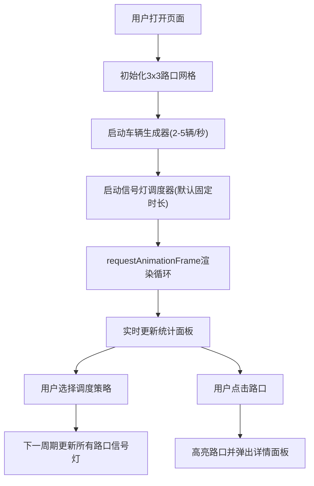

## 1. 产品概述

2D未来交通流智能调度系统是一个基于浏览器的交通仿真平台，帮助城市管理者直观评估不同信号灯策略对车流拥堵程度的影响。通过可视化3x3交叉路口网格、实时车流模拟、多种调度策略切换和详细统计分析，为交通规划决策提供数据支撑。

## 2. 核心功能

### 2.1 用户角色

| 角色 | 使用方式 | 核心能力 |
|------|---------|---------|
| 城市管理者/交通规划者 | 浏览器直接访问 | 观察车流、切换策略、查看统计数据、分析路口详情 |

### 2.2 功能模块

1. **主仿真画布**：3x3交叉路口网格、车辆动态渲染、信号灯显示
2. **调度策略控制**：四种信号灯策略切换下拉菜单
3. **实时统计面板**：总车辆数、平均等待时间、最大排队长度、总通过车辆数、历史折线图
4. **路口详情弹窗**：点击路口查看各方向排队长度、车流量、信号灯相位信息

### 2.3 页面详情

| 页面名称 | 模块名称 | 功能描述 |
|---------|---------|---------|
| 主仿真页 | 路口网格渲染 | 绘制3x3十字交叉路口，含主干道与支路，白色虚线车道线 |
| 主仿真页 | 车辆仿真系统 | 每秒2-5辆随机生成，6x3像素圆角矩形，蓝红渐变颜色，2像素/帧恒定速度 |
| 主仿真页 | 信号灯系统 | 红黄绿灯组带倒计时，悬浮显示于路口上方 |
| 主仿真页 | 策略切换控制 | 下拉菜单选择四种调度策略，下一周期生效，0.5秒淡入淡出 |
| 主仿真页 | 实时统计面板 | 四项核心指标每秒刷新，60秒历史折线图自动滚动 |
| 主仿真页 | 路口详情弹窗 | 点击路口高亮显示，展示四方向排队、30秒流量、信号灯状态 |

## 3. 核心流程

## 4. 用户界面设计

### 4.1 设计风格

- **主色调**：深蓝灰底色#1A1A2E，道路深灰#2D2D44
- **强调色**：车辆蓝色#4A90D9到红色#D94A4A渐变，信号灯红/黄/绿
- **按钮/控件**：扁平设计，圆角4px，字重500
- **字体**：无衬线现代字体，清晰可读
- **视觉效果**：车辆阴影、路口黄色光晕高亮(半径40px，透明度0.3)

### 4.2 页面设计概述

| 页面名称 | 模块名称 | UI元素 |
|---------|---------|--------|
| 主仿真页 | Canvas画布 | 占窗口90%，居中显示，深蓝灰背景 |
| 主仿真页 | 右侧控制面板 | 固定280px宽，含策略下拉、统计数据、折线图 |
| 主仿真页 | 信号灯显示 | 路口上方悬浮，红/黄/绿圆形(红/绿10px，黄6px，间距2px) |
| 主仿真页 | 路口高亮 | 黄色光晕效果，半径40px，透明度0.3 |
| 主仿真页 | 弹窗 | 圆角设计，显示路口详细数据 |

### 4.3 响应式

- **桌面端**(≥900px)：Canvas占90%窗口，右侧固定280px控制面板
- **移动端**(<900px)：Canvas占90%窗口，控制面板移至底部，高度自适应

### 4.4 动画与过渡

- 车辆加减速：0.3秒 cubic-bezier(0.25,0.1,0.25,1)
- 信号灯切换：0.3秒 同种缓动
- 面板弹出：0.3秒 同种缓动
- 策略切换：0.5秒淡入淡出

## 5. 性能要求

- 50辆车同时运行时保持60FPS帧率
- 每帧计算时间不超过8ms
- 使用requestAnimationFrame驱动渲染循环
