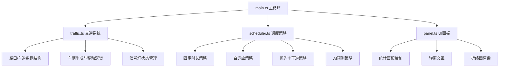

## 1. 架构设计



## 2. 技术描述

- **前端框架**：原生TypeScript + HTML5 Canvas
- **构建工具**：Vite
- **无后端依赖**：纯前端仿真应用

## 3. 项目文件结构

| 文件路径 | 用途 |
|---------|------|
| `package.json` | 依赖配置：typescript、vite；启动脚本：npm run dev |
| `index.html` | 入口页面，全屏Canvas容器 |
| `vite.config.js` | Vite构建配置，无特殊插件 |
| `tsconfig.json` | TypeScript配置：严格模式、DOM类型、目标ES2020 |
| `src/main.ts` | 游戏主循环，初始化各模块，requestAnimationFrame驱动 |
| `src/traffic.ts` | 路口/车道数据结构，车辆生成与移动，信号灯状态管理 |
| `src/scheduler.ts` | 四种调度策略实现，历史数据收集，AI预测(简单移动平均) |
| `src/panel.ts` | 统计面板绘制，弹窗交互，折线图渲染 |

## 4. 核心数据模型

### 4.1 车辆 (Vehicle)
```typescript
interface Vehicle {
  id: number;
  x: number;
  y: number;
  angle: number;           // 行驶方向(弧度)
  speed: number;           // 当前速度
  targetSpeed: number;     // 目标速度(2像素/帧)
  lane: Lane;              // 所属车道
  trajectory: 'left' | 'straight' | 'right';  // 行车轨迹
  waitTime: number;        // 等待时间(帧)
  color: string;           // 当前颜色(根据等待时间渐变)
  stopped: boolean;        // 是否停止
  passed: boolean;         // 是否已通过路口计数
}
```

### 4.2 车道 (Lane)
```typescript
interface Lane {
  id: string;
  direction: 'north' | 'south' | 'east' | 'west';
  intersection: Intersection;
  stopLineX: number;
  stopLineY: number;
  queueLength: number;     // 排队车辆数
  vehicles: Vehicle[];     // 当前车道车辆
}
```

### 4.3 路口 (Intersection)
```typescript
interface Intersection {
  id: string;
  gridX: number;
  gridY: number;
  centerX: number;
  centerY: number;
  isMainRoad: boolean;     // 是否主干道
  lanes: { [key in 'north' | 'south' | 'east' | 'west']: Lane[] };
  signal: TrafficSignal;
  trafficHistory: number[]; // 历史30秒每秒通过车辆数
}
```

### 4.4 信号灯 (TrafficSignal)
```typescript
interface TrafficSignal {
  currentPhase: 'northSouth' | 'eastWest';
  currentLight: 'red' | 'yellow' | 'green';
  remainingTime: number;   // 剩余时间(秒)
  greenDuration: number;   // 当前绿灯时长
  yellowDuration: number;  // 黄灯时长(固定3秒)
  redDuration: number;     // 红灯时长
}
```

### 4.5 调度策略类型
```typescript
type ScheduleStrategy = 'fixed' | 'adaptive' | 'mainRoadPriority' | 'aiPredict';
```

## 5. 调度策略算法

### 5.1 固定时长策略
- 绿灯30秒 + 黄灯3秒 + 红灯30秒
- 南北方向与东西方向交替

### 5.2 自适应策略
- 统计各方向排队车辆数
- 绿灯时长 = base(15秒) + 排队数 × 2秒
- 范围限制：最短10秒，最长60秒

### 5.3 优先主干道策略
- 主干道方向绿灯时间 × 2
- 支路方向绿灯时间保持基础值

### 5.4 AI预测策略(简单移动平均)
- 收集过去30秒每秒通过车辆数
- 计算移动平均预测下一周期车流
- 根据预测值按比例分配绿灯时长

## 6. 性能优化策略

1. **Canvas分层**：静态道路预渲染到离屏Canvas，每帧仅绘制车辆和信号灯
2. **空间索引**：按网格分块管理车辆，碰撞检测仅检查相邻格子
3. **对象池**：复用Vehicle对象，避免频繁GC
4. **节流更新**：统计数据每秒更新一次而非每帧
5. **批量绘制**：同色车辆批量路径绘制
