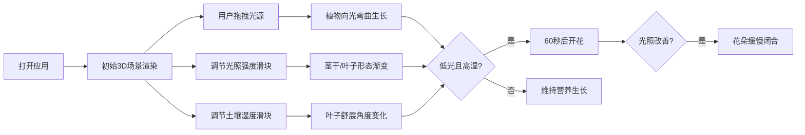

## 1. 产品概述

一个基于3D WebGL的植物向光性生长交互模拟应用，用户可像园艺师一样在虚拟花盆中种植植物，通过调节光源位置、光照强度和土壤湿度观察植物的动态生长响应。

- 核心价值：通过沉浸式3D交互直观展示植物向光性、趋光性和水分胁迫响应等生物学现象
- 目标用户：学生、教育工作者、植物爱好者及对自然模拟感兴趣的用户

## 2. 核心特性

### 2.1 功能模块
1. **3D植物模拟**：茎干分段弯曲生长、叶子褶皱变形、动态形态响应
2. **可拖拽光源**：三维空间移动的发光球体，带粒子光晕效果
3. **环境参数控制**：光照强度滑块、土壤湿度滑块
4. **动态响应系统**：向光性弯曲、形态变化、开花条件触发
5. **视觉氛围**：粒子星空背景、柔和阴影、深色科技感UI

### 2.2 页面详情
| 页面名称 | 模块名称 | 功能描述 |
|-----------|-------------|---------------------|
| 主页面 | 3D场景容器 | 展示花盆、植物、光源的3D渲染，支持鼠标交互 |
| 主页面 | 光源拖拽 | 鼠标拖拽光源在XZ平面自由移动，Y轴范围限制1-8单位 |
| 主页面 | 控制面板 | 光照强度滑块(0.1-2.0)、土壤湿度滑块(10%-100%) |
| 主页面 | 开花系统 | 低光高湿条件下60秒后顶端开花，光照改善后缓慢闭合 |

## 3. 核心流程

用户打开应用 → 看到初始植物和默认光源 → 拖拽光源改变位置 → 植物茎干缓慢朝光源弯曲 → 调节光照强度滑块 → 茎干粗细、叶子大小渐变 → 调节湿度滑块 → 叶子舒展角度变化 → 设置低光高湿条件 → 等待60秒观察开花 → 增强光照 → 花朵缓慢闭合

## 4. 用户界面设计

### 4.1 设计风格
- **主题色**：深色科技感，背景#1A1A2E，控件半透明深灰#2A2A3A，描边#4A4A5A
- **植物色**：茎干从#4CAF50渐变至#2E7D32，叶子半透明#81C784，花瓣粉紫渐变
- **光源色**：黄色发光球体
- **圆角规范**：所有UI控件统一圆角8px
- **字体**：现代无衬线字体，清晰易读
- **动效**：滑块数值浮标0.2s淡出，布局切换0.4s弹性过渡

### 4.2 页面布局
| 区域 | 模块 | UI元素 |
|-----------|-------------|-------------|
| 左侧70% | 3D场景 | Canvas画布，深色背景，浮动星空粒子，花盆阴影 |
| 右侧30% | 控制面板 | 垂直卡片堆叠(间距12px)，两张参数滑块卡片 |
| 滑块控件 | 参数调节 | 滑块轨道、拖拽手柄、数值浮标(拖动时显示) |

### 4.3 响应式设计
- 桌面端：左右分栏布局(70%/30%)
- 移动端：自动切换上下布局(70%高度/底部30%)
- 布局切换：0.4秒弹性过渡动画
- 触摸优化：移动端支持触控拖拽光源和滑块

### 4.4 3D场景规范
- **环境**：深色背景#1A1A2E，200个浮动白色星空粒子
- **光照**：环境光提供基础照明，点光源跟随拖拽球体
- **相机**：透视相机，合理初始视角，支持OrbitControls环绕观察
- **花盆**：深棕色圆柱体，半径3单位，高2单位
- **土壤**：黑色表面带随机小颗粒肌理
- **植物**：6段茎干(每段可独立旋转)，2片对称小叶(各4分段)
- **阴影**：花盆底部柔和圆形阴影，半透明0.3，Y偏移-0.5
- **性能**：帧率≥45fps，粒子≤300，茎段≤6，叶段≤8
