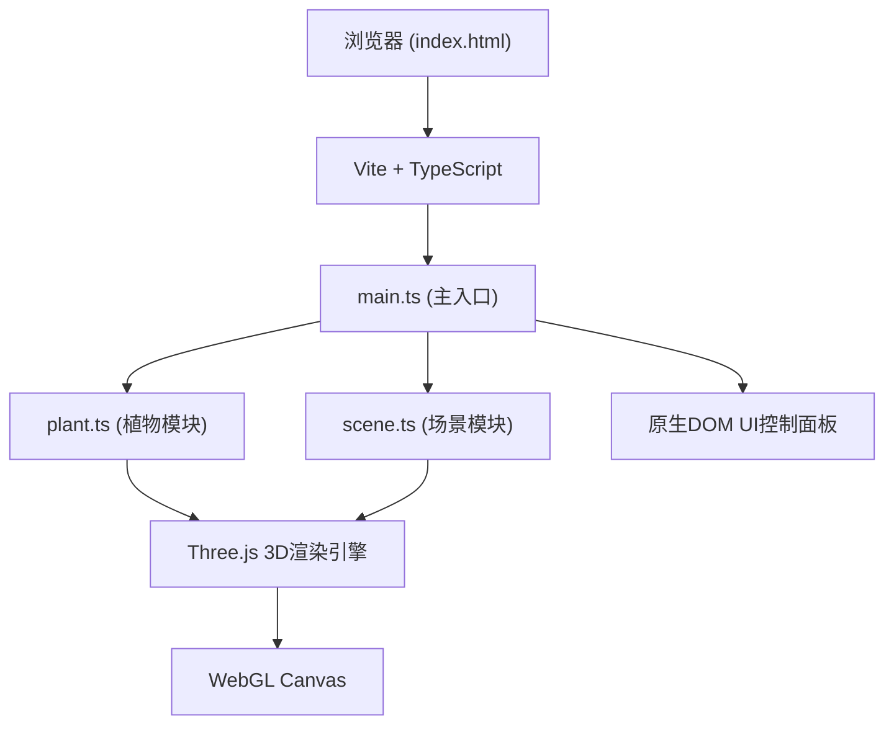

## 1. 架构设计



## 2. 技术描述

- **前端框架**：原生 TypeScript (无UI框架)，使用 Three.js 进行3D渲染
- **构建工具**：Vite
- **3D引擎**：Three.js (three + @types/three)
- **编程语言**：TypeScript (严格模式)
- **样式方案**：原生CSS，内联在HTML的style标签中

## 3. 文件结构

| 文件 | 用途 |
|-------|---------|
| package.json | 项目依赖和脚本配置 |
| index.html | 入口页面，包含UI布局和样式 |
| vite.config.js | Vite构建配置 |
| tsconfig.json | TypeScript编译配置(严格模式，含DOM类型) |
| src/main.ts | 主入口：初始化场景/相机/渲染器、动画循环、光源拖拽逻辑、UI事件绑定 |
| src/plant.ts | 植物模块：茎段网格构建、叶子分段、生长算法、向光性响应、曲率更新、开花系统 |
| src/scene.ts | 场景模块：花盆/土壤/阴影/星空粒子创建、参数集成协调 |

## 4. 核心类型定义

### 4.1 环境参数
```typescript
interface EnvironmentParams {
  lightIntensity: number;    // 0.1 - 2.0
  soilMoisture: number;      // 10 - 100 (%)
  lightPosition: THREE.Vector3;
}
```

### 4.2 植物状态
```typescript
interface PlantState {
  stemSegments: THREE.Mesh[];      // 6段茎干
  leaves: { left: THREE.Mesh[]; right: THREE.Mesh[] };  // 每侧4段
  stemRotations: number[];         // 每段旋转角度
  flower?: THREE.Group;            // 可选花朵
  isFlowering: boolean;
  flowerTimer: number;             // 开花计时(秒)
}
```

### 4.3 光源状态
```typescript
interface LightSource {
  mesh: THREE.Mesh;
  light: THREE.PointLight;
  particles: THREE.Points;
  isDragging: boolean;
}
```

## 5. 核心算法

### 5.1 向光性弯曲
- 计算光源相对于植物顶端的方向向量
- 每帧将茎段旋转角度向目标方向插值逼近，速度0.02弧度/帧
- 越靠上的茎段弯曲幅度越大(权重递增)

### 5.2 形态响应
- 光照强度影响茎干粗细(scale)和叶子大小，强光→粗壮/宽大，弱光→细长/窄小
- 土壤湿度影响叶子曲率(展开度)，高湿→舒展，低湿→蜷缩
- 所有变化使用线性插值平滑过渡，变化率0.01/帧

### 5.3 开花触发
- 条件：lightIntensity < 0.3 且 soilMoisture > 80
- 满足条件后累计计时，达到60秒触发开花
- 6瓣随机粉紫渐变花瓣 + 黄色花心
- 光照改善后花瓣缓慢闭合(缩放至0)

## 6. 性能优化

- 植物分段：茎段≤6，叶段≤8，总网格数控制
- 粒子系统：总粒子≤300(星空200 + 光晕100)
- 材质复用：相同外观使用共享材质实例
- 矩阵更新：仅在变化时标记needsUpdate
- 帧率监控：使用requestAnimationFrame，目标≥45fps
