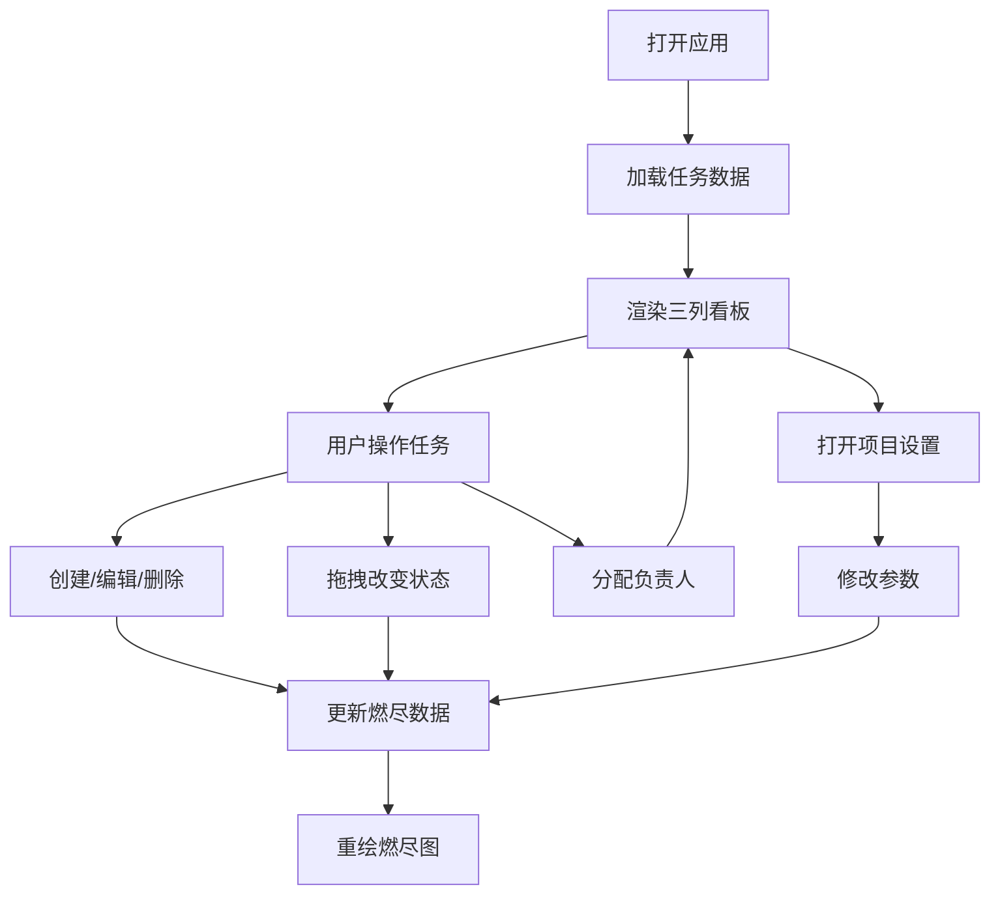

## 1. 产品概述
微型团队任务看板与燃尽图预测应用，为敏捷开发团队提供任务进度跟踪、剩余工时评估和项目完成时间预测功能。
- 主要用途：管理团队任务、可视化项目进度、预测项目交付时间
- 目标用户：敏捷开发团队成员、项目经理、Scrum Master

## 2. 核心功能

### 2.1 用户角色
无角色区分，所有用户拥有完整权限。

### 2.2 功能模块
1. **任务看板页面**：任务CRUD、拖拽排序、负责人分配、燃尽图展示
2. **项目设置弹窗**：项目名称、开始日期、每日可用工时配置

### 2.3 页面详情
| 页面名称 | 模块名称 | 功能描述 |
|-----------|-------------|---------------------|
| 任务看板 | 任务列（待办/进行中/已完成） | 三列看板展示，支持拖拽移动任务 |
| 任务看板 | 任务卡片 | 显示标题、工时、负责人，支持编辑删除 |
| 任务看板 | 燃尽图 | Canvas绘制理想线与实际线，悬停显示详情 |
| 项目设置弹窗 | 配置表单 | 修改项目名称、开始日期、每日可用工时 |

## 3. 核心流程
用户打开应用 → 查看任务看板 → 创建/编辑/删除任务 → 拖拽任务改变状态 → 查看燃尽图更新 → 设置项目参数 → 重新计算燃尽数据

## 4. 用户界面设计

### 4.1 设计风格
- **主色调**：深色主题 #1A1A2E，卡片背景 #16213E
- **状态列渐变**：待办 #0F3460、进行中 #E94560、已完成 #0FFF50
- **强调色**：工时标签 #FFD700，实际燃尽线 #FF3B30，理想线 #888
- **卡片样式**：圆角 8px，阴影 0 4px 6px rgba(0,0,0,0.3)
- **动效**：过渡时长 200-300ms，拖拽动画 300ms
- **字体**：无衬线系统字体，简洁现代

### 4.2 页面设计概述
| 页面名称 | 模块名称 | UI元素 |
|-----------|-------------|-------------|
| 任务看板 | 标题栏 | 项目名称 + 设置按钮 |
| 任务看板 | 三列布局 | 水平排列，响应式垂直堆叠 <768px |
| 任务看板 | 任务卡片 | 标题截断15字、工时标签、负责人头像 |
| 任务看板 | 燃尽图 | 300px高度Canvas，网格线虚线，悬停提示 |
| 项目设置弹窗 | 模态框 | 半透明覆盖层、缩放动画、居中圆角卡片 |

### 4.3 响应式设计
- 桌面端（≥768px）：三列水平排列，列宽自适应最小320px
- 移动端（<768px）：三列垂直堆叠，单列全宽展示
