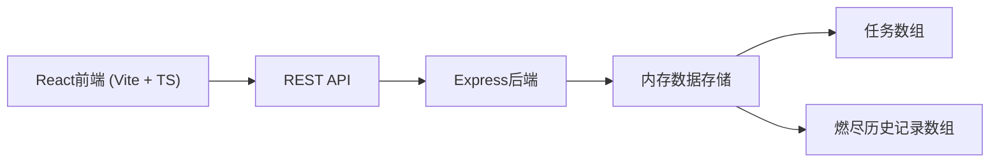
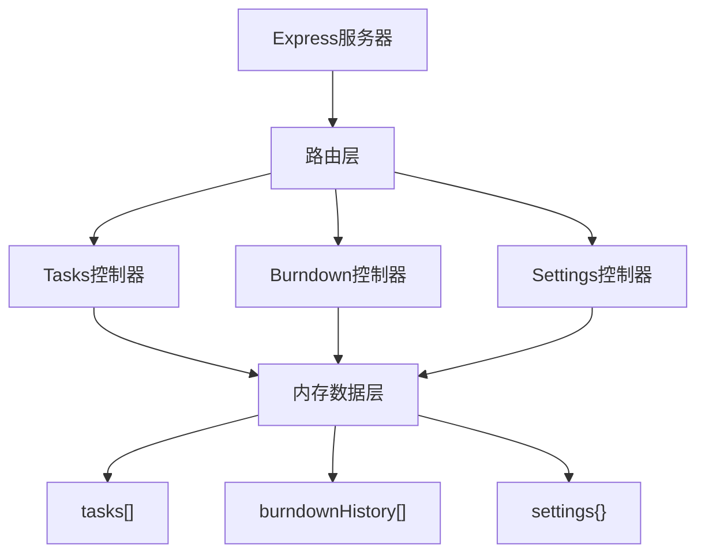
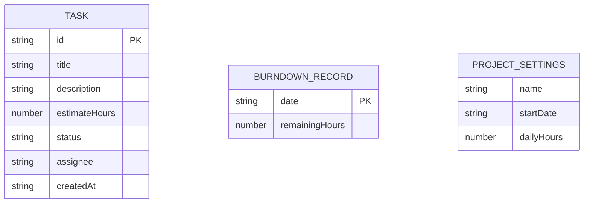

## 1. 架构设计



## 2. 技术描述
- **前端**：React 18 + TypeScript + Vite
- **后端**：Express 4 + TypeScript + CORS + UUID
- **数据存储**：内存数组（应用启动时恢复示例数据）
- **UI库**：原生CSS + Canvas绘图

## 3. 路由定义
| 路由 | 用途 |
|-------|---------|
| / | 主页面（任务看板 + 燃尽图） |

## 4. API 定义

### 类型定义
```typescript
type TaskStatus = 'todo' | 'in-progress' | 'done';

interface Task {
  id: string;
  title: string;
  description: string;
  estimateHours: number;
  status: TaskStatus;
  assignee: string | null;
  createdAt: string;
}

interface ProjectSettings {
  name: string;
  startDate: string;
  dailyHours: number;
}

interface BurndownPoint {
  date: string;
  ideal: number;
  actual: number;
}
```

### REST API
| 方法 | 路径 | 描述 | 请求体 | 响应 |
|------|------|------|--------|------|
| GET | /tasks | 获取所有任务 | - | Task[] |
| POST | /tasks | 创建新任务 | {title, description, estimateHours, status} | Task |
| PUT | /tasks/:id | 更新任务 | Partial<Task> | Task |
| DELETE | /tasks/:id | 删除任务 | - | {success: true} |
| GET | /burndown | 获取燃尽数据 | - | BurndownPoint[] |
| GET | /settings | 获取项目设置 | - | ProjectSettings |
| PUT | /settings | 更新项目设置 | ProjectSettings | ProjectSettings |

## 5. 服务器架构



## 6. 数据模型

### 6.1 ER 图


### 6.2 初始数据
- **待办任务**：3个
- **进行中任务**：2个
- **已完成任务**：1个
- **项目设置**：名称"我的项目"、开始日期今天、每日8小时
