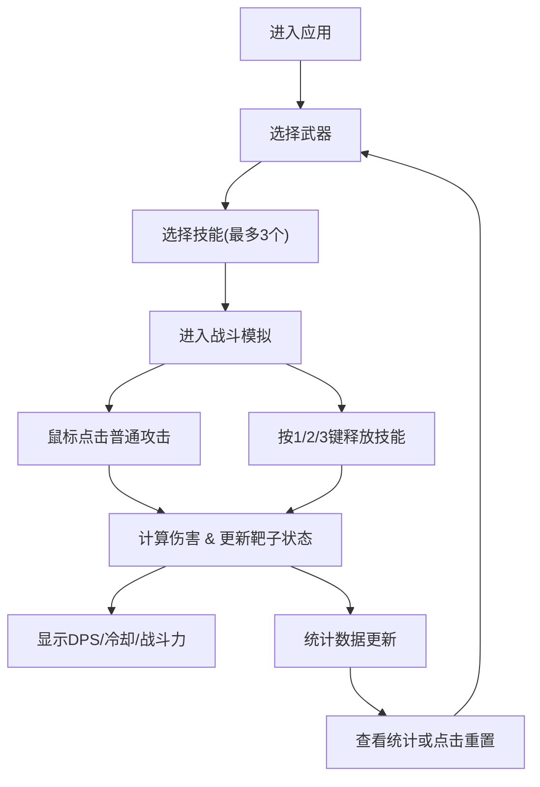

## 1. 产品概述

2D武器-技能搭配模拟沙盒是一款面向MMORPG玩家的战斗模拟工具，让玩家在虚拟战斗场景中测试不同武器与技能组合的伤害输出和战斗效果。

- 主要用途：帮助玩家在战斗前模拟和优化武器-技能搭配策略
- 目标用户：MMORPG游戏玩家、游戏爱好者
- 产品价值：提供数据驱动的搭配决策支持，减少试错成本，提升游戏体验

## 2. 核心功能

### 2.1 用户角色

| 角色 | 注册方式 | 核心权限 |
|------|----------|----------|
| 玩家用户 | 无需注册，直接使用 | 选择武器/技能、模拟战斗、查看统计数据 |

### 2.2 功能模块

1. **武器选择面板**：6种武器图标列表，显示属性与描述，单选择一
2. **技能选择面板**：6种技能图标，最多选择3个，支持快捷键激活
3. **战斗模拟画布**：中央网格背景区域，靶子生成与移动，技能特效渲染
4. **属性与状态面板**：实时DPS、技能冷却环形进度条、战斗力评分
5. **统计面板**：总伤害、击杀数、最高DPS、战斗时长、技能使用柱状图、重置按钮

### 2.3 页面详情

| 页面名称 | 模块名称 | 功能描述 |
|----------|----------|----------|
| 主页面 | 武器选择栏 | 左侧60x60px武器图标列表，选中金色发光边框 |
| 主页面 | 战斗画布 | 中央响应式Canvas，网格背景，靶子移动，技能特效 |
| 主页面 | 属性面板 | 右侧显示武器属性、3个技能槽位与冷却进度 |
| 主页面 | 统计面板 | 底部战斗统计数据与技能使用柱状图 |
| 主页面 | 技能栏 | 下方技能图标选择，快捷键1/2/3提示 |

## 3. 核心流程

玩家进入应用后，从左侧武器栏选择一把武器，从下方技能栏选择最多3个技能，然后通过鼠标点击靶子进行普通攻击或按1/2/3键释放技能。系统实时计算伤害并显示DPS、技能冷却状态和战斗力评分。战斗结束后可查看统计数据或重置重新开始。

## 4. 用户界面设计

### 4.1 设计风格
- 主色调：深灰#1E1E2E（背景）、深蓝#2B2B4A（面板）
- 强调色：紫色#8B5CF6（按钮，悬停#A78BFA，点击#6D28D9）
- 点缀色：金色#F59E0B（选中高亮）、白色#FFFFFF（文字）
- 按钮样式：圆角矩形，紫色填充，悬停变亮，点击变暗
- 字体：等宽字体（代码风格），白色文字
- 布局风格：三栏卡片式布局，半透明面板配1px白色边框（透明度0.3）
- 图标风格：Canvas绘制的简易几何图形（剑=灰色三角、弓=棕色弧形、法杖=紫色棒状、火球=橙红圆点、冰霜=蓝色方块、治疗=绿色十字）

### 4.2 页面设计概览

| 页面名称 | 模块名称 | UI元素 |
|----------|----------|--------|
| 主页面 | 武器栏 | 60x60px图标卡片，选中金色发光（模糊8px），悬停微缩放 |
| 主页面 | 战斗画布 | 40x40px网格（#333333线条），响应式尺寸，内边距2px |
| 主页面 | 属性面板 | 技能槽位显示30px直径环形冷却进度条，快捷键角标 |
| 主页面 | 统计面板 | 技能使用柱状图，柱子颜色对应技能类型 |
| 主页面 | 响应式 | <768px时左右栏变为侧滑面板（0.3s ease-out动画） |

### 4.3 响应式设计
- 桌面优先（Desktop-first）设计
- 屏幕宽度 < 768px 时：
  - 左侧武器栏变为左滑入面板（点击按钮滑入/滑出，动画0.3s ease-out）
  - 右侧属性面板变为右滑入面板
  - 中央战斗画布占满剩余宽度
  - 底部统计面板保持固定

### 4.4 动画与特效
- 技能按键反馈：图标放大闪烁0.1秒
- 普通攻击命中：白色闪光0.1秒
- 火球特效：半径0→50px圆形爆炸，橙红到透明渐变，持续0.3秒
- 冰霜特效：靶子变蓝冻结2秒，碎裂消失
- 治疗特效：绿色光环扩散，减少20%技能冷却
- 靶子击毁：8个同色粒子四散，持续0.5秒
- 靶子刷新：每3秒右侧随机位置生成，最多5个，速度1px/帧向左移动
