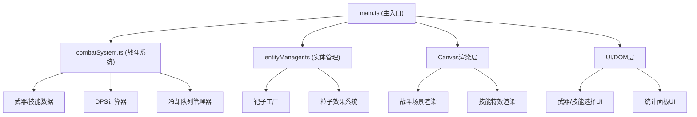

## 1. 架构设计



## 2. 技术说明

- **前端框架**：TypeScript + HTML5 Canvas + 原生DOM（无额外UI框架）
- **构建工具**：Vite@5
- **编程语言**：TypeScript@5（严格模式）
- **渲染引擎**：HTML5 Canvas 2D API
- **后端**：无（纯前端应用）
- **数据库**：无（内存存储）

## 3. 模块与文件职责

| 文件 | 职责 | 输入/输出 |
|------|------|-----------|
| `package.json` | 项目依赖与脚本配置 | typescript、vite 依赖，`npm run dev` 启动 |
| `index.html` | 入口页面，Canvas与UI容器 | 全屏布局，CSS样式 |
| `vite.config.js` | Vite构建配置 | TypeScript、静态资源处理 |
| `tsconfig.json` | TypeScript编译配置 | 严格模式，DOM类型，ES2020 |
| `src/main.ts` | 主入口，协调所有子系统 | 初始化游戏循环、事件绑定、场景管理 |
| `src/combatSystem.ts` | 战斗逻辑系统 | 输入：武器/技能选择 → 计算伤害/DPS/冷却 → 输出：伤害事件、DPS值、状态 |
| `src/entityManager.ts` | 实体管理系统 | 输入：伤害事件 → 更新靶子状态 → 输出：实体数据、粒子效果、击毁事件 |
| `src/types.ts` | 类型定义 | Weapon、Skill、Target、Particle、CombatState 等接口 |

### 数据流向

1. **用户输入层**（main.ts）：
   - 鼠标点击 → 普通攻击事件 → combatSystem.calculateWeaponDamage()
   - 键盘1/2/3 → 技能事件 → combatSystem.castSkill()

2. **战斗计算层**（combatSystem.ts）：
   - 接收武器/技能配置
   - 计算瞬时伤害、持续伤害
   - 维护冷却队列
   - 计算5秒滚动平均DPS
   - 输出伤害事件 → entityManager.applyDamage()

3. **实体状态层**（entityManager.ts）：
   - 管理靶子生成/移动/血量
   - 接收伤害 → 更新靶子血量
   - 靶子死亡 → 触发粒子爆炸效果
   - 输出实体状态 → 渲染层

4. **渲染层**（main.ts 内 Canvas 绘制）：
   - 每帧绘制：网格背景、靶子、技能特效、粒子
   - UI层：DPS显示、冷却环形进度、统计面板

## 4. 核心数据结构

### 4.1 武器类型

```typescript
interface Weapon {
  id: string;
  name: string;
  baseDamage: number;      // 基础伤害
  attackSpeed: number;     // 攻击速度（次/秒）
  attackRange: number;     // 攻击范围（像素）
  color: string;           // 图标主色
  description: string;
}
```

### 4.2 技能类型

```typescript
interface Skill {
  id: string;
  name: string;
  instantDamage: number;   // 瞬时伤害
  dotDamage: number;       // 持续伤害/秒
  dotDuration: number;     // 持续时间（秒）
  cooldown: number;        // 冷却时间（秒）
  effectRadius: number;    // 效果范围（像素）
  type: 'fire' | 'ice' | 'heal';
  color: string;
  description: string;
}
```

### 4.3 靶子实体

```typescript
interface Target {
  id: string;
  x: number;
  y: number;
  radius: number;
  hp: number;
  maxHp: number;
  speed: number;
  frozen: boolean;
  frozenTime: number;
  burning: boolean;
  burnTime: number;
  burnDamage: number;
  hitFlash: number;        // 命中闪光计时
}
```

## 5. 性能约束与实现策略

- **帧率目标**：稳定60FPS，使用 `requestAnimationFrame`
- **DPS更新**：每秒更新1次（滚动5秒窗口），不每帧计算
- **靶子数量**：上限5个，每3秒尝试生成，超过则跳过
- **粒子总数**：上限50个，每次爆炸8个，超出优先移除最早的粒子
- **内存管理**：对象池复用粒子与靶子对象，避免频繁GC
- **事件节流**：鼠标移动无额外处理，技能按键按下即触发（无重复触发保护）
