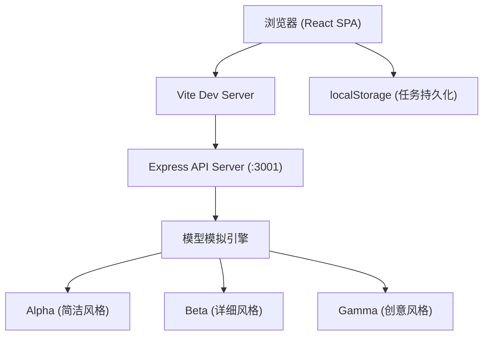
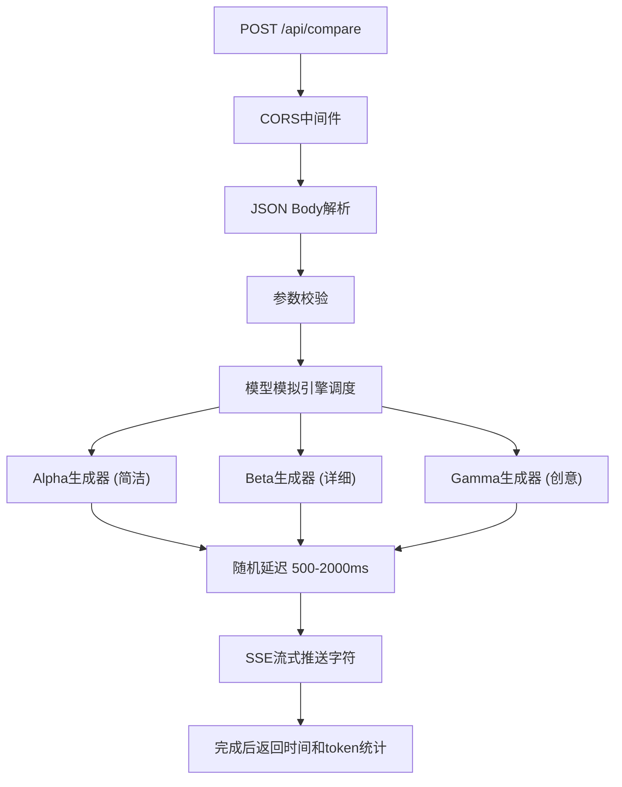
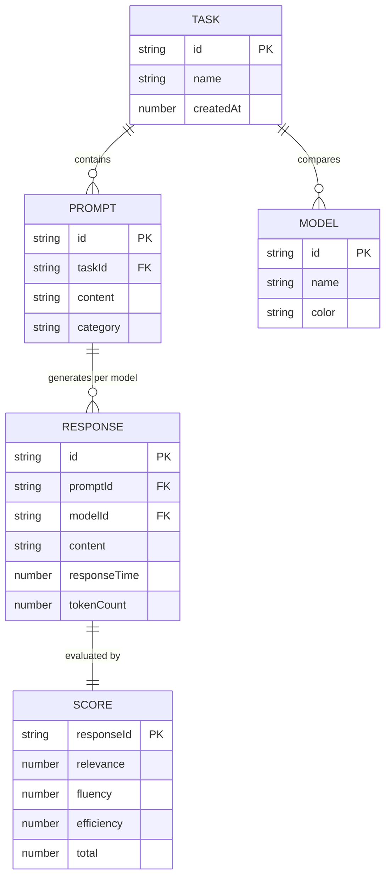

## 1. 架构设计



## 2. 技术说明

- **前端**：React@18 + TypeScript@5 + Vite@5
- **状态管理**：React Hooks (useState/useEffect/useCallback)，组件本地状态
- **样式方案**：原生CSS Modules + CSS变量（深色主题）
- **后端**：Express@4 + TypeScript
- **跨域**：cors中间件
- **唯一标识**：uuid
- **数据存储**：浏览器localStorage（最多5条历史任务）
- **构建工具**：Vite，配置/api代理转发至后端Express服务

## 3. 目录结构

```
auto68/
├── package.json
├── index.html
├── vite.config.js
├── tsconfig.json
├── server/
│   └── index.ts          # Express后端API
└── src/
    ├── App.tsx           # 主应用组件
    ├── main.tsx          # React入口
    ├── styles/
    │   └── globals.css   # 全局样式与主题变量
    ├── types/
    │   └── index.ts      # 共享类型定义
    ├── utils/
    │   ├── scoring.ts    # 评分算法
    │   └── storage.ts    # localStorage封装
    └── components/
        ├── TaskPanel.tsx     # 左侧任务管理面板
        ├── ModelCard.tsx     # 模型对话气泡卡片
        └── ComparePanel.tsx  # 右侧对比看板
```

## 4. API定义

### 4.1 类型定义

```typescript
// 模型标识
type ModelId = 'alpha' | 'beta' | 'gamma';

interface ModelOption {
  id: ModelId;
  name: string;
  color: string;
  style: 'concise' | 'detailed' | 'creative';
}

interface PromptItem {
  id: string;
  content: string;
  category?: string;
}

interface ModelResponse {
  modelId: ModelId;
  content: string;
  responseTime: number;  // 毫秒
  tokenCount: number;    // 估算值
}

interface Score {
  relevance: number;   // 1-10 相关性
  fluency: number;     // 1-10 流畅度
  efficiency: number;  // 1-10 效率
  total: number;       // 总分
}

interface Task {
  id: string;
  name: string;
  createdAt: number;
  prompts: PromptItem[];
  selectedModels: ModelId[];
  results: {
    [promptId: string]: {
      [modelId: string]: ModelResponse;
    };
  };
  scores: {
    [promptId: string]: {
      [modelId: string]: Score;
    };
  };
}

// API请求
interface CompareRequest {
  prompt: string;
  models: ModelId[];
}

// API响应 - SSE流式
interface StreamChunk {
  modelId: ModelId;
  delta: string;
  done: boolean;
  responseTime?: number;
  tokenCount?: number;
}
```

### 4.2 端点定义

| 方法 | 路径 | 用途 |
|------|------|------|
| POST | /api/compare | 发送提示词，流式返回各模型回复(SSE) |
| GET | /api/models | 获取可用模型列表 |

## 5. 服务端架构



## 6. 数据模型

### 6.1 实体关系



### 6.2 localStorage结构

```typescript
// Key: 'model_compare_history'
interface HistoryStorage {
  tasks: Task[];  // 最多5条，按createdAt降序
}
```

内置6个典型场景提示词模板：
- 代码Debug："帮我找出这段JavaScript代码中的bug并修复：[示例代码片段]"
- 文本摘要："请用3句话摘要以下文章：[长文本段落]"
- 创意写作："写一个关于AI觉醒的科幻短篇开头（200字以内）"
- 数学推理："有一个数列：2, 6, 12, 20, 30, ? 请问第n项的通项公式是什么？第100项是多少？"
- 多轮对话："我正在计划一次日本东京旅行，推荐3天行程安排"
- 情感分析："分析以下顾客评论的情感倾向（正面/负面/中性）并提取关键词：[评论内容]"
