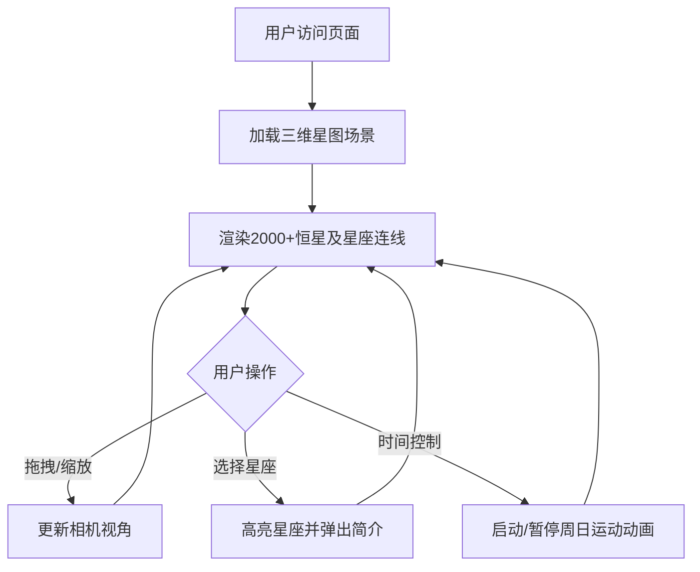

## 1. 产品概述
3D交互式星图应用，为用户提供沉浸式的夜空探索体验，解决传统二维星图缺乏沉浸感和交互性的问题。
- 主要目的：让用户在浏览器中通过三维视角探索星座和恒星分布，学习天文知识
- 目标用户：天文爱好者、学生、对星空感兴趣的普通用户
- 产品价值：以直观、交互的方式呈现浩瀚星空，降低天文知识学习门槛

## 2. 核心特性

### 2.1 功能模块
1. **星空渲染模块**：三维星空渲染，包含2000+颗随机分布恒星，具备闪烁动画效果
2. **星座连线模块**：预定义5个以上常见星座，支持高亮显示和简介展示
3. **视角控制模块**：鼠标拖拽旋转、滚轮缩放，支持平滑过渡
4. **时间动画模块**：模拟夜空周日运动，支持速度调节和暂停/重置
5. **响应式UI模块**：桌面端和移动端适配，触控支持

### 2.2 页面详情
| 页面名称 | 模块名称 | 功能描述 |
|-----------|-------------|---------------------|
| 主页面 | 三维星图画布 | 全屏3D星空渲染，支持交互操作 |
| 主页面 | 星座选择下拉菜单 | 左上角毛玻璃效果菜单，选择高亮显示的星座 |
| 主页面 | 时间控制按钮组 | 右上角加速/暂停/重置控制，1x/2x/4x速度切换 |
| 主页面 | 星座简介卡片 | 点击星座弹出，展示名称、主要恒星、神话背景 |

## 3. 核心流程
用户打开应用进入三维星图，可通过鼠标/触屏拖拽旋转视角、滚轮/双指缩放；点击星座名称或连线区域查看星座简介；通过时间控制按钮启动周日视运动动画，可调节速度。

## 4. 用户界面设计

### 4.1 设计风格
- **主色调**：深蓝色渐变背景（#0a0e27 到 #1a1f3a），营造深邃太空氛围
- **辅助色**：高亮蓝色（rgba(100,180,255,0.6)）用于星座连线，白色/淡黄色用于恒星发光
- **按钮风格**：圆角按钮，悬停时背景色变亮，按压缩放至0.95倍（过渡动画）
- **字体**：使用现代无衬线字体，标题清晰醒目，正文易读
- **布局**：全屏Canvas，UI元素悬浮布局（左上、右上、居中弹出卡片）
- **视觉效果**：毛玻璃背景、高斯模糊光晕、柔和阴影、淡入淡出动画

### 4.2 页面设计概述
| 页面名称 | 模块名称 | UI元素 |
|-----------|-------------|-------------|
| 主页面 | 三维星图画布 | 全屏Canvas，深蓝色渐变背景，白色/淡黄色发光恒星点，蓝色半透明连线 |
| 主页面 | 星座选择下拉菜单 | 毛玻璃效果背景，圆角边框，高斯模糊，下拉动画 |
| 主页面 | 时间控制按钮组 | 圆角按钮组，悬停高亮，按下缩放，速度指示器 |
| 主页面 | 星座简介卡片 | 圆角12px，柔和阴影，0.3s淡入淡出动画，标题+正文排版 |

### 4.3 响应式
- 桌面端（1920x1080）：完整UI布局，鼠标交互
- 移动端（375x667）：按钮和菜单尺寸适配，单指拖拽旋转，双指缩放
- 触控优化：增大可点击区域，禁用浏览器默认手势

### 4.4 3D场景指引
- **环境**：深蓝色渐变背景，无外部光源，恒星自发光
- **光照**：使用Points材质自发光，无场景光源，确保恒星明亮可见
- **相机设置**：PerspectiveCamera，初始视野角度适合观察整个天球
- **相机运动**：OrbitControls，Y轴360度旋转，X轴±45度限制，缩放范围5-50单位
- **交互**：鼠标左键旋转，滚轮缩放，点击星座连线高亮
- **动画**：恒星闪烁（shader动画），周日运动（场景绕Y轴缓慢旋转）
- **性能预算**：2000+Points使用BufferGeometry，LineSegments使用合并几何体，目标帧率桌面端50FPS+，移动端35FPS+
