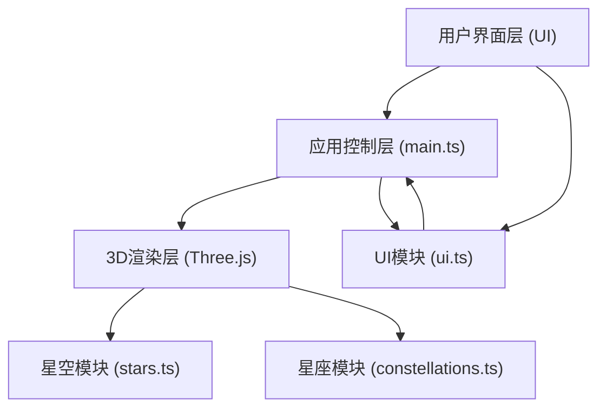

## 1. 架构设计



架构说明：
- **用户界面层**：DOM元素构成的UI控件（下拉菜单、按钮组、信息卡片）
- **应用控制层**：main.ts 负责场景初始化、动画循环、事件协调
- **3D渲染层**：基于Three.js的3D场景，包含恒星和星座两个子模块
- **UI模块**：ui.ts 负责DOM元素创建、样式、事件绑定，通过自定义事件与main.ts通信

## 2. 技术描述
- **前端框架**：无框架，原生 TypeScript + Three.js
- **构建工具**：Vite（处理TypeScript编译和资源打包）
- **3D渲染**：Three.js rlatest + @types/three
- **类型系统**：TypeScript 严格模式，ESNext 目标
- **后端**：无后端，纯前端应用
- **数据库**：无数据库，星座数据硬编码

## 3. 项目文件结构
```
.
├── package.json
├── vite.config.js
├── tsconfig.json
├── index.html
└── src/
    ├── main.ts           # 场景初始化、相机、渲染器、动画循环、事件管理
    ├── stars.ts          # 恒星数据生成、PointsMesh创建、闪烁动画
    ├── constellations.ts # 星座数据定义、连线创建、高亮、简介数据
    └── ui.ts             # DOM UI元素创建、样式、事件、自定义事件通信
```

## 4. 模块职责说明

### 4.1 main.ts
- 初始化 THREE.Scene、PerspectiveCamera、WebGLRenderer
- 创建 OrbitControls 并配置限制（Y轴360°、X轴±45°、缩放5-50）
- 导入并加载 stars.ts 和 constellations.ts 模块
- 监听窗口 resize 事件，更新相机和渲染器
- 启动 requestAnimationFrame 动画循环
- 管理时间动画状态（速度、暂停、重置）
- 监听 ui.ts 发出的自定义事件，响应UI操作

### 4.2 stars.ts
- 导出 createStars(scene) 函数
- 生成2000+恒星数据：球坐标系随机分布 → 笛卡尔坐标
- 恒星属性：位置(Vector3)、大小(0.2-1.2)、颜色(蓝/白/黄/红，按真实恒星光谱分布权重)、闪烁相位
- 使用 BufferGeometry + PointsMaterial（或ShaderMaterial实现闪烁）
- 提供 updateStars(time) 函数用于每帧更新闪烁效果

### 4.3 constellations.ts
- 预定义至少5个星座数据：猎户座、大熊座、小熊座、狮子座、天蝎座
- 每个星座数据包含：名称、主要恒星列表（名称+坐标）、连线对数组、神话背景简介
- 导出 createConstellations(scene) 创建 LineSegments
- 导出 highlightConstellation(name) 高亮指定星座（改变连线颜色/粗细/透明度）
- 导出 clearHighlight() 清除所有高亮
- 导出 getConstellationInfo(name) 获取星座简介数据
- 提供射线检测辅助函数，支持点击连线区域识别

### 4.4 ui.ts
- 导出 initUI() 函数，创建所有DOM元素
- 左上角：星座选择下拉菜单（毛玻璃 backdrop-filter: blur）
- 右上角：时间控制按钮组（加速1x/2x/4x、暂停/恢复、重置）
- 居中：星座简介卡片（初始隐藏，点击星座时淡入）
- 按钮交互：hover变亮、active缩放0.95（CSS transition）
- 通过 CustomEvent 与 main.ts 通信：
  - 'constellation-selected'：用户选择星座
  - 'time-speed-change'：速度变化
  - 'time-toggle-pause'：暂停/恢复
  - 'time-reset'：重置时间
  - 'close-info-card'：关闭简介卡片

## 5. 性能优化策略
- 使用 BufferGeometry 而非 Geometry（已弃用）
- 恒星使用单个 Points 对象（而非多个Mesh）
- 星座连线使用 LineSegments，按星座分组便于独立控制材质
- 闪烁动画使用 ShaderMaterial 在GPU端计算，避免CPU逐顶点更新
- 禁用阴影映射（星空场景不需要）
- 使用 OrbitControls 的 enableDamping 实现平滑惯性
- 限制像素比：renderer.setPixelRatio(Math.min(window.devicePixelRatio, 2))

## 6. 响应式实现
- CSS media query 针对移动端调整UI尺寸
- OrbitControls 自动支持触控（单指旋转、双指缩放）
- Canvas 使用 resize 事件监听，保持全屏
- 移动端禁用 touch-action 避免浏览器默认手势干扰
