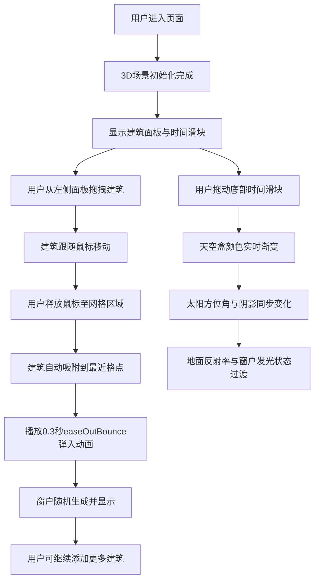

## 1. 产品概述

3D交互式城市天际线生长模拟器，让用户以城市规划师的视角，在虚拟地形上通过拖拽建筑方块，观察城市从空地逐步生长为错落有致的天际线的完整过程。

- 核心目的：提供沉浸式的城市规划体验，通过3D可视化展示城市生长过程与光影变化
- 目标用户：城市规划爱好者、建筑设计师、教育场景学习者
- 产品价值：将抽象的城市规划概念转化为直观可交互的3D体验，兼具教育性与娱乐性

## 2. 核心功能

### 2.1 用户角色
无需用户注册，所有访客均可直接使用全部功能。

### 2.2 功能模块
1. **主场景页面**：3D地形网格、建筑放置区域、时间滑块、建筑面板
2. **建筑管理模块**：三种预设建筑类型、拖拽放置、网格吸附、弹性动画、窗户生成
3. **环境控制模块**：时间滑块、天空盒渐变、动态阴影、昼夜切换、光照模式
4. **UI交互模块**：左侧建筑面板、底部时间滑块、拖拽反馈、动画过渡

### 2.3 页面详情
| 页面名称 | 模块名称 | 功能描述 |
|---------|---------|---------|
| 主场景页面 | 3D地形网格 | 20x20单位灰色网格平面，网格线#444444，支持建筑放置 |
| 主场景页面 | 建筑面板 | 左侧固定220px宽度，展示三种建筑卡片，含图标和尺寸标注 |
| 主场景页面 | 时间滑块 | 底部圆弧形滑块，0-24小时，步长0.1，金色滑块圆点 |
| 主场景页面 | 建筑放置 | 拖拽建筑到网格，自动吸附格点，0.3秒easeOutBounce弹入动画 |
| 主场景页面 | 窗户系统 | 建筑顶部随机0-3个亮黄色窗户，夜晚模式发光（点光源范围0.6，强度0.5） |
| 主场景页面 | 环境系统 | 天空盒三色渐变、太阳方位角变化、动态阴影、地面反射率过渡 |

## 3. 核心流程

用户进入页面后，可从左侧面板选择建筑类型，拖拽至3D场景网格上，建筑自动吸附并播放弹入动画。通过底部时间滑块可调节一天中的不同时刻，观察天空、阴影、光照的实时变化。用户可不断添加建筑直至形成完整的城市天际线。

## 4. 用户界面设计

### 4.1 设计风格
- **主色调**：深色主题，背景#1A1A2E，卡片#16213E，边框#0F3460
- **强调色**：金色#FFD700（滑块、窗户光晕），浅米色#F5E6CC（低层），浅蓝#B3D4FC（中层），深蓝#2C3E50（高层）
- **按钮风格**：卡片式建筑选择器，带悬停高亮和选中状态边框
- **字体**：现代无衬线字体，标题清晰醒目，正文简洁易读
- **布局风格**：左右分栏，左侧固定面板，右侧3D场景，底部弧形滑块
- **图标风格**：简约几何图标，与建筑外形呼应

### 4.2 页面设计概览
| 页面名称 | 模块名称 | UI元素 |
|---------|---------|--------|
| 主场景页面 | 建筑面板 | 深色卡片、建筑预览小图标、尺寸文字标注、悬停高亮效果 |
| 主场景页面 | 3D场景区域 | 灰色网格平面、建筑模型、动态阴影、天空背景 |
| 主场景页面 | 时间滑块 | 圆弧轨道（半径40px）、金色圆形滑块、时间刻度标识 |
| 主场景页面 | 整体布局 | 左右分栏布局、深色背景、无缝边框、精致阴影 |

### 4.3 响应式设计
- 采用桌面端优先设计策略
- 页面最小宽度：1024px
- 3D场景最小高度：600px
- 左侧建筑面板固定宽度：220px
- 窗口尺寸变化时，3D场景区域自适应缩放

### 4.4 3D场景指引
- **环境与氛围**：纯程序化天空盒，三色渐变（白天#87CEEB → 黄昏#FF7F50 → 夜晚#0B0B2E），营造沉浸式昼夜过渡
- **光照设置**：方向光模拟太阳光，随时间实时调整方位角和仰角，阴影柔和实时计算；夜晚窗户点光源营造温暖氛围
- **相机设置**：PerspectiveCamera，45°视场角，初始位置俯视3/4角度，支持鼠标轨道旋转、缩放、平移
- **构图与焦点**：20x20网格居中布局，天际线高低错落形成视觉节奏，光影变化为核心视觉焦点
- **交互与动画**：建筑放置时easeOutBounce弹性动画（0.3秒），时间调节时颜色与光影平滑过渡，拖拽时半透明预览
- **后处理效果**：柔和阴影、窗户点光源光晕、地面反射率动态变化
- **性能预算**：最多200个建筑同时渲染，帧率≥45FPS，交互响应≤100ms，建筑使用合并几何体优化

## 5. 性能与质量要求
| 指标 | 要求 |
|------|------|
| 最大建筑数量 | 200个 |
| 最低帧率 | ≥45 FPS |
| 建筑放置响应 | ≤100ms |
| 滑块调节响应 | ≤100ms |
| 动画流畅度 | 60FPS目标 |
