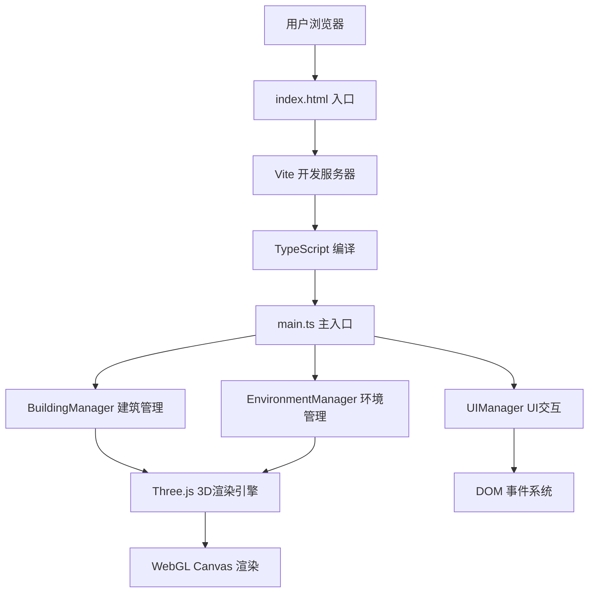

## 1. 架构设计



## 2. 技术选型说明

- **前端框架**：原生 TypeScript（无需React/Vue，直接操作Three.js与DOM以获得最佳性能）
- **3D引擎**：three@latest + @types/three
- **构建工具**：vite@latest（快速HMR，原生ESM支持）
- **语言**：TypeScript@latest（严格模式，完整类型安全）
- **初始化方式**：手动创建项目结构与配置文件
- **后端**：无（纯前端项目，无需服务端）
- **数据库**：无（所有状态存在内存中）

## 3. 路由定义
纯单页应用，无路由系统，所有功能在 `/` 页面完成。

| 路由 | 用途 |
|------|------|
| / | 主场景页面，3D城市天际线模拟器 |

## 4. 文件结构与模块职责

```
auto70/
├── package.json           # 依赖与脚本配置
├── index.html             # HTML入口，挂载Canvas与UI容器
├── vite.config.js         # Vite构建配置
├── tsconfig.json          # TypeScript严格模式配置
└── src/
    ├── main.ts            # 主入口：场景初始化、模块协调、渲染循环
    ├── BuildingManager.ts # 建筑：生成、吸附、动画、窗户、光晕
    ├── EnvironmentManager.ts # 环境：时间、天空盒、光照、阴影、反射
    └── UIManager.ts       # UI：面板、滑块、拖拽事件、反馈
```

### 4.1 模块职责划分

| 文件 | 核心职责 | 对外接口 |
|------|---------|---------|
| main.ts | 初始化Three.js场景/相机/渲染器，整合三个Manager，驱动requestAnimationFrame渲染循环，处理窗口resize | init(), animate() |
| BuildingManager.ts | 建筑几何体定义、拖拽预览、网格吸附计算、easeOutBounce动画、窗户与点光源生成、建筑数量限制 | createBuilding(), placeBuilding(), updateWindowsByTime() |
| EnvironmentManager.ts | 时间滑块值映射、天空盒三色插值、太阳方位角/仰角计算、方向光与阴影参数、地面材质反射率、环境光强度 | setTime(), getTime(), updateEnvironment() |
| UIManager.ts | 左侧建筑面板渲染、卡片图标生成、拖拽事件绑定（dragstart/dragover/drop）、底部弧形Canvas滑块绘制与交互、UI状态反馈 | init(), onBuildingSelect(), onTimeChange() |

## 5. 核心数据结构与类型定义

### 5.1 建筑类型定义

```typescript
enum BuildingType {
  LOW_RISE = 'low_rise',      // 低层住宅
  MID_RISE = 'mid_rise',      // 中层办公楼
  HIGH_RISE = 'high_rise',    // 高层塔楼
}

interface BuildingConfig {
  type: BuildingType;
  width: number;
  depth: number;
  heightRange: [number, number];
  color: string;
  label: string;
}

interface Building {
  id: string;
  type: BuildingType;
  mesh: THREE.Mesh;
  gridX: number;
  gridZ: number;
  height: number;
  windows: THREE.Mesh[];
  windowLights: THREE.PointLight[];
  animationProgress: number;
}
```

### 5.2 环境状态定义

```typescript
interface EnvironmentState {
  timeOfDay: number;          // 0-24小时
  skyColor: THREE.Color;
  sunPosition: THREE.Vector3;
  ambientIntensity: number;
  directionalIntensity: number;
  groundReflectivity: number;
  isNight: boolean;
}
```

## 6. 关键技术实现方案

### 6.1 网格吸附算法
- 网格大小：20x20单位，格距1单位，坐标范围 [-10, 9]
- 吸附逻辑：将世界坐标 `Math.round()` 后钳制在有效范围内
- 占用检测：使用 `Set<string>` 存储 `"gridX,gridZ"` 键，避免重叠

### 6.2 easeOutBounce 弹性动画
- 持续时间：0.3秒（300ms）
- 实现：基于时间参数 `t` 的分段函数计算缩放因子，初始Y=0，逐步弹至目标高度
- 触发：建筑放置时启动，在主渲染循环中逐帧更新mesh.scale.y

### 6.3 天空盒三色渐变插值
- 关键时间点：6时→白天#87CEEB，18时→黄昏#FF7F50，21时→夜晚#0B0B2E
- 算法：根据当前时间找到相邻两个关键色，使用 THREE.Color.lerp() 线性插值
- 应用：设置 scene.background，同步更新雾效颜色

### 6.4 太阳方位角与阴影
- 时间→角度映射：0时/24时对应后方，12时对应正前方，仰角正弦曲线
- 方向光位置：`(cos(azimuth) * cos(elevation), sin(elevation), sin(azimuth) * cos(elevation))` 乘以距离系数
- 阴影：PCFSoftShadowMap，shadow.mapSize=2048，camera.left/right/top/bottom=-15/15

### 6.5 窗户与夜晚光晕
- 窗户数量：`min(3, Math.floor(height) + random 0-1)` 个，每1单位高度+1概率
- 窗户尺寸：0.15x0.15 PlaneGeometry，MeshBasicMaterial #FFD700
- 夜晚模式：时间<6或>20时，窗户Plane显示，对应PointLight（intensity=0.5, distance=0.6）开启

### 6.6 圆弧形时间滑块
- 实现：使用独立Canvas 2D绘制圆弧轨道，监听鼠标位置计算角度
- 圆弧参数：半径40px，角度范围约180°（底部半圆），圆心在滑块容器中心下方
- 值映射：角度→0-24小时线性映射，步长0.1，金色圆形滑块按钮
- 拖拽：监听mousedown/mousemove/mouseup，计算鼠标与圆心的极角

### 6.7 拖拽建筑放置
- 左侧面板建筑卡片设置 draggable=true，dragstart时存入 dataTransfer 建筑类型
- Three.js场景canvas监听 dragover（preventDefault），raycaster检测鼠标与网格平面交点
- drop事件：获取建筑类型→执行网格吸附→检查占用→调用BuildingManager.placeBuilding()

### 6.8 性能优化策略
- 建筑几何体：每种建筑类型共享一个 BoxGeometry 实例，仅material.clone()
- 窗户：使用InstancedMesh候选方案（如需进一步优化），当前每建筑最多3个
- 点光源：仅夜晚模式启用，范围限制0.6，数量可控
- 阴影：仅方向光投射阴影，窗户点光源不投射
- 渲染循环：仅在建筑动画期间强制全频更新，静止时可降频（可选）

## 7. 配置文件要点

### package.json
- dependencies: three
- devDependencies: @types/three, typescript, vite
- scripts: dev → "vite", build → "tsc && vite build"

### tsconfig.json
- compilerOptions.strict = true
- target: ES2020, module: ESNext
- lib: ["DOM", "ESNext"]
- moduleResolution: "bundler"
- include: ["src/**/*.ts"]

### vite.config.js
- server.port: 5173
- server.open: true（自动打开浏览器）
