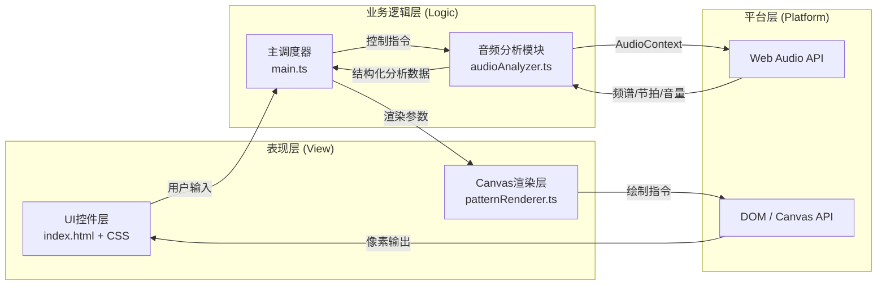

## 1. 架构设计



**数据流向说明：**
1. 用户通过UI（文件上传/麦克风按钮）触发音频输入，`main.ts` 创建 AudioContext 并初始化 `audioAnalyzer.ts`
2. `audioAnalyzer.ts` 每帧调用 Web Audio API 获取 FFT 数据，计算频谱（128频段）、节拍强度（0-1）、RMS音量
3. `main.ts` 动画循环（requestAnimationFrame）接收分析数据，传递给 `patternRenderer.ts`
4. `patternRenderer.ts` 维护图案状态数组，根据音频数据更新每个图案的位置、大小、颜色、旋转、透明度，最终绘制到 Canvas

## 2. 技术选型

- **前端框架**：原生 TypeScript（无框架）+ HTML5 Canvas API
- **构建工具**：Vite 5.x（原生ESM、HMR热更新）
- **音频处理**：Web Audio API（AnalyserNode、AudioContext、getByteFrequencyData、getByteTimeDomainData）
- **类型系统**：TypeScript 5.x 严格模式（strict: true）
- **样式方案**：原生 CSS + CSS 变量 + @media 响应式查询

**选型理由：**
- 性能敏感场景（60fps Canvas绘制）使用原生TS避免框架虚拟DOM开销
- Vite提供极速冷启动和HMR，适合创意编程迭代
- Web Audio API为浏览器原生能力，无需额外音频处理库

## 3. 文件结构与职责

| 文件路径 | 职责 | 依赖 | 被依赖 |
|----------|------|------|--------|
| `package.json` | 项目元信息、依赖声明、启动脚本（npm run dev） | - | - |
| `index.html` | 入口页面，挂载Canvas和所有UI控件 | - | - |
| `vite.config.js` | Vite构建配置（端口、server等） | - | - |
| `tsconfig.json` | TypeScript严格模式配置（DOM+ESNext类型） | - | - |
| `src/main.ts` | 主入口，初始化音频上下文、分析器、渲染引擎，驱动RAF动画循环调度 | `audioAnalyzer.ts`, `patternRenderer.ts` | - |
| `src/audioAnalyzer.ts` | 音频分析模块，封装AnalyserNode，输出频谱/节拍/RMS结构化数据 | Web Audio API | `main.ts` |
| `src/patternRenderer.ts` | 图案渲染模块，管理5种图案实例，根据音频数据更新并绘制到Canvas | Canvas 2D API | `main.ts` |
| `src/styles.css` | 全局样式，深色主题、响应式布局、自定义滑块、按钮动画 | - | `index.html` |

## 4. 核心数据结构

### 4.1 音频分析输出 (AudioAnalysisData)
```typescript
interface AudioAnalysisData {
  frequencyData: Uint8Array;    // 128频段FFT频谱数据，值范围0-255
  timeDomainData: Uint8Array;   // 时域波形数据
  beatIntensity: number;        // 节拍强度 0-1
  rmsVolume: number;            // RMS音量 0-1
  lowBandEnergy: number;        // 低频段(0-20)归一化能量 0-1
  midBandEnergy: number;        // 中频段(20-80)归一化能量 0-1
  highBandEnergy: number;       // 高频段(80-128)归一化能量 0-1
  isBeat: boolean;              // 当前帧是否检测到节拍
}
```

### 4.2 图案状态基类 (PatternState)
```typescript
interface PatternState {
  id: number;
  x: number;                    // 中心X坐标
  y: number;                    // 中心Y坐标
  scale: number;                // 尺寸缩放
  rotation: number;             // 旋转角度(弧度)
  alpha: number;                // 透明度 0-1
  hue: number;                  // HSL色相
  saturation: number;           // HSL饱和度
  lightness: number;            // HSL亮度
  velocityX?: number;           // X方向速度(粒子用)
  velocityY?: number;           // Y方向速度(粒子用)
  life?: number;                // 剩余生命周期
}
```

### 4.3 渲染参数 (RenderParams)
```typescript
interface RenderParams {
  patternMode: 'circle' | 'polygon' | 'spiral' | 'particles' | 'waveform';
  beatThreshold: number;        // 节拍检测阈值 0-1，默认0.5
  saturation: number;           // 颜色饱和度 0-100，默认70
  particleCount: number;        // 粒子数量 10-200，默认50
  sizeScale: number;            // 图案尺寸缩放 0.5-2.0，默认1.0
  glow: { enabled: boolean; intensity: number };      // 辉光效果
  trail: { enabled: boolean; intensity: number };     // 残影效果
  mosaic: { enabled: boolean; blockSize: number };    // 马赛克效果
}
```

## 5. 关键算法说明

### 5.1 频谱-颜色映射
- 低频段(0-20)：HSL 色相 0→30（红→橙）
- 中频段(20-80)：HSL 色相 120→220（绿→蓝）
- 高频段(80-128)：HSL 色相 270→330（紫→粉）
- 某频段能量>0.3阈值时，图案颜色切换为该频段映射色

### 5.2 节拍检测算法
- 维护历史RMS音量滑动窗口（约43帧/0.7s）
- 当前RMS > 窗口平均值 × 阈值（默认1.3）且 beatIntensity > 0.5 判定为节拍
- 检测到节拍后设置30帧冷却期避免重复触发

### 5.3 节拍爆发动画
- 检测到节拍时，所有图案位置重置到画布中心
- 尺寸瞬间放大至1.5倍，通过 easeOutCubic 缓动函数在15帧内渐变恢复原始尺寸
- easeOutCubic: `t => 1 - Math.pow(1 - t, 3)`

### 5.4 性能优化策略
- Canvas 2D 使用 `save()`/`restore()` 最小化状态切换
- 粒子模式下对象池复用，避免频繁GC
- FFT尺寸固定为256（输出128频段），平衡精度与性能
- 残影效果使用低 alpha（0.02）覆盖半透明矩形而非逐像素操作
