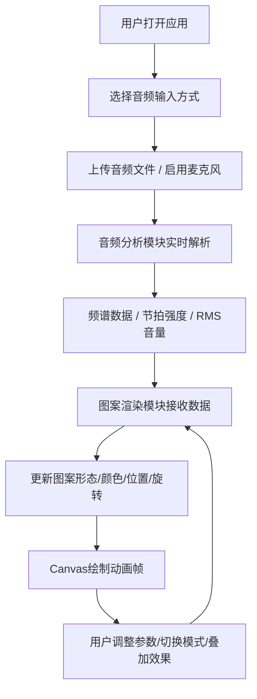

## 1. 产品概述

音频驱动动态图案生成器——面向数字艺术创作者和音乐可视化爱好者的实时音画联觉工具，通过解析音频频谱、节拍和音量动态驱动多种几何图案形态变化，创造沉浸式视觉艺术体验。

- 核心价值：将声音转化为可视的动态几何艺术，支持自定义效果叠加，为创作者提供实时互动的音乐可视化创作平台
- 目标用户：数字艺术创作者、音乐可视化设计师、VJ现场演出人员、音乐爱好者

## 2. 核心功能

### 2.1 功能模块

1. **音频输入模块**：文件上传（MP3/WAV/OGG）、麦克风实时输入
2. **音频分析模块**：128频段FFT频谱分析、节拍检测、RMS音量计算
3. **图案渲染模块**：5种动态图案模式（圆形脉冲、多边形旋转、螺旋线生长、粒子簇扩散、波形轨迹）
4. **视觉效果模块**：辉光、残影、马赛克叠加效果
5. **参数控制模块**：节拍阈值、颜色饱和度、粒子数量、图案尺寸缩放
6. **响应式UI模块**：桌面端底部操作栏+左上角参数面板，移动端侧边栏+底部抽屉

### 2.2 页面详情

| 页面名称 | 模块名称 | 功能描述 |
|-----------|-------------|---------------------|
| 主应用页 | Canvas画布 | 全屏自适应，实时渲染音频驱动的动态图案 |
| 主应用页 | 底部操作栏 | 文件上传按钮、麦克风开关、5种图案模式切换按钮 |
| 主应用页 | 左上参数面板 | 节拍阈值滑块、颜色饱和度滑块、粒子数量滑块、图案尺寸缩放滑块 |
| 主应用页 | 效果控制 | 辉光/残影/马赛克三种效果独立开关及强度调节 |

## 3. 核心流程

用户打开应用 → 选择音频输入方式（上传文件或启用麦克风）→ 选择图案模式 → 调整参数面板的滑块 → 开启叠加视觉效果 → 实时观看音画联觉动画

## 4. 用户界面设计

### 4.1 设计风格
- **主色调**：深色背景 #0A0A0A，主色 #00E5FF（青色），辅助色 #7C4DFF（紫色），强调色 #FF4081（粉红）
- **按钮风格**：圆角矩形，悬浮缓动 0.2s，点击涟漪效果
- **字体**：现代无衬线字体，亮色文字在深色背景上保持高对比度
- **布局风格**：全屏画布 + 浮动控制面板，毛玻璃半透明效果
- **图标风格**：简约线条几何图标，选中时发光动画

### 4.2 页面设计详情

| 页面名称 | 模块名称 | UI元素 |
|-----------|-------------|-------------|
| 主应用页 | Canvas画布 | 全屏黑色背景，动态几何图案居中渲染 |
| 主应用页 | 底部操作栏 | 高度60px，深灰#1E1E1E半透明，圆角按钮居中排列 |
| 主应用页 | 左上参数面板 | 宽度220px，毛玻璃效果，自定义渐变滑块（#00E5FF→#7C4DFF） |
| 主应用页 | 图案模式按钮 | 圆形图标，选中时外围发光脉冲动画 |
| 主应用页 | 麦克风按钮 | 按下时红色圆点闪烁指示录音状态 |

### 4.3 响应式设计
- **桌面端（≥768px）**：底部固定水平操作栏（高60px），左上角固定参数面板（宽220px）
- **移动端（<768px）**：左侧垂直侧边栏（宽60px），参数面板折叠为底部弹出式抽屉
- 所有交互反馈缓动时间 0.2-0.3s，按钮点击涟漪扩散效果

### 4.4 性能与交互约束
- 1080p分辨率下稳定60fps
- 音频分析延迟低于20ms
- 粒子数≤100时单帧绘制≤16ms
- 节拍检测强度>0.5时触发图案爆发效果（easeOutCubic缓动）
