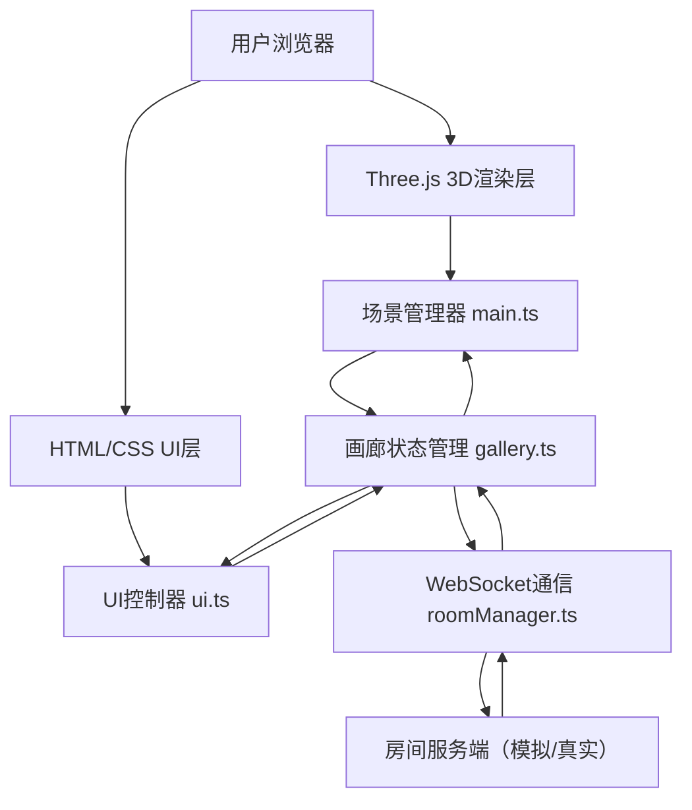
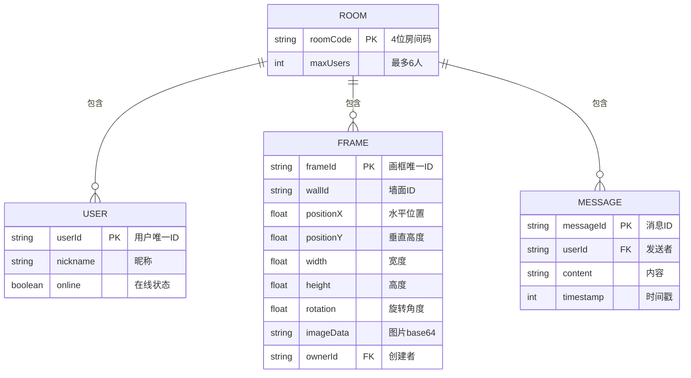

## 1. 架构设计



## 2. 技术说明

- **前端框架**：TypeScript + Vite
- **3D渲染**：Three.js @0.160.x
- **实时通信**：WebSocket（内置模拟服务，支持真实WS服务替换）
- **UI层**：原生HTML/CSS + TypeScript DOM操作
- **状态管理**：gallery.ts 内部状态对象 + 事件回调机制

## 3. 文件结构

| 文件路径 | 用途 |
|----------|------|
| package.json | 项目依赖：three、@types/three、typescript、vite |
| index.html | 入口页面，全屏Canvas + UI容器 |
| vite.config.js | Vite构建配置 |
| tsconfig.json | TypeScript严格模式配置 |
| src/main.ts | 主入口：初始化场景、相机、渲染器、控制器、动画循环 |
| src/gallery.ts | 画廊状态管理：画框列表、用户列表、消息列表 |
| src/roomManager.ts | WebSocket连接管理：连接、重连、消息收发 |
| src/ui.ts | UI渲染：用户面板、聊天框、编辑面板、视图切换 |

## 4. 消息协议定义

```typescript
// 消息类型枚举
type MessageType = 
  | 'join_room'       // 加入房间
  | 'room_state'      // 房间完整状态（新用户同步）
  | 'user_joined'     // 用户加入通知
  | 'user_left'       // 用户离开通知
  | 'user_status'     // 用户状态变更
  | 'place_frame'     // 放置画框
  | 'update_frame'    // 更新画框
  | 'delete_frame'    // 删除画框
  | 'send_message'    // 发送聊天消息
  | 'chat_message';   // 聊天消息广播

// 画框数据结构
interface FrameData {
  id: string;
  wallId: 'north' | 'south' | 'east' | 'west';
  positionX: number;      // 墙面水平位置
  positionY: number;      // 垂直高度（离地面0.5-3）
  width: number;          // 宽度（1-4单位）
  height: number;         // 高度（按比例）
  rotation: number;       // 旋转角度（-30到30度）
  imageData: string;      // base64图片数据
  ownerId: string;        // 创建者用户ID
}

// 用户数据结构
interface UserData {
  id: string;
  nickname: string;
  online: boolean;
}

// 聊天消息结构
interface ChatMessage {
  id: string;
  userId: string;
  nickname: string;
  content: string;
  timestamp: number;
}
```

## 5. 数据模型



## 6. 性能优化策略

- **对象池**：画框网格材质复用，避免重复创建Three.js对象
- **平滑动画**：使用requestAnimationFrame + 线性插值实现0.5秒过渡
- **状态节流**：画框拖拽操作节流发送，每50ms最多发送一次更新
- **纹理优化**：图片压缩后传输，使用Three.js纹理缓存
- **碰撞检测**：简化AABB碰撞，仅检测相机与四面墙的距离
- **帧率控制**：自适应渲染帧率，在低端设备上降低渲染质量
