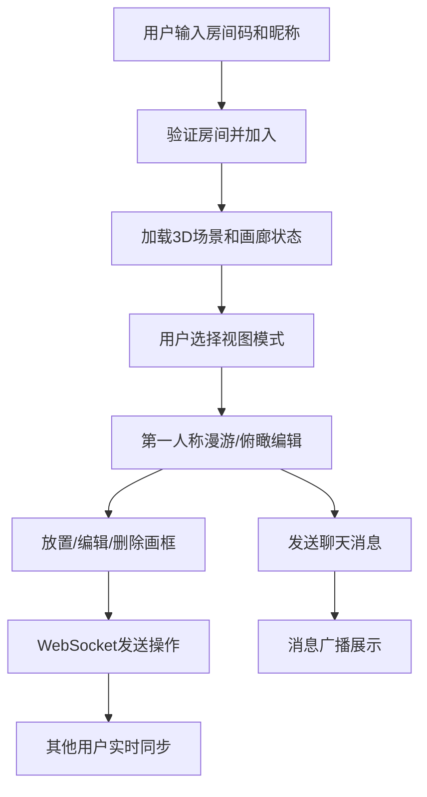

## 1. 产品概述

在线多人协作虚拟画廊策展工具，为艺术爱好者、策展人、学生群体提供共享的3D虚拟画廊空间，支持自由布置画框、上传数字画作、实时协作编辑，适用于线上艺术展、虚拟毕业设计展及美术教学场景。

- 核心价值：打破物理空间限制，提供沉浸式虚拟策展体验，支持多人实时协作
- 目标用户：艺术爱好者、独立策展人、美术专业学生、教师

## 2. 核心功能

### 2.1 用户角色
| 角色 | 加入方式 | 核心权限 |
|------|----------|----------|
| 普通用户 | 输入4位房间码+昵称 | 加入房间、放置/编辑/删除画框、上传图片、发送聊天消息、切换视图模式 |

### 2.2 功能模块
1. **房间系统**：4个独立画廊房间，通过4位房间码加入，每房间最多6人
2. **3D画廊场景**：网格地面、米色墙面、第一人称漫游、俯瞰编辑
3. **画框管理**：放置、调整大小、旋转、垂直移动、删除、更换图片
4. **实时同步**：WebSocket双向通信，所有操作300ms内同步
5. **用户系统**：在线状态显示、用户列表
6. **聊天系统**：文字消息发送、气泡展示

### 2.3 页面详情
| 页面名称 | 模块名称 | 功能描述 |
|----------|----------|----------|
| 主界面 | 加载屏幕 | 淡紫色旋转圆环加载动画，进入后展示画廊 |
| 主界面 | 顶部用户面板 | 房间人数、用户昵称列表、在线状态圆点 |
| 主界面 | 右上角视图切换 | 第一人称/俯瞰模式切换按钮 |
| 主界面 | 底部聊天框 | 消息输入、历史消息气泡展示 |
| 主界面 | 画框编辑面板 | 大小调整、旋转角度、垂直位置、删除、换图 |
| 主界面 | 3D画廊场景 | 网格地面、米色墙面、画框渲染、光照效果 |

## 3. 核心流程

用户输入房间码和昵称 → 验证并加入房间 → 加载3D画廊场景和当前状态 → 用户选择视图模式 → 在墙面放置/编辑画框 → 操作通过WebSocket实时同步给其他用户 → 用户可发送聊天消息互动

## 4. 用户界面设计

### 4.1 设计风格
- **主色调**：淡紫 #A78BFA
- **强调色**：亮橙 #F97316
- **背景色**：深色 #1E1E2E
- **卡片色**：#2A2A3C
- **地面网格**：深灰 #2D2D2D
- **墙面颜色**：淡米色 #F5F0E8
- **按钮风格**：圆角、点击缩放微交互
- **字体**：现代无衬线字体，清晰可读
- **布局风格**：3D场景全屏，UI元素悬浮叠加
- **动效**：画框状态变化0.5秒平滑过渡，按钮点击缩放反馈，加载动画旋转圆环

### 4.2 页面设计概述
| 页面名称 | 模块名称 | UI元素 |
|----------|----------|--------|
| 主界面 | 加载屏幕 | 居中淡紫色旋转圆环、半透明背景 |
| 主界面 | 顶部用户面板 | 深色半透明卡片、用户头像/昵称/状态圆点、人数统计 |
| 主界面 | 视图切换按钮 | 右上角悬浮、图标+文字、淡紫主色调 |
| 主界面 | 底部聊天框 | 消息输入框、发送按钮、气泡消息（昵称+时间+内容） |
| 主界面 | 画框编辑面板 | 深色卡片、滑块控件、数值输入、删除按钮、换图按钮 |
| 主界面 | 3D场景 | 网格地面、米色墙面、木质画框、墙面泛光、顶部渐变柔光 |

### 4.3 响应式
- 桌面端优先（1024px以上）
- UI元素使用百分比和视窗单位自适应
- 画框编辑面板居中弹出，最大宽度限制

### 4.4 3D场景指导
- **环境**：封闭房间空间，4面墙+地面+天花板
- **光照**：环境光+方向光，用户接近墙面时产生泛光效果，画面顶部渐变柔光
- **相机**：第一人称视角（鼠标旋转、WASD移动、碰撞检测）和俯瞰视角（正交/透视俯视）
- **交互**：墙面点击放置画框、画框点击选中编辑、俯瞰模式框选批量操作
- **动效**：画框位置/旋转/大小变化0.5秒平滑插值
- **性能**：6人+20画框场景保持30帧以上
