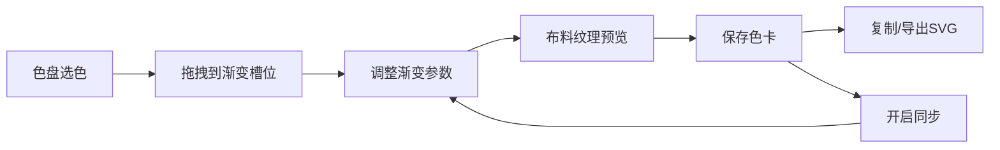

## 1. 产品概述

本项目是一个微型交互式中国传统色卡与渐变生成器，面向设计师和绘画爱好者，提供从传统色系取色、创建自定义渐变、布料纹理预览、色卡收藏与导出的完整工作流。

- 目标用户：UI/UX设计师、插画师、传统美学爱好者
- 核心价值：将中国传统色彩美学数字化，降低配色门槛，提供即时视觉反馈

## 2. 核心功能

### 2.1 功能模块

1. **色盘面板**：36种中国传统色圆形网格展示，悬停提示，点击选中，拖拽取色
2. **渐变编辑器**：三槽位颜色配置，渐变类型（线性/径向）与角度选择
3. **布料纹理预览**：丝绸、棉麻、帆布三种纹理叠加的渐变实时预览
4. **色卡收藏栏**：保存配色方案，复制HEX，导出SVG，同步切换
5. **响应式布局**：桌面端左右分栏，移动端上下堆叠

### 2.2 页面详情

| 页面名称 | 模块名称 | 功能描述 |
|---------|---------|---------|
| 主页面 | 色盘面板 | 半径180px圆形网格，36种传统色，每色直径28px，悬停显示色名+HEX，金色发光选中边框，支持拖拽 |
| 主页面 | 渐变编辑器 | 3个40x40px圆角槽位接收拖入颜色，渐变类型（线性0°/45°/90°/135°、径向中心/左上/右下） |
| 主页面 | 布料预览区 | 300x200px canvas预览，丝绸微光/棉麻纤维/帆布编织三种纹理，0.3s淡入淡出切换 |
| 主页面 | 收藏栏 | 横向滚动色卡列表（隐藏滚动条），200x100px圆角卡片，复制/导出图标，月牙形同步toggle |

## 3. 核心流程

用户选择传统色 → 拖拽到渐变槽位 → 调整渐变类型与角度 → 选择布料纹理预览 → 保存色卡到收藏栏 → 复制HEX或导出SVG → 可开启同步反向回传编辑区

## 4. 用户界面设计

### 4.1 设计风格

- **主色**：米白#FDF8F0背景，深棕#3E2723文字
- **强调色**：金色#D4A853 → #B8860B渐变按钮，发光金色选中边框
- **字体**：衬线体配合东方美学韵味
- **交互动效**：所有过渡使用0.2s cubic-bezier ease，拖拽阴影drop-shadow 0 4px 12px rgba(0,0,0,0.3)

### 4.2 页面设计概览

| 模块 | UI元素 |
|------|--------|
| 色盘面板 | 圆形网格布局，色块悬停放大，金色发光边框选中态 |
| 渐变编辑器 | 圆角方块槽位，拖拽缩放动画0.95→1.0，类型角度选择器 |
| 布料预览 | Canvas渲染，纹理叠加半透明层，切换淡入淡出 |
| 色卡收藏 | 圆角卡片内阴影inset 0 2px 6px rgba(0,0,0,0.2)，月牙形toggle渐变#F5F5F5→#D4A853 |

### 4.3 响应式

- 桌面端（≥768px）：左侧色盘 + 右侧编辑区并排布局
- 移动端（<768px）：上下堆叠，色盘改为4列正方形网格（24x24px），收藏栏高度80→120px，字体0.9倍

### 4.4 性能指标

- 色盘渲染和渐变预览更新 ≤ 50ms
- 拖拽操作 60fps 流畅
- 收藏栏滚动使用transform优化无卡顿
