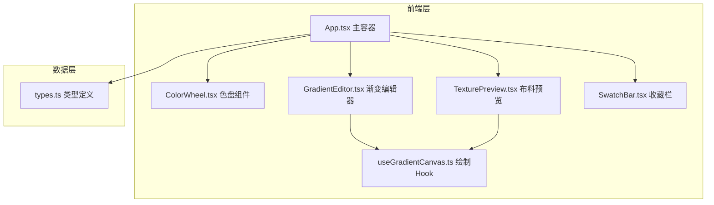

## 1. 架构设计



## 2. 技术栈说明

- **前端框架**：React 18 + TypeScript
- **构建工具**：Vite 5 + @vitejs/plugin-react
- **Canvas渲染**：原生2D Canvas API绘制渐变与纹理
- **状态管理**：React useState/useCallback（轻量场景无需zustand）
- **样式方案**：纯CSS + CSS Modules（避免Tailwind，满足精细东方美学设计需求）

## 3. 文件结构

```
auto76/
├── index.html                 # HTML入口
├── vite.config.js            # Vite配置
├── tsconfig.json             # TS配置
├── package.json              # 依赖与脚本
└── src/
    ├── main.tsx              # React入口
    ├── App.tsx               # 主容器组件
    ├── types.ts              # 类型定义
    ├── hooks/
    │   └── useGradientCanvas.ts  # Canvas绘制Hook
    └── components/
        ├── ColorWheel.tsx    # 色盘组件
        ├── GradientEditor.tsx # 渐变编辑器
        ├── TexturePreview.tsx # 布料预览
        └── SwatchBar.tsx     # 收藏栏
```

## 4. 类型定义

```typescript
// ColorInfo: 颜色信息
interface ColorInfo {
  name: string;   // 色名：胭脂、竹青等
  hex: string;    // HEX值
  rgb: { r: number; g: number; b: number };
}

// GradientType: 渐变类型
type GradientType = 'linear' | 'radial';

// GradientConfig: 渐变配置
interface GradientConfig {
  colorList: (ColorInfo | null)[];  // 3个槽位
  type: GradientType;
  angle: number | 'center' | 'top-left' | 'bottom-right';
}

// Swatch: 色卡记录
interface Swatch {
  id: string;
  gradientConfig: GradientConfig;
  timestamp: number;
  isSynced: boolean;
}

// TextureType: 纹理类型
type TextureType = 'silk' | 'cotton' | 'canvas';
```

## 5. 核心算法说明

### 5.1 色盘圆形网格布局算法
- 以中心点为圆心，半径180px，按极坐标分布36个色块
- 每圈色块数量递增，避免中心拥挤

### 5.2 Canvas渐变绘制
- **线性渐变**：根据角度计算起点/终点坐标
- **径向渐变**：根据位置（中心/左上/右下）确定圆心与半径
- **纹理叠加**：使用离屏Canvas生成纹理pattern，再通过globalAlpha合成

### 5.3 SVG导出
- 动态生成100x50 SVG，内含`<linearGradient>`或`<radialGradient>`定义与`<rect>`引用
- 使用Blob + URL.createObjectURL触发下载

## 6. 性能优化策略

1. **Canvas重绘节流**：渐变参数变化时使用requestAnimationFrame批量更新
2. **纹理缓存**：三种纹理pattern预生成缓存，避免重复计算
3. **收藏栏滚动**：使用`transform: translateX`而非`scrollLeft`触发GPU加速
4. **拖拽优化**：使用CSS transform实现拖拽跟随，避免reflow
5. **React渲染优化**：使用React.memo包装子组件，useMemo/useCallback避免不必要重渲染
