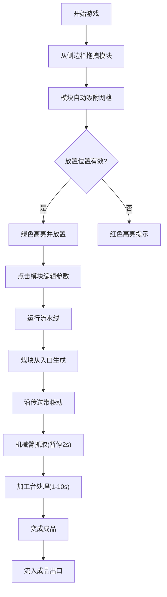

## 1. 产品概述
蒸汽朋克风格2D工厂流水线模拟器，玩家通过拖拽模块构建自动化生产线，实时观察物品加工流动过程。
- 面向休闲游戏爱好者和工厂建造类游戏玩家，提供创造性的流水线搭建体验
- 核心价值在于直观的可视化建造系统和流畅的物品流动态效果

## 2. 核心特性

### 2.1 用户角色
无需用户注册，单用户游戏体验。

### 2.2 功能模块
1. **主游戏界面**：16x12网格画布、模块侧边栏、统计面板
2. **模块系统**：传送带（直型/弯型）、机械臂、加工台（圆锯/锤锻/熔炉）、原料入口、成品出口
3. **编辑系统**：拖拽放置、点击编辑、删除功能、布局保存/加载
4. **物品流动系统**：原料生成、沿传送带移动、机械臂抓取、加工台处理、成品输出
5. **统计系统**：实时数据监控和产出率计算

### 2.3 页面详情
| 页面名称 | 模块名称 | 功能描述 |
|-----------|-------------|---------------------|
| 主游戏界面 | 网格画布 | 16x12网格，支持模块吸附放置，浅灰色网格线 |
| 主游戏界面 | 模块侧边栏 | 深棕底色，展示5种可拖拽模块，悬停金色边框 |
| 主游戏界面 | 编辑菜单 | 半透明深色背景，调整传送带方向、机械臂角度、加工台耗时 |
| 主游戏界面 | 统计面板 | 半透明钢化玻璃效果，显示物品数量、产出率、处理时间 |
| 主游戏界面 | 物品流动画 | 煤块沿传送带移动，机械臂旋转动画，加工台旋转效果 |

## 3. 核心流程
玩家从侧边栏拖拽模块到网格，构建从原料入口到成品出口的流水线。煤块从煤斗生成，沿传送带移动，经过机械臂抓取和加工台处理，最终变成金币/铁锭/齿轮流入成品箱。

## 4. 用户界面设计
### 4.1 设计风格
- 主色调：深棕(#4A3728)、古铜(#B87333)、暗金(#D4AF37)、灰色金属(#808080)
- 网格线：浅灰(#C0C0C0)，每格60x60像素(移动端40x40)
- 模块图标：圆角矩形，渐变填充(#5C4033到#4A3728)，悬停金色边框
- 画布：8px圆角边框，2px铜色外边框
- 统计面板：金属感边框(浅金#D4AF37，2px)，渐变深蓝灰背景(#1E2A38到#2C3E50)

### 4.2 页面设计概览
| 页面名称 | 模块名称 | UI元素 |
|-----------|-------------|-------------|
| 主游戏界面 | 网格画布 | 16x12浅色网格、模块放置区、鼠标跟随高亮 |
| 主游戏界面 | 侧边栏 | 深棕背景、模块卡片、拖拽缩放动画(1.1倍，0.2s过渡) |
| 主游戏界面 | 编辑菜单 | 半透明#1A1A1A背景、圆角、方向箭头按钮、滑块控件 |
| 主游戏界面 | 统计面板 | 钢化玻璃半透明效果、金属边框、渐变背景 |

### 4.3 响应式设计
- 桌面端(≥800px)：侧边栏位于右侧，网格单元格60x60像素
- 移动端(<800px)：侧边栏折叠为底部横条，网格单元格40x40像素，字体和图标自动缩放

### 4.4 动画效果
- 所有动画使用requestAnimationFrame驱动，目标60fps
- 机械臂旋转动画、物品平滑移动、加工台图标旋转
- 模块删除时红色闪烁3次(每200ms)后消失
- 拖拽时模块放大1.1倍，过渡0.2s
