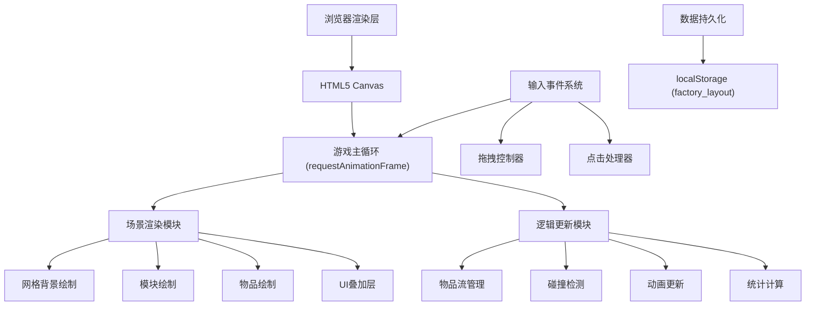

## 1. 架构设计


## 2. 技术描述
- 前端：TypeScript + HTML5 Canvas + Vite
- 构建工具：Vite 5.x
- 无后端服务，纯前端实现
- 数据存储：localStorage（布局保存/加载）
- 无第三方UI库，全部Canvas原生绘制

## 3. 文件结构
| 文件路径 | 用途 |
|-------|---------|
| /package.json | 项目依赖和启动脚本配置 |
| /index.html | 入口页面，包含全屏Canvas和UI元素 |
| /vite.config.js | Vite构建配置 |
| /tsconfig.json | TypeScript严格模式配置 |
| /src/main.ts | 游戏主循环，场景初始化、控制面板、拖拽逻辑、物品流管理、碰撞检测 |
| /src/modules.ts | 所有工厂模块类定义：传送带、机械臂、加工台等属性及渲染方法 |

## 4. 数据模型

### 4.1 模块类型定义
```typescript
type ModuleType = 'conveyor_straight' | 'conveyor_curve' | 'arm' | 'saw' | 'hammer' | 'furnace' | 'input' | 'output';
type Direction = 'up' | 'down' | 'left' | 'right';

interface BaseModule {
  id: string;
  type: ModuleType;
  gridX: number;
  gridY: number;
  isPlacing: boolean;
  isDeleting: boolean;
  deleteFlashCount: number;
}

interface ConveyorModule extends BaseModule {
  type: 'conveyor_straight' | 'conveyor_curve';
  direction: Direction;
}

interface ArmModule extends BaseModule {
  type: 'arm';
  targetAngle: number;
  currentAngle: number;
  isGrabbing: boolean;
  grabTimer: number;
}

interface ProcessorModule extends BaseModule {
  type: 'saw' | 'hammer' | 'furnace';
  processTime: number;
  processing: boolean;
  processProgress: number;
  iconRotation: number;
}

interface Item {
  id: string;
  type: 'coal' | 'gold' | 'iron' | 'gear';
  x: number;
  y: number;
  direction: Direction;
  speed: number;
  paused: boolean;
  pauseTimer: number;
  processing: boolean;
}
```

### 4.2 游戏状态
```typescript
interface GameState {
  modules: BaseModule[];
  items: Item[];
  selectedModule: BaseModule | null;
  showEditMenu: boolean;
  editMenuTimer: number;
  dragData: { type: ModuleType; offsetX: number; offsetY: number } | null;
  stats: {
    totalItems: number;
    inProgress: number;
    finishedItems: number;
    productionRate: number;
    avgProcessTime: number;
    recentFinishedTimes: number[];
  };
}
```

## 5. 性能优化策略
- 物品对象池：预创建Item对象避免频繁GC
- 离屏Canvas缓存：静态模块预渲染到离屏Canvas
- 空间分区：网格索引加速碰撞和邻接查询
- 帧率监控：动态调整渲染精度
- 统计数据节流：产出率计算节流至每秒更新
