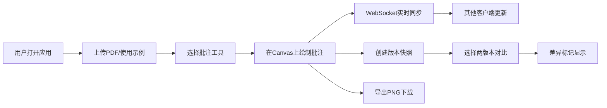

## 1. 产品概述

实时协同PDF批注应用，解决远程团队在审阅合同、设计稿或论文时难以在同一个文档上留下同步批注和版本对比的问题。支持PDF上传渲染、实时批注同步、版本快照对比、PNG导出等核心功能。

## 2. 核心功能

### 2.1 功能模块

1. **PDF查看器**：PDF上传解析、Canvas渲染、缩放（50%-200%）、拖拽平移、缩略图面板、示例PDF生成
2. **批注工具**：荧光笔高亮（黄色半透明）、文本框批注（淡黄背景）、批注选择/拖动/删除、时间戳与用户名
3. **实时协同**：WebSocket批注同步、在线人数显示、1秒内视图更新
4. **版本对比**：快照保存（最多5个）、双栏并排对比、差异颜色标记（红/蓝）
5. **导出功能**：当前页面PNG导出下载

### 2.2 页面详情

| 页面名称 | 模块名称 | 功能描述 |
|-----------|-------------|---------------------|
| 主页面 | 顶部工具栏 | 上传按钮、批注工具切换、快照管理、导出按钮、在线人数徽标 |
| 主页面 | 左侧缩略图面板 | 可收起/展开（汉堡菜单）、各页缩略图显示、点击跳转 |
| 主页面 | PDF查看区域 | 多页Canvas渲染、缩放平移、批注覆盖层 |
| 主页面 | 批注工具条 | 荧光笔/文本框切换、工具选中状态指示 |
| 主页面 | 版本对比面板 | 快照列表、版本A/B选择、双栏对比视图、差异标记 |

## 3. 核心流程

用户打开应用 → 上传PDF或使用示例PDF → 选择批注工具（荧光笔/文本框） → 在页面上绘制批注 → 批注通过WebSocket实时同步到其他客户端 → 可创建快照保存当前批注状态 → 选择两个版本进行并排对比查看差异 → 可将当前带批注页面导出为PNG

## 4. 用户界面设计

### 4.1 设计风格

- **主色调**：浅灰底色 #F0F2F5，工具栏白色 #FFFFFF，阴影 #E0E0E0
- **强调色**：荧光笔黄 #FFD700，文本框淡蓝 #87CEEB，选中边框 #4A90D9，在线人数绿色背景
- **按钮样式**：圆角矩形 border-radius:8px，悬停 #E8E8E8，点击 #D0D0D0 缩放0.95，过渡200ms ease-out
- **工具条**：左侧悬浮半透明毛玻璃 backdrop-filter:blur(6px)
- **布局**：顶部工具栏 + 左侧缩略图（可收起） + 中央PDF区域 + 左侧批注工具条（悬浮）

### 4.2 页面设计概述

| 页面名称 | 模块名称 | UI元素 |
|-----------|-------------|-------------|
| 主页面 | 顶部工具栏 | 白色背景、底部阴影、按钮圆角、在线人数绿色徽标 |
| 主页面 | 批注工具条 | 毛玻璃悬浮、黄色荧光笔按钮、蓝色文本框按钮、选中时蓝色外框 |
| 主页面 | PDF查看区域 | Canvas渲染、支持缩放平移、批注覆盖层透明叠加 |
| 主页面 | 缩略图面板 | 默认收起、300ms动画展开、100px宽圆角缩略图 |

### 4.3 响应式设计

- 桌面端（≥768px）：工具栏单行、工具条左侧悬浮、缩略图侧边展开
- 移动端（<768px）：工具栏两行排列、工具条底部固定、缩略图全屏覆盖

### 4.4 性能指标

- 批注同步延迟 ≤ 500ms
- 页面渲染帧数 ≥ 30fps
- 版本切换响应 < 200ms
