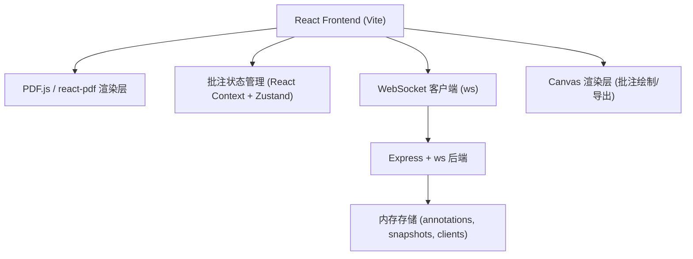
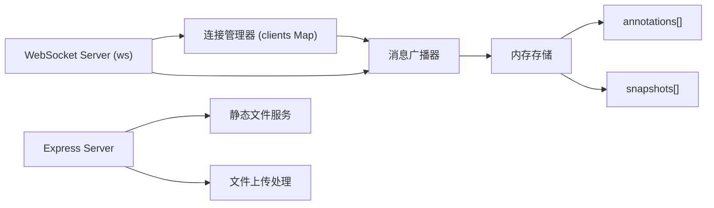
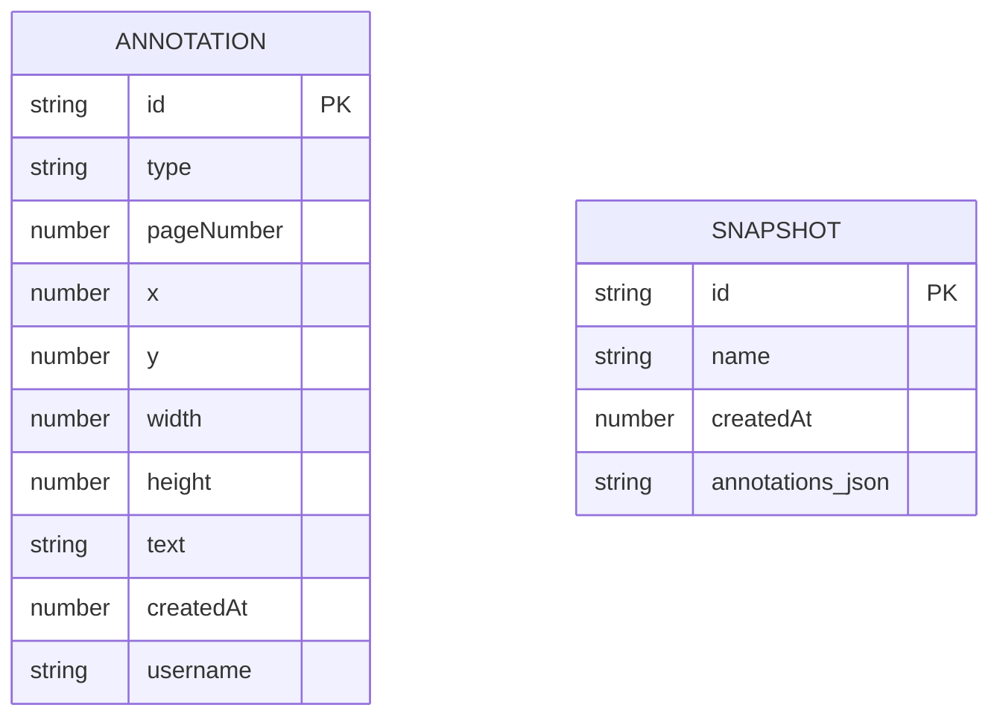

## 1. 架构设计



## 2. 技术描述

- **前端**：React 18 + TypeScript + Vite + react-pdf (pdfjs-dist)
- **后端**：Express 4 + ws (WebSocket) + cors + uuid
- **状态管理**：React Context（全局批注状态） + useState（局部状态）
- **渲染引擎**：PDF.js 解析PDF，Canvas 渲染页面和批注覆盖层
- **无数据库**：使用内存数组存储，重启即清空

## 3. 路由定义

| 路由 | 用途 |
|-------|---------|
| / | 主应用页面（PDF查看、批注、对比、导出） |
| /ws | WebSocket连接端点 |
| /api/upload | PDF文件上传接口 |
| /api/pdf/:page | 获取PDF页面渲染数据 |

## 4. API 定义

### WebSocket 消息协议

```typescript
// 客户端 → 服务端
interface ClientMessage {
  type: 'add' | 'move' | 'delete' | 'sync' | 'snapshot_create';
  payload: any;
}

// 服务端 → 客户端
interface ServerMessage {
  type: 'annotation_add' | 'annotation_move' | 'annotation_delete' | 
        'user_count' | 'sync_all' | 'snapshot_list';
  payload: any;
}

// 批注数据结构
interface Annotation {
  id: string;
  type: 'highlight' | 'textbox';
  pageNumber: number;
  x: number;        // 相对页面比例坐标 0-1
  y: number;
  width: number;    // 相对页面比例 0-1
  height: number;
  text?: string;    // textbox类型专用
  createdAt: number;
  username: string;
}

// 快照数据结构
interface Snapshot {
  id: string;
  name: string;
  createdAt: number;
  annotations: Annotation[];
}
```

## 5. 服务端架构



## 6. 数据模型

### 6.1 数据模型定义



### 6.2 服务端内存结构

```typescript
// 内存存储（无需持久化）
const store = {
  annotations: Annotation[] = [],
  snapshots: Snapshot[] = [],
  clients: Map<string, WebSocket> = new Map(),
  clientCount: number = 0
};
```

## 7. 文件结构

```
.
├── package.json
├── index.html
├── vite.config.js
├── tsconfig.json
├── src/
│   ├── main.tsx
│   ├── App.tsx
│   ├── types.ts              # 共享类型定义
│   ├── store.ts              # 全局状态管理
│   ├── components/
│   │   ├── PDFViewer.tsx
│   │   ├── AnnotationToolbar.tsx
│   │   ├── TopToolbar.tsx
│   │   ├── ThumbnailPanel.tsx
│   │   ├── VersionCompare.tsx
│   │   └── AnnotationOverlay.tsx
│   ├── hooks/
│   │   ├── useWebSocket.ts
│   │   └── usePDF.ts
│   └── utils/
│       ├── canvasUtils.ts
│       └── samplePDF.ts
└── src/server.ts             # Express + WebSocket 后端
```
