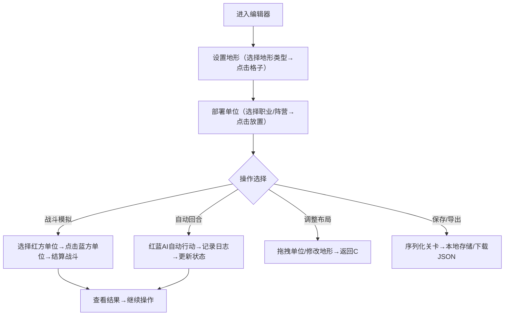

## 1. 产品概述
2D回合制战棋关卡编辑器与测试平台，为战棋爱好者提供可视化工具，快速构思、平衡和验证关卡地形与单位部署策略。
- 主要用户：战棋游戏爱好者、关卡设计师、独立开发者
- 核心价值：降低战棋关卡设计门槛，提供即时可视化验证能力

## 2. 核心功能

### 2.1 功能模块
1. **六边形网格战场编辑器**：20x15格子六边形网格，支持5种地形类型设置
2. **单位部署系统**：支持红蓝双方3种职业单位的放置、拖拽和属性配置
3. **战斗模拟系统**：手动选择敌我单位进行攻击结算，显示战斗结果
4. **AI自动回合系统**：红蓝双方AI自动模拟完整回合，含动作日志
5. **数据持久化**：支持关卡状态保存/加载，JSON导入导出

### 2.2 页面详情
| 页面名称 | 模块名称 | 功能描述 |
|---------|---------|---------|
| 主编辑器 | 六边形网格画布 | 绘制20x15六边形网格，支持地形编辑和单位部署 |
| 主编辑器 | 右侧控制面板 | 地形选择、单位放置、控制按钮组 |
| 主编辑器 | 左侧动作日志 | 滚动显示战斗日志（最大20条） |
| 主编辑器 | 战斗结果浮层 | 显示攻击伤害和单位消亡信息 |

## 3. 核心流程

## 4. 用户界面设计

### 4.1 设计风格
- 主色调：深暗蓝灰背景（#000000页面背景，#1A202C面板背景，#2D3748网格默认底色）
- 地形色：平地#A0AEC0、草地#48BB78、岩石#9C4221、水域#3182CE、高地#D69E2E
- 强调色：黄色高亮#F6E05E（当前行动单位边框），红/蓝阵营色标识单位
- 按钮风格：圆角矩形（背景#4A5568，悬停变#2D3748）
- 字体：无衬线字体，浅色文字#E2E8F0，深色主题
- 图标风格：Emoji图标（⚔️🏹🔮）

### 4.2 页面设计概述
| 页面名称 | 模块名称 | UI元素 |
|---------|---------|--------|
| 主编辑器 | 六边形网格 | 20x15六边形布局，0.8秒淡入动画，边框#4A5568 |
| 主编辑器 | 右侧面板（220px） | 地形按钮组（5个48x48方形按钮）、单位按钮组（3个带emoji图标）、底部控制按钮组 |
| 主编辑器 | 左侧日志区 | 滚动文字容器，深色背景，浅色文字 |
| 主编辑器 | 战斗浮层 | 半透明背景，结果文字动画弹出 |

### 4.3 响应式设计
- 桌面端（≥900px）：右侧固定面板 + 左侧画布布局
- 移动端（<900px）：面板移至画布下方，垂直堆叠布局
- 触摸优化：按钮最小触控区域48x48px

### 4.4 动画与交互
- 网格线0.8秒淡入动画
- 单位移动范围浅色光环（透明度0.3）
- 悬停/点击反馈：颜色变化 + 轻微缩放效果
- 攻击结果：0.5秒延迟展示，当前行动单位0.3秒黄色高亮
