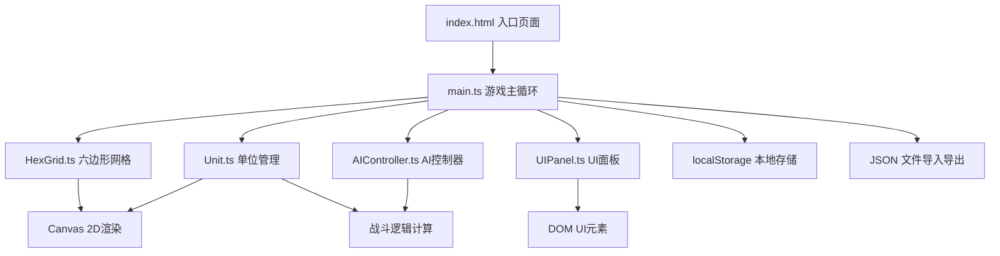

## 1. 架构设计


## 2. 技术描述
- 前端框架：TypeScript + HTML5 Canvas + Vite（纯前端，无后端依赖）
- 构建工具：Vite 5.x
- 语言：TypeScript（严格模式，DOM + ESNext类型）
- 渲染：Canvas 2D API（六边形网格、地形、单位绘制）
- UI交互：原生DOM事件 + CSS（面板、按钮、日志）
- 数据存储：浏览器 localStorage + Blob API（JSON导入导出）

## 3. 文件组织结构
```
project-root/
├── package.json
├── index.html
├── vite.config.js
├── tsconfig.json
└── src/
    ├── main.ts           # 游戏主循环入口，协调各模块
    ├── HexGrid.ts        # 六边形网格类：20x15格子管理、坐标转换、绘制、命中检测
    ├── Unit.ts           # 单位类：阵营/职业/属性/位置/移动范围/战斗逻辑
    ├── AIController.ts   # AI控制器：红蓝AI自动回合、路径搜索、目标选择、日志
    └── UIPanel.ts        # UI面板类：按钮、日志、浮层的创建与事件绑定
```

## 4. 核心数据模型

### 4.1 类型定义
```typescript
// 地形类型
type TerrainType = 'plain' | 'grass' | 'rock' | 'water' | 'highland';
// 单位阵营
type Faction = 'red' | 'blue';
// 单位职业
type UnitClass = 'warrior' | 'archer' | 'mage';

// 格子坐标（轴坐标系q,r）
interface HexCoord { q: number; r: number; }
// 像素坐标
interface Point { x: number; y: number; }

// 地形属性
interface TerrainInfo {
  color: string;
  moveCost: number;      // 移动消耗
  passable: boolean;     // 是否可通行
  defBonus: number;      // 防御加成
  rangeBonus: number;    // 射程加成（弓箭手/法师）
}

// 单位属性
interface UnitStats {
  maxHP: number;
  attack: number;
  move: number;
}

// 单位实例
interface Unit {
  id: string;
  faction: Faction;
  unitClass: UnitClass;
  hp: number;
  position: HexCoord;
  alive: boolean;
}
```

### 4.2 六边形坐标系统
- 采用轴向坐标系（q, r），20列 x 15行
- 六边形边长20像素（pointy-top布局）
- 坐标转换公式：
  - x = size * (√3 * q + √3/2 * r)
  - y = size * (3/2 * r)

## 5. 性能优化
- 渲染：requestAnimationFrame 60FPS循环，脏矩形/状态标记避免全量重绘
- 战斗计算：纯内存运算，目标响应时间<200ms
- AI寻路：BFS算法，剪枝优化，避免重复计算
- 事件防抖：拖拽操作节流处理
