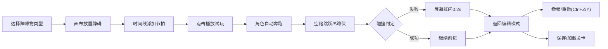

## 1. 产品概述

2D横版卷轴节奏跑酷游戏关卡编辑器与试玩模拟器，面向节奏游戏和跑酷游戏爱好者，解决缺乏可视化工具时难以快速设计、测试和调整关卡节奏的问题。用户可以可视化地放置障碍物、设置节拍标记、实时试玩验证节奏配合，并保存/加载关卡设计。

## 2. 核心功能

### 2.1 用户角色
| 角色 | 注册方式 | 核心权限 |
|------|----------|----------|
| 普通用户 | 无需注册，本地使用 | 编辑关卡、放置障碍物、设置节拍、试玩、保存/加载关卡 |

### 2.2 功能模块
1. **关卡编辑器**：横向无限卷轴画布，支持放置三种障碍物（矮墙、尖刺、移动平台），网格吸附
2. **节拍时间线**：底部节拍时间线，支持添加/删除节拍标记，与障碍物X位置对齐
3. **试玩模拟器**：Q版角色自动奔跑，键盘控制（空格跳跃/S键蹲伏），碰撞判定，节拍音效同步
4. **关卡管理**：保存到localStorage，加载已保存关卡，关卡列表展示
5. **撤销/重做**：支持最近10步操作，Ctrl+Z撤销、Ctrl+Y重做，显示操作步数

### 2.3 页面详情
| 页面名称 | 模块名称 | 功能描述 |
|----------|----------|----------|
| 主编辑页 | 关卡画布 | 1200×600像素画布，#2A2A2E背景，50px网格（#3D3D42），横向滚动，支持障碍物放置 |
| 主编辑页 | 节拍时间线 | 40px高度，#1E1E22背景，支持添加节拍标记（#9B59B6竖线，30px高），与障碍物X位置对齐 |
| 主编辑页 | 控制面板 | 250px宽度（#222226背景），障碍物选择按钮、节拍添加、播放/停止、保存/加载列表、撤销/重做状态 |
| 主编辑页 | 试玩模式 | Q版角色自动奔跑，空格跳跃、S键蹲伏，碰撞失败屏幕红色闪烁0.2秒，Web Audio鼓点音效 |

## 3. 核心流程

用户从控制面板选择障碍物类型→鼠标移至画布（十字准星）→点击放置（自动吸附网格）→在节拍时间线点击添加节拍标记→点击播放按钮→角色从左自动奔跑，鼓点按节拍播放→按空格跳跃/S键蹲伏躲避障碍物→碰撞或通关后返回编辑模式→可随时撤销/重做操作→保存关卡到本地存储或加载已有关卡。

## 4. 用户界面设计

### 4.1 设计风格
- **主色调**：深色主题，背景#1A1A1E，文字#E0E0E0
- **按钮颜色**：常态#333，悬停渐变至#555（0.2s过渡），点击缩放0.95
- **障碍物颜色**：矮墙#E74C3C、尖刺#F39C12、移动平台#3498DB、节拍线#9B59B6
- **角色**：宽30px高40px，红色帽子、蓝色上衣的Q版造型
- **字体**：使用现代无衬线字体，清晰易读
- **布局**：画布占中央70%宽度，右侧250px固定控制面板，响应式适配（<900px时控制面板移至底部横向布局）

### 4.2 页面设计概述
| 页面名称 | 模块名称 | UI元素 |
|----------|----------|--------|
| 主编辑页 | 关卡画布 | 1200×600px、深色网格背景、障碍物渲染、滚动区域 |
| 主编辑页 | 节拍时间线 | 40px高深色条、紫色节拍竖线、时间刻度 |
| 主编辑页 | 控制面板 | 彩色障碍物按钮、播放/停止按钮、保存/加载列表、撤销重做状态文本 |
| 主编辑页 | 角色动画 | Q版角色奔跑动画、跳跃蹲伏状态切换、碰撞闪烁效果 |

### 4.3 响应式
桌面端优先，浏览器宽度<900px时控制面板从右侧移至底部并改为横向布局，画布自适应缩放。

## 5. 性能要求
- 60fps流畅运行
- 节拍播放与角色动画严格同步，延迟≤16ms
- 撤销/重做操作即时响应
