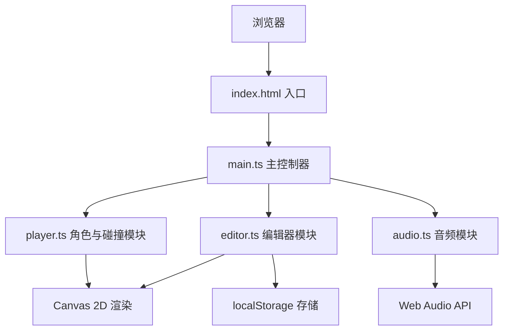

## 1. 架构设计

纯前端单页应用，无后端服务。使用TypeScript编写，Vite构建，HTML5 Canvas渲染游戏画面。



## 2. 技术栈说明
- **前端框架**：原生TypeScript（无React/Vue框架，纯Canvas渲染）
- **构建工具**：Vite
- **渲染**：HTML5 Canvas 2D API
- **音频**：Web Audio API
- **存储**：浏览器localStorage
- **状态管理**：模块内部状态 + 撤销/重做栈

## 3. 文件结构
| 文件路径 | 用途 |
|----------|------|
| `package.json` | 依赖配置：typescript、vite，启动脚本npm run dev |
| `index.html` | 入口页面，包含Canvas和UI元素 |
| `vite.config.js` | Vite构建配置 |
| `tsconfig.json` | TypeScript严格模式，包含DOM类型 |
| `src/main.ts` | 游戏主循环，初始化Canvas和UI，状态切换管理 |
| `src/editor.ts` | 关卡编辑器逻辑：鼠标事件、网格吸附、障碍物CRUD、撤销重做栈 |
| `src/player.ts` | 角色控制与碰撞检测：键盘输入、跳跃/蹲伏动画、通过/失败判定 |
| `src/audio.ts` | 节拍音效生成：Web Audio API创建鼓点音频，与时间线同步 |

## 4. 核心数据模型

### 4.1 障碍物类型
```typescript
type ObstacleType = 'wall' | 'spike' | 'platform';

interface Obstacle {
  id: string;
  type: ObstacleType;
  x: number;       // X坐标（吸附到50px网格）
  baseY: number;   // 基础Y坐标（地面线）
  width: number;   // 宽度
  height: number;  // 高度
  color: string;   // 颜色
}
```

### 4.2 节拍标记
```typescript
interface Beat {
  id: string;
  x: number;       // X坐标（与障碍物对齐）
  time: number;    // 对应播放时间（毫秒）
}
```

### 4.3 关卡数据
```typescript
interface Level {
  id: string;
  name: string;
  obstacles: Obstacle[];
  beats: Beat[];
  createdAt: number;
}
```

### 4.4 角色状态
```typescript
interface PlayerState {
  x: number;
  y: number;
  velocityY: number;
  isJumping: boolean;
  isCrouching: boolean;
  isRunning: boolean;
  width: number;
  height: number;
}
```

### 4.5 编辑器状态
```typescript
interface EditorState {
  obstacles: Obstacle[];
  beats: Beat[];
  selectedTool: ObstacleType | 'beat' | null;
  undoStack: Level[];
  redoStack: Level[];
  undoCount: number;
  isPlaying: boolean;
}
```

## 5. 撤销/重做机制
- 维护最多10个历史快照（Level数据）
- 每次障碍物/节拍变更时推入undoStack
- Ctrl+Z：undoStack弹出，当前状态恢复，推入redoStack
- Ctrl+Y：redoStack弹出，当前状态恢复，推入undoStack
- 显示格式："撤销(N/10)"

## 6. 性能优化策略
- Canvas仅重绘视口内区域
- 使用requestAnimationFrame主循环（60fps）
- 时间戳驱动动画，确保节拍与渲染同步
- 避免每帧创建新对象，复用渲染数据
- Web Audio提前调度鼓点事件，确保低延迟播放
