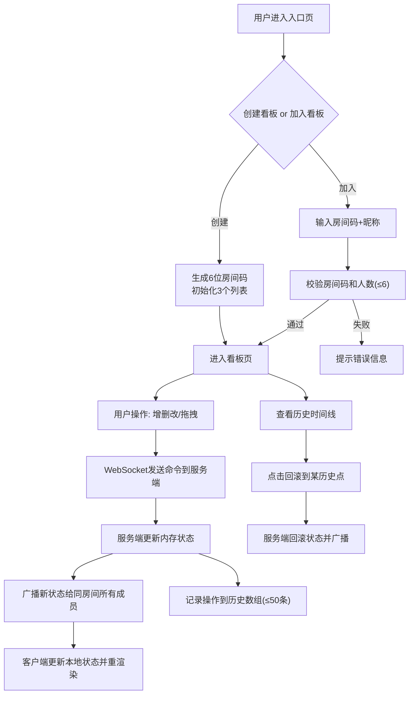

## 1. 产品概述

微型多人实时协作看板工具，服务于小型创业团队的敏捷开发场景，解决现有看板工具功能过重、需付费的痛点，提供轻量可自部署的看板管理方案。
- 目标用户：3-6人小型创业团队、产品研发小组
- 核心价值：零配置、轻量部署、实时协作、操作可回溯

## 2. 核心功能

### 2.1 用户角色
本产品不区分角色权限，所有加入房间的用户拥有同等操作权限。

### 2.2 功能模块
1. **入口/房间管理**：创建看板生成房间码、输入房间码加入看板、昵称录入
2. **看板主界面**：多列表卡片布局（待办/进行中/完成）、卡片增删改
3. **拖拽交互**：卡片跨列表拖拽、同列表内排序、拖拽视觉反馈
4. **实时同步**：WebSocket 广播状态变更、新成员加入自动同步全量状态
5. **操作历史**：时间线展示最近50条操作、一键回滚到历史点

### 2.3 页面详情
| 页面名称 | 模块名称 | 功能描述 |
|---------|---------|----------|
| 入口页 | 房间创建/加入 | 创建看板生成6位房间码、输入房间码+昵称加入、人数上限校验(≤6人) |
| 看板页 | 顶部栏 | 房间码显示、在线用户头像列表(圆形36px、昵称首字母、随机色)、退出按钮 |
| 看板页 | 左侧历史面板 | 250px宽度、#F3F4F6背景、时间线展示操作记录、回滚按钮 |
| 看板页 | 中间看板区 | #F9FAFB背景、多列表横向滚动、列表卡片式设计(280px宽、圆角8px、轻阴影) |
| 看板页 | 卡片组件 | 标题展示、悬停气泡显示详情、拖拽时半透明阴影+3度旋转、动画过渡0.2s |
| 看板页 | 添加卡片表单 | 内联表单、标题必填、内容可选、淡入淡出动画0.3s |

## 3. 核心流程

用户创建看板 → 系统生成6位房间码并初始化3个空列表 → 用户分享房间码 → 其他成员输入房间码+昵称加入 → 系统同步完整看板状态给新成员 → 任意用户增删改卡片/拖拽排序 → WebSocket广播给同房间所有成员 → 记录操作到历史数组(最多50条) → 用户可点击回滚到某历史点

## 4. 用户界面设计

### 4.1 设计风格
- **主色调**：#3B82F6（蓝）用于按钮、链接、交互元素
- **中性色**：#F9FAFB（主背景）、#F3F4F6（侧栏背景）、#FFFFFF（卡片背景）、#1F2937（标题深灰）、#374151（正文深灰）
- **按钮风格**：圆角6px、悬停时#2563EB、按下时#1D4ED8
- **字体**：系统默认字体栈 -apple-system, BlinkMacSystemFont, "Segoe UI", Roboto, sans-serif
- **布局风格**：三栏式（侧栏+看板区）、卡片式列表、响应式自适应
- **阴影层次**：列表卡片 0 1px 3px rgba(0,0,0,0.1)，拖拽中卡片 0 4px 12px rgba(0,0,0,0.15)

### 4.2 页面设计概述
| 页面名称 | 模块名称 | UI元素 |
|---------|---------|--------|
| 入口页 | 房间表单 | 居中卡片布局、主色按钮、淡入页面入场动画 |
| 看板页 | 顶部栏 | 固定高度60px、房间码加粗16px #1F2937、用户头像横向排列间距8px、右对齐退出按钮 |
| 看板页 | 历史面板 | 宽度250px、#F3F4F6背景、时间线竖线+圆点、每条记录显示用户昵称/操作/时间HH:mm:ss |
| 看板页 | 列表容器 | 横向排列、间距16px、X轴滚动、padding 24px |
| 看板页 | 列表卡片 | 280px宽、圆角8px、白色背景、padding 16px、标题加粗14px #1F2937、底部添加卡片按钮 |
| 看板页 | 卡片项 | 背景#F9FAFB、圆角6px、padding 12px、间距10px、悬停时背景#F3F4F6、cursor-grab |
| 看板页 | 拖拽态卡片 | opacity 0.9、rotate(3deg)、重阴影、cursor-grabbing |

### 4.3 响应式
- Desktop-first 设计
- 屏幕 < 768px 时：左侧历史面板折叠为顶部抽屉，点击按钮滑入（动画 500ms）
- 看板区域自适应剩余宽度，Y轴滚动
- 卡片列表在小屏可横向滚动

### 4.4 动效规范
- 卡片添加：opacity 0→1, 0.3s ease
- 卡片删除：opacity 1→0, 0.3s ease
- 卡片移动：transition transform/position 0.2s ease
- 抽屉滑入：transform translateX(-100%)→0, 500ms ease
- 悬停气泡：tooltip 淡入 0.15s
