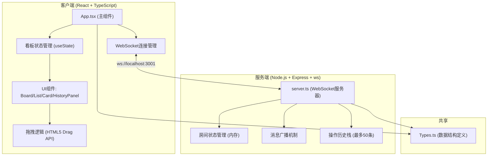

## 1. 架构设计



## 2. 技术描述

- **前端框架**：React 18 + TypeScript（严格模式）
- **构建工具**：Vite + @vitejs/plugin-react
- **后端服务**：Express 4 提供静态服务、ws 库实现 WebSocket
- **数据存储**：纯内存（Room 状态 Map + 操作历史数组）
- **实时通信**：WebSocket 协议，JSON 序列化消息
- **唯一标识**：uuid 库生成 id
- **拖拽实现**：原生 HTML5 Drag and Drop API
- **无额外UI库**：全部使用原生 CSS 实现样式

## 3. 目录结构与文件职责

```
auto89/
├── package.json          # 依赖和启动脚本
├── index.html            # Vite 入口 HTML
├── vite.config.js        # Vite 构建配置
├── tsconfig.json         # TypeScript 严格模式配置
└── src/
    ├── Types.ts          # 共享数据结构定义 (Card/List/Board/Action等)
    ├── server.ts         # WebSocket + Express 服务器 (端口3001)
    ├── App.tsx           # React 主组件 (连接管理+状态+布局)
    ├── components/
    │   ├── EntryPage.tsx     # 入口页 (创建/加入房间)
    │   ├── Board.tsx         # 看板主容器
    │   ├── ListColumn.tsx    # 列表列组件
    │   ├── CardItem.tsx      # 卡片组件
    │   ├── AddCardForm.tsx   # 添加卡片内联表单
    │   ├── HistoryPanel.tsx  # 左侧历史时间线面板
    │   ├── TopBar.tsx        # 顶部栏 (房间码/在线用户/退出)
    │   └── UserAvatar.tsx    # 用户头像组件
    └── styles.css        # 全局样式与动画
```

**文件调用关系（数据流向）**：
- `Types.ts` ← `server.ts` + `App.tsx` 共同引用
- `server.ts`：接收客户端消息 → 更新 `Room` 内存状态 → 广播新状态给同房间所有 ws → 记录 `Action` 到历史数组
- `App.tsx`：用户操作 → 组装命令消息 → WebSocket.send() → 接收服务端广播 → setState 更新本地状态 → React 重渲染
- 组件树：`App` → `EntryPage | (TopBar + HistoryPanel + Board)`；`Board` → 多个 `ListColumn`；`ListColumn` → 多个 `CardItem` + `AddCardForm`

## 4. WebSocket 消息协议

所有消息为 JSON 格式，包含 `type` 字段区分命令类型：

| 消息类型 | 发送方 | payload 字段 | 说明 |
|---------|--------|-------------|------|
| `CREATE_BOARD` | 客户端 | `{ nickname }` | 创建新看板，返回 roomCode 和初始状态 |
| `JOIN_BOARD` | 客户端 | `{ roomCode, nickname }` | 加入已有看板 |
| `JOINED` | 服务端 | `{ board, users, history }` | 加入成功，同步全量状态 |
| `USER_JOINED` | 服务端广播 | `{ users }` | 有新用户加入，广播在线用户列表 |
| `USER_LEFT` | 服务端广播 | `{ users }` | 有用户离开，广播在线用户列表 |
| `ADD_LIST` | 客户端 | `{ title }` | 添加新列表 |
| `ADD_CARD` | 客户端 | `{ listId, title, content }` | 添加新卡片到指定列表 |
| `MOVE_CARD` | 客户端 | `{ cardId, fromListId, toListId, toIndex }` | 拖拽移动卡片 |
| `STATE_UPDATED` | 服务端广播 | `{ board, action }` | 状态变更广播，附带本次操作记录 |
| `ROLLBACK` | 客户端 | `{ actionIndex }` | 回滚到指定历史点 |
| `ROLLBACKED` | 服务端广播 | `{ board, history }` | 回滚完成，同步完整状态和历史 |
| `ERROR` | 服务端 | `{ message }` | 错误提示 |

## 5. 服务端数据结构

```typescript
interface Room {
  roomCode: string;          // 6位字母数字房间码
  board: Board;              // 看板状态
  users: User[];             // 在线用户列表 (≤6)
  history: Action[];         // 操作历史栈 (≤50)
  clients: Map<string, WebSocket>;  // clientId -> ws 连接
}

interface User {
  id: string;
  nickname: string;
  color: string;             // 随机头像颜色
}
```

服务端用全局 `Map<string, Room>` 维护所有房间。

## 6. 数据模型（共享 Types.ts）

```typescript
interface Card {
  id: string;
  title: string;
  content: string;
  position: number;          // 列表内排序索引
  createdAt: number;
}

interface ListColumn {
  id: string;
  title: string;
  cards: Card[];
}

interface Board {
  id: string;
  lists: ListColumn[];
}

interface Action {
  type: 'ADD_LIST' | 'ADD_CARD' | 'MOVE_CARD' | 'ROLLBACK';
  timestamp: number;
  nickname: string;
  payload: any;              // 根据 type 不同内容不同
  description: string;       // 用于时间线展示的人类可读描述
}
```

## 7. 性能保障措施

- **拖拽 60fps**：使用 HTML5 Drag API 原生实现，拖拽预览使用 CSS transform，避免重排
- **WebSocket 延迟**：JSON 序列化消息体最小化，仅发送变更增量（除首次 JOINED 同步全量）
- **状态同步**：服务端单线程内存处理，避免 IO 阻塞，广播使用 ws.send 异步批量
- **React 渲染**：卡片组件 memo 化，拖拽时仅更新受影响列表的 state
- **历史栈上限**：只保留最近 50 条 Action，超出自动 shift，控制内存和渲染量
