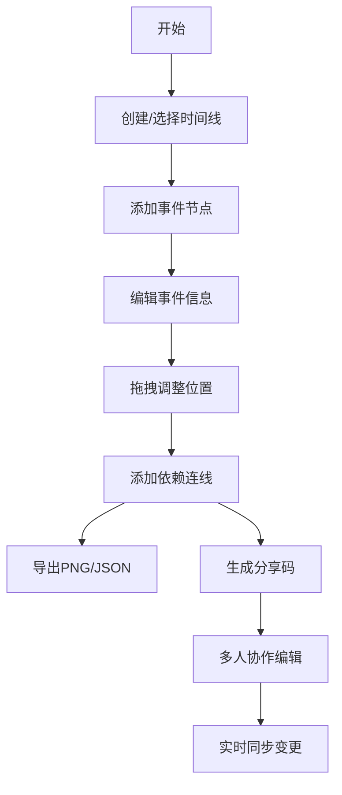

## 1. 产品概述

交互式时间线创建与分享应用，为历史爱好者、项目管理者和内容创作者提供可视化、可分享、响应式的事件序列整理工具。用户可创建多个时间线，添加事件节点，通过分享码链接访问，并支持多人实时协作编辑。

## 2. 核心功能

### 2.1 用户角色

| 角色 | 注册方式 | 核心权限 |
|------|----------|----------|
| 普通用户 | 无需注册，直接使用 | 创建、编辑、分享时间线，参与协作 |

### 2.2 功能模块

1. **时间线列表页**：左侧时间线卡片列表、创建新时间线、分享链接访问
2. **时间线编辑画布**：横向滚动时间轴、事件节点管理、拖拽调整、依赖连线
3. **事件编辑模态框**：日期选择、标题/描述输入、颜色选择
4. **工具栏**：导出PNG、导出JSON、添加事件
5. **实时协作**：多人编辑同步、节点锁定提示

### 2.3 页面详情

| 页面名称 | 模块名称 | 功能描述 |
|----------|----------|----------|
| 主页面 | 时间线列表 | 展示所有已创建时间线卡片，支持创建新时间线 |
| 主页面 | 时间线画布 | 横向滚动时间轴，可视化展示事件节点和依赖关系 |
| 主页面 | 工具栏 | 导出功能、添加事件、缩放控制 |
| 模态框 | 事件编辑 | 编辑事件的日期、标题、描述、颜色 |
| 模态框 | 协作提示 | 显示节点被其他用户锁定的状态 |

## 3. 核心流程

用户创建时间线 → 添加事件节点（设置日期、标题、描述、颜色）→ 拖拽调整节点位置 → 添加依赖连线 → 导出PNG/JSON → 生成分享码 → 通过链接分享 → 多人实时协作编辑

## 4. 用户界面设计

### 4.1 设计风格

- **主色调**：深蓝#1E3A5F、蓝灰#2C3E50、亮蓝#4A90D9
- **背景色**：侧边栏深色#1A252F、主区域浅色#F8F9FA、画布#E8ECEF
- **事件色板**：红#E74C3C、蓝#3498DB、绿#2ECC71、橙#F39C12、紫#9B59B6、青#1ABC9C
- **卡片样式**：深蓝背景#1E3A5F、圆角8px、边缘发光#4A90D9、悬停上移3px
- **按钮样式**：圆角6px、点击波浪反馈
- **布局**：左侧导航栏240px + 主区域响应式布局
- **字体**：现代无衬线字体，清晰层级

### 4.2 页面设计概览

| 页面名称 | 模块名称 | UI元素 |
|----------|----------|--------|
| 主页面 | 时间线列表卡片 | 深蓝背景、圆角8px、发光边框、悬停动画 |
| 主页面 | 时间轴画布 | 渐变灰背景、水平居中粗线时间轴、两端箭头 |
| 主页面 | 事件节点 | 圆形节点、垂直线连接、标签显示、悬停放大 |
| 主页面 | 工具栏 | 深色背景#2C3E50、功能按钮、导出选项 |
| 模态框 | 事件编辑 | 白色背景、圆角12px、半透明遮罩、表单输入 |

### 4.3 响应式设计

- **桌面端**：左侧240px导航栏 + 主区域画布（最小宽度600px）
- **移动端**（<768px）：侧边栏收缩为顶部汉堡菜单，画布占满宽度

### 4.4 动画效果

- 节点创建：从中心淡入放大（0→1比例，0.3秒）
- 节点删除：淡出缩小（1→0，0.2秒）
- 依赖连线：0.5秒渐显效果
- 节点悬停：放大至22px，显示工具提示
- 拖拽过渡：0.2秒平滑动画
- 卡片悬停：上移3px
