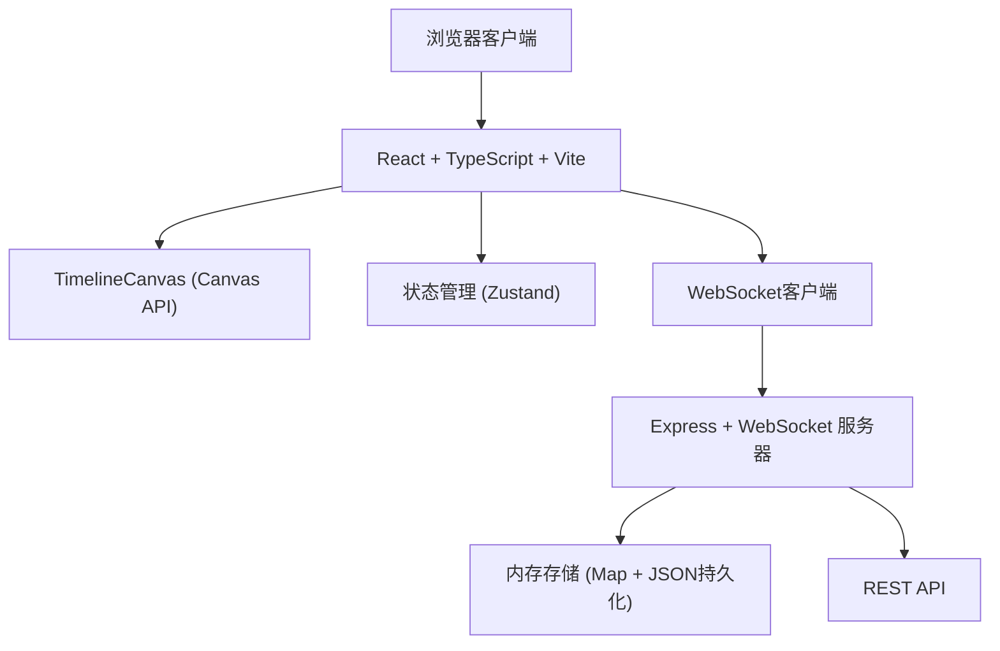
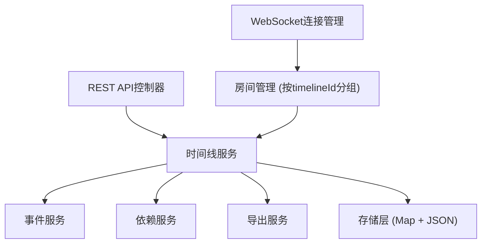
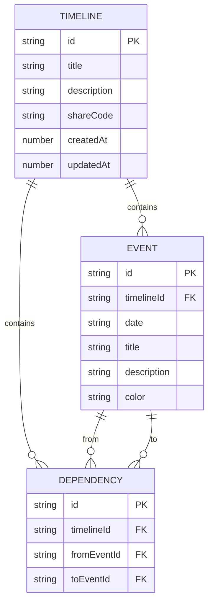

## 1. 架构设计



## 2. 技术说明

- **前端**：React 18 + TypeScript + Vite + Zustand + html2canvas
- **后端**：Express 4 + WebSocket (ws) + TypeScript
- **构建工具**：Vite
- **数据存储**：内存Map结构 + JSON文件持久化
- **实时通信**：WebSocket

## 3. 路由定义

| 路由 | 用途 |
|------|------|
| `/` | 主页面，显示时间线列表和画布 |
| `/timeline/:shareCode` | 通过分享码访问特定时间线 |

## 4. API 定义

### 4.1 类型定义

```typescript
interface TimelineEvent {
  id: string;
  date: string;
  title: string;
  description: string;
  color: string;
  x?: number;
  y?: number;
  lockedBy?: string;
  lockedByName?: string;
}

interface Dependency {
  id: string;
  from: string;
  to: string;
}

interface Timeline {
  id: string;
  title: string;
  description: string;
  shareCode: string;
  events: TimelineEvent[];
  dependencies: Dependency[];
  createdAt: number;
  updatedAt: number;
}

interface Collaborator {
  id: string;
  name: string;
  timelineId: string;
}
```

### 4.2 REST API

| 方法 | 路径 | 描述 |
|------|------|------|
| GET | `/api/timelines` | 获取所有时间线列表 |
| GET | `/api/timelines/:id` | 获取单个时间线详情 |
| GET | `/api/timelines/share/:shareCode` | 通过分享码获取时间线 |
| POST | `/api/timelines` | 创建新时间线 |
| PUT | `/api/timelines/:id` | 更新时间线信息 |
| DELETE | `/api/timelines/:id` | 删除时间线 |
| POST | `/api/timelines/:id/events` | 添加事件 |
| PUT | `/api/timelines/:id/events/:eventId` | 更新事件 |
| DELETE | `/api/timelines/:id/events/:eventId` | 删除事件 |
| POST | `/api/timelines/:id/dependencies` | 添加依赖 |
| DELETE | `/api/timelines/:id/dependencies/:depId` | 删除依赖 |
| POST | `/api/timelines/:id/export/png` | 导出PNG |
| GET | `/api/timelines/:id/export/json` | 导出JSON |

### 4.3 WebSocket 消息

```typescript
interface WSMessage {
  type: 'join' | 'leave' | 'event_add' | 'event_update' | 'event_delete' | 'event_lock' | 'event_unlock' | 'dependency_add' | 'dependency_delete' | 'timeline_update';
  payload: any;
  timelineId: string;
  userId: string;
  userName: string;
}
```

## 5. 服务器架构



## 6. 数据模型

### 6.1 实体关系



### 6.2 内存存储结构

```typescript
// 内存中的数据存储
const timelines: Map<string, Timeline> = new Map();
const shareCodeIndex: Map<string, string> = new Map(); // shareCode -> timelineId
const rooms: Map<string, Set<WebSocket>> = new Map(); // timelineId -> connections
const collaborators: Map<string, Map<string, Collaborator>> = new Map(); // timelineId -> userId -> collaborator
```

## 7. 前端架构

### 7.1 组件结构

```
App.tsx
├── Sidebar.tsx (时间线列表)
│   └── TimelineCard.tsx
├── Toolbar.tsx (顶部工具栏)
├── TimelineCanvas.tsx (Canvas画布)
├── EventModal.tsx (事件编辑模态框)
└── CollaboratorBadge.tsx (协作者显示)
```

### 7.2 状态管理 (Zustand Store)

```typescript
interface AppState {
  timelines: Timeline[];
  currentTimeline: Timeline | null;
  collaborators: Collaborator[];
  zoom: number;
  pan: { x: number; y: number };
  selectedEventId: string | null;
  draggedEventId: string | null;
  hoveredEventId: string | null;
  isModalOpen: boolean;
  editingEvent: TimelineEvent | null;
}
```

### 7.3 Canvas 渲染分层

- **Layer 1 (背景)**：画布渐变背景、网格线
- **Layer 2 (时间轴)**：水平中心线、两端箭头、年份标记
- **Layer 3 (依赖连线)**：虚线箭头连接
- **Layer 4 (事件节点)**：垂直线、圆形节点、标签、工具提示
- **Layer 5 (交互层)**：拖拽预览、选中高亮、锁定图标
