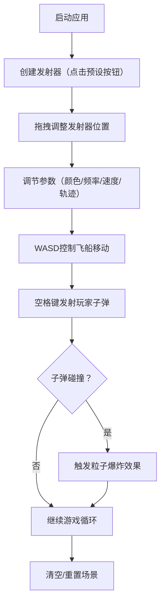

## 1. 产品概述
独立游戏开发者专用的轻量级2D横版射击游戏弹幕编辑器与粒子碰撞模拟器，用于快速设计、测试弹幕模式及碰撞粒子效果，节省反复进入游戏引擎调试的时间。

- **目标用户**：独立游戏开发者，特别是需要设计弹幕系统的2D射击游戏开发者
- **核心价值**：可视化、实时反馈的弹幕设计工具，降低调试成本

## 2. 核心功能

### 2.1 用户角色
无需用户注册，单用户本地工具。

### 2.2 功能模块
1. **发射器系统**：支持最多4个子弹发射器，可拖拽移动，三种轨迹模式（直线、正弦波、螺旋线）
2. **属性控制面板**：实时调节发射器参数（颜色、频率、速度、轨迹模式）
3. **玩家控制系统**：WASD控制三角形飞船，空格键发射子弹，尾部粒子尾迹
4. **碰撞检测与粒子系统**：玩家子弹与敌人子弹碰撞时触发彩色粒子爆炸和闪光圆环效果
5. **实时监控面板**：FPS显示、子弹总数统计、场景摘要
6. **场景管理**：清空发射器、重置场景功能

### 2.3 页面详情
| 页面名称 | 模块名称 | 功能描述 |
|---------|---------|---------|
| 主界面 | 顶部工具栏 | 4个预设发射器按钮（直线、正弦波、螺旋线、混合模式） |
| 主界面 | 游戏画布区 | 1100x600px深灰背景，带浅网格线，内发光边框 |
| 主界面 | 右侧属性面板 | 220px宽，选中发射器的参数调节，FPS显示，子弹总数 |
| 主界面 | 底部操作区 | 清空按钮、重置按钮、实时场景摘要 |

## 3. 核心流程
用户点击预设按钮创建发射器 → 拖拽调整发射器位置 → 在右侧面板调节参数 → WASD控制飞船移动 → 空格键发射子弹 → 子弹碰撞触发粒子爆炸 → 实时观察效果并调整参数。

## 4. 用户界面设计

### 4.1 设计风格
- **主题**：暗色霓虹荧光风格，深紫黑色背景，半透明玻璃态UI控件带发光边框
- **主色调**：深灰#1A1A2E、深灰#2A2A2E、半透明深灰#1E1E2ECC、霓虹蓝#5555AA
- **强调色**：黄色#FFD700、红色#E74C3C、蓝色#3498DB、绿色#00FF88、浅蓝#4FC3F7
- **按钮样式**：圆角8px，悬停缩放1.05倍+颜色变亮，过渡0.2s ease-out
- **字体**：monospace（FPS显示）、sans-serif（参数标签）
- **布局**：桌面优先，画布左+面板右，宽度<1400px时面板移至底部

### 4.2 页面设计概览
| 页面名称 | 模块名称 | UI元素 |
|---------|---------|---------|
| 主界面 | 顶部工具栏 | 深灰#2A2A2E背景，80px高，4个发射器按钮 |
| 主界面 | 游戏画布区 | 1100x600px，深灰#1A1A2E，浅网格#3A3A4A间距40px，2px内发光边框#5555AA |
| 主界面 | 右侧属性面板 | 220px宽，#1E1E2ECC半透明，圆角12px，参数控件+FPS+子弹数 |
| 主界面 | 底部操作区 | 红色清空按钮、蓝色重置按钮，白色12px场景摘要文字 |

### 4.3 响应式设计
- 桌面端（≥1400px）：左侧画布1100px + 右侧属性面板220px
- 窄屏（<1400px）：画布在上，属性面板移至底部水平排列（高度120px）

### 4.4 视觉特效
- 发射器拖拽时金黄色#FFD700高亮
- 按钮点击抖动动画0.1s
- 重置场景黑色渐变过渡0.5s
- 粒子爆炸：20-40颗粒子1.5秒，白色闪光圆环0.3秒
- 飞船移动尾部淡蓝色粒子尾迹
