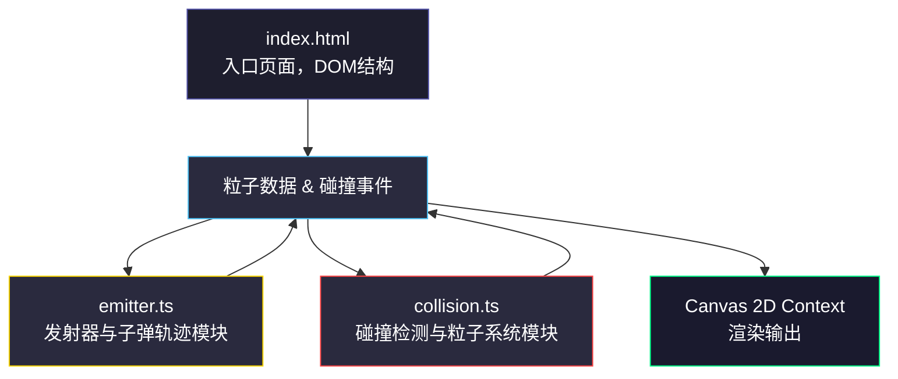

## 1. 架构设计



**数据流说明**：
1. `main.ts` 初始化Canvas、事件监听、游戏循环
2. 每帧调用 `emitter.ts` 的更新函数生成/更新敌人子弹
3. 每帧调用 `collision.ts` 的检测函数进行碰撞判定，生成粒子
4. `main.ts` 协调渲染顺序：背景网格 → 发射器 → 敌人子弹 → 玩家 → 玩家子弹 → 粒子 → UI覆盖层

## 2. 技术说明
- **前端框架**：原生 TypeScript + HTML5 Canvas 2D API
- **构建工具**：Vite 5.x
- **无后端、无数据库**：纯前端单页应用
- **状态管理**：模块内闭包变量，无需额外状态库

## 3. 项目文件结构
```
├── package.json              # 依赖：typescript、vite，启动脚本 npm run dev
├── vite.config.js            # Vite基础配置
├── tsconfig.json             # 严格模式，DOM + ESNext 类型
├── index.html                # 入口页面：全屏画布 + UI控制面板DOM
└── src/
    ├── main.ts               # 游戏主循环、初始化、场景管理、渲染调度
    ├── emitter.ts            # 发射器配置、子弹轨迹计算、子弹对象池
    └── collision.ts          # 碰撞检测、粒子系统（对象池）、爆炸效果
```

**模块间调用关系**：
- `main.ts` → `emitter.ts`：调用 `createEmitter()`、`updateEmitters()`、`removeEmitter()`
- `main.ts` → `collision.ts`：调用 `checkCollisions()`、`updateParticles()`、`createExplosion()`
- `emitter.ts` → 导出类型：`EmitterConfig`、`Bullet`
- `collision.ts` → 导出类型：`Particle`、`Explosion`

## 4. 关键数据结构

```typescript
// emitter.ts
type TrajectoryMode = 'linear' | 'sine' | 'spiral' | 'mixed';

interface Emitter {
  id: number;
  x: number;
  y: number;
  color: string;
  frequency: number;   // 秒/发，0.1-2
  speed: number;       // 像素/帧，1-10
  mode: TrajectoryMode;
  lastShotTime: number;
  isDragging: boolean;
}

interface Bullet {
  x: number;
  y: number;
  vx: number;
  vy: number;
  radius: number;
  color: string;
  isPlayer: boolean;
  age: number;         // 存活帧数
  maxAge: number;
  // 轨迹附加参数
  baseAngle?: number;
  spiralRadius?: number;
  sineAmplitude?: number;
  sineFrequency?: number;
}

// collision.ts
interface Particle {
  x: number;
  y: number;
  vx: number;
  vy: number;
  size: number;
  initialSize: number;
  color: string;
  alpha: number;
  age: number;
  maxAge: number;
  active: boolean;     // 对象池复用标志
}

interface FlashRing {
  x: number;
  y: number;
  radius: number;
  alpha: number;
  age: number;
  maxAge: number;
}
```

## 5. 性能优化策略
1. **requestAnimationFrame** 主循环，目标60FPS
2. **子弹>200颗时降帧至30FPS**（通过跳帧实现）
3. **粒子对象池**：预分配500个Particle对象，active标志复用，避免GC
4. **FPS采样**：最近30帧滑动平均，刷新频率≥10次/秒
5. **碰撞检测**：基于距离的圆形碰撞，距离<12px判定碰撞
6. **离屏缓存**：网格背景预渲染到离屏Canvas

## 6. 核心算法
- **直线轨迹**：`vx = cos(angle) * speed`, `vy = sin(angle) * speed`
- **正弦波轨迹**：基于直线 + `y += sin(age * freq) * amplitude`
- **螺旋线轨迹**：角度每帧递增，半径缓慢增大，`vx = cos(angle) * speed`, `vy = sin(angle) * speed`
- **颜色混合**：碰撞爆炸色取玩家子弹色与敌人子弹色的RGB线性插值
- **粒子对象池**：`getParticle()`优先复用active=false的对象，无空闲则新建（上限500）
