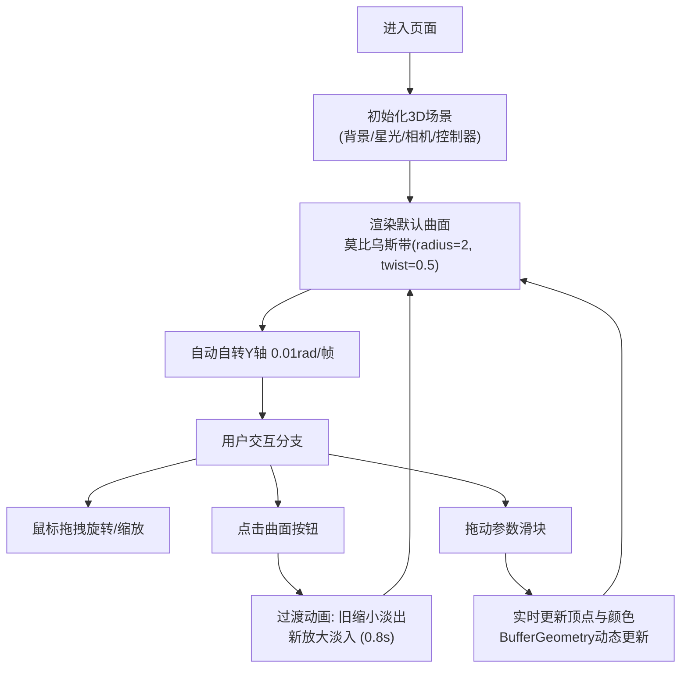

## 1. 产品概述
面向数学爱好者与学生的微型交互式3D抽象数学曲面生成与变换展示器，以直观的3D方式呈现参数方程生成的动态曲面。用户可通过滑块实时调整方程参数，观察曲面连续形变，配合流动渐变色彩与鼠标视角控制，探索数学之美。

## 2. 核心功能

### 2.1 功能模块
1. **3D渲染主场景**: 深空蓝渐变背景、星光粒子、数学曲面渲染、自动自转与鼠标控制
2. **控制面板**: 曲面选择按钮、参数调节滑块、实时参数反馈
3. **曲面切换动画**: 淡入淡出缩放过渡、easeInOutCubic缓动

### 2.2 页面详情
| 页面名称 | 模块名称 | 功能描述 |
|----------|----------|----------|
| 主页面 | 3D场景 | 全屏Canvas渲染深空背景、星光粒子、参数曲面；自动Y轴自转；鼠标拖拽旋转视角与缩放 |
| 主页面 | 曲面选择 | 4个圆形选择按钮（莫比乌斯带M、克莱因瓶K、罗马曲面R、自定义C），选中发光边框 |
| 主页面 | 参数滑块 | 每个曲面3个滑块，实时调整参数，曲面连续形变，HSL颜色流动渐变 |
| 主页面 | 切换动画 | 旧曲面淡出缩放至0，新曲面从0淡入放大，0.8秒easeInOutCubic |

## 3. 核心流程
用户进入页面 → 默认显示莫比乌斯带（自动缓慢自转）→ 用户可鼠标拖拽旋转视角/滚轮缩放 → 点击右侧曲面按钮切换曲面（带过渡动画）→ 拖动滑块实时调整参数观察形变 → 颜色随参数流动变化

## 4. 用户界面设计

### 4.1 设计风格
- **主色调**: 深空蓝渐变 `#0A0A2E → #1A1A4E` 背景
- **强调色**: 青色 `#00D2FF`（滑钮、选中发光边框）
- **曲面色**: HSL流动渐变 `#FF6B6B → #4ECDC4 → #45B7D1`
- **玻璃态面板**: 半透明白色 `#FFFFFF80`，圆角12px，毛玻璃效果
- **整体氛围**: 科技感、沉浸式、数学艺术感

### 4.2 页面设计概览
| 页面名称 | 模块名称 | UI元素 |
|----------|----------|--------|
| 主页面 | 3D场景 | 全屏Canvas、深空渐变背景、50颗闪烁星光粒子 |
| 主页面 | 控制面板 | 右侧定位280px宽、距右20px、玻璃态半透明 |
| 主页面 | 选择按钮 | 4个圆形40px按钮(M/K/R/C)、选中青色发光边框、悬停`#FFFFFF20` |
| 主页面 | 滑块 | 轨道4px×180px`#E0E0E0`、滑钮16px青色`#00D2FF`、0.1s弹性动画 |

### 4.3 响应式
桌面端优先设计，控制面板固定在右侧。Canvas自适应窗口大小。

### 4.4 3D场景指引
- **环境**: 深空渐变背景，50颗星光粒子缓慢旋转闪烁
- **光照**: 环境光+两点光源，突出曲面立体感
- **相机**: PerspectiveCamera，OrbitControls阻尼0.1，缩放0.5-4倍
- **动画**: 曲面自动Y轴0.01rad/帧自转，切换时0.8s缩放淡入淡出
- **性能**: BufferGeometry动态更新顶点与颜色，目标帧率45FPS+，切换动画30FPS+
