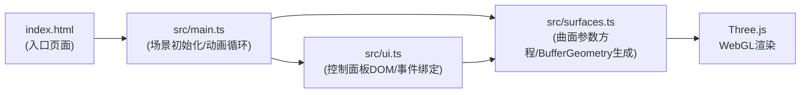

## 1. 架构设计
纯前端项目，基于 Three.js + TypeScript + Vite 架构。



## 2. 技术描述
- **前端**: TypeScript 5.x + Three.js 0.160+ + Vite 5.x
- **初始化工具**: Vite vanilla-ts 模板
- **后端**: 无（纯前端项目）
- **数据库**: 无
- **关键技术点**:
  - Three.js `BufferGeometry` 动态更新顶点位置与颜色属性实现GPU加速
  - `OrbitControls` 实现鼠标拖拽旋转与缩放（带阻尼）
  - CSS `backdrop-filter: blur()` 实现毛玻璃控制面板
  - `easeInOutCubic` 缓动函数实现曲面切换动画
  - 自定义参数方程生成三角网格（每个曲面≥2000顶点）

## 3. 文件结构
```
├── index.html              # 入口页面，Canvas + 控制面板容器
├── package.json            # three, @types/three, typescript, vite
├── vite.config.js          # Vite 基础配置
├── tsconfig.json           # 严格模式，DOM + ESNext
└── src/
    ├── main.ts             # 场景/相机/渲染器/控制器初始化，动画循环
    ├── surfaces.ts         # 4种曲面参数方程 + BufferGeometry生成
    └── ui.ts               # DOM控制面板，按钮与滑块事件绑定
```

## 4. 模块定义

### 4.1 surfaces.ts
```typescript
export type SurfaceType = 'mobius' | 'klein' | 'roman' | 'custom';

export interface SurfaceParams {
  mobius: { radius: number; twist: number; resolution: number };
  klein: { radius: number; tube: number; resolution: number };
  roman: { size: number; resolution: number; distortion: number };
  custom: { a: number; b: number; c: number };
}

export function createSurfaceGeometry(
  type: SurfaceType,
  params: SurfaceParams[SurfaceType]
): THREE.BufferGeometry;

export function updateSurfaceGeometry(
  geometry: THREE.BufferGeometry,
  type: SurfaceType,
  params: SurfaceParams[SurfaceType]
): void;
```

### 4.2 ui.ts
```typescript
export interface UICallbacks {
  onSurfaceChange: (type: SurfaceType) => void;
  onParamsChange: (type: SurfaceType, params: any) => void;
}

export function createControlPanel(
  container: HTMLElement,
  callbacks: UICallbacks
): { updateParams: (type: SurfaceType, params: any) => void };
```

### 4.3 main.ts
```typescript
// 场景、相机、渲染器、OrbitControls初始化
// 星光粒子系统创建与动画
// 曲面Mesh管理（切换动画、缩放淡入淡出）
// 动画循环（requestAnimationFrame）
// 窗口resize处理
```

## 5. 性能策略
- **GPU加速**: 使用`BufferGeometry` + `Float32BufferAttribute`，避免每帧重建geometry，仅更新attribute数组后标记`needsUpdate=true`
- **颜色计算**: 顶点着色基于参数方程结果在JS端计算后写入color attribute，由GPU插值
- **帧率控制**: 实时参数调整时顶点增量更新，切换时0.8秒动画节流
- **网格密度**: resolution参数控制细分，默认保证每曲面≥2000顶点
