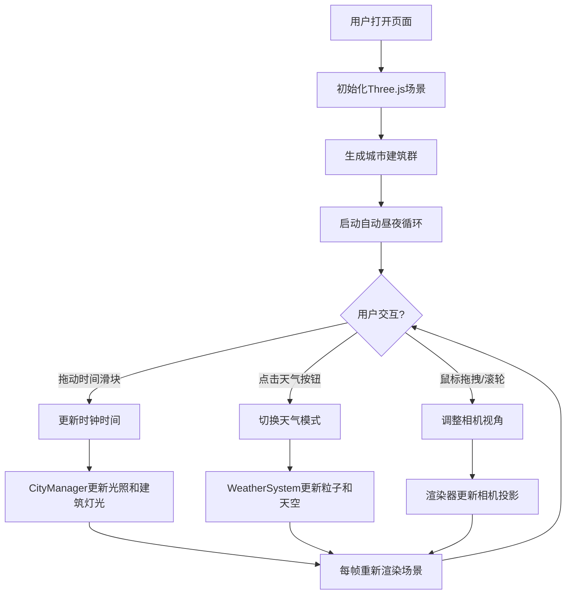

## 1. 产品概述

数字孪生城市3D可视化应用，为智慧园区管理提供直观的昼夜循环和气象模拟功能。通过Three.js构建沉浸式3D场景，帮助管理者直观了解园区在不同时间和天气条件下的状态。

- 主要用途：智慧园区的3D可视化展示与模拟
- 目标用户：园区管理人员、智慧城市规划者
- 产品价值：提供沉浸式昼夜循环和气象模拟，增强决策直观性

## 2. 核心功能

### 2.1 功能模块

1. **主视口3D场景**：城市建筑群渲染、昼夜光照系统、天气粒子效果
2. **HUD控制面板**：时间滑块控制、天气模式切换按钮、状态显示
3. **交互控制系统**：鼠标拖拽视角、滚轮缩放、自动昼夜循环

### 2.2 功能详情

| 模块名称 | 子功能 | 功能描述 |
|-----------|--------|----------|
| 3D场景渲染 | 城市建筑群 | 随机生成不同高度和位置的建筑，带窗口灯光 |
| | 昼夜循环 | 自动旋转太阳光源，同步天空盒颜色渐变（晨光→正午→黄昏→午夜） |
| | 阴影系统 | 实时计算建筑阴影投射方向 |
| 天气系统 | 晴天模式 | 清晰天空，无粒子效果 |
| | 雨天模式 | 雨粒子系统 + 地面镜面反射 + 雾效增强 |
| | 雪天模式 | 雪粒子系统 + 雾效 |
| UI控制 | 时间滑块 | 0-24小时手动调节，实时更新光照 |
| | 天气按钮 | 晴天/雨天/雪天三态切换，带平滑过渡动画 |
| | 毛玻璃面板 | 半透明rgba背景 + backdrop-filter模糊效果 |
| 性能优化 | 粒子管理 | 不超过2000个粒子，自动移除超龄粒子 |
| | 帧率保障 | 10万顶点场景下保持至少30FPS |

## 3. 核心流程

用户打开应用后，自动进入3D场景，系统开始自动昼夜循环。用户可通过右下角控制面板：
1. 拖动时间滑块跳转到任意时刻
2. 点击天气按钮切换天气模式
3. 鼠标拖拽旋转视角，滚轮缩放场景

## 4. 用户界面设计

### 4.1 设计风格

- **主色调**：深色背景 (#0a0a1a) + 科技蓝高光 (#4fc3f7)
- **辅助色**：建筑暖光 (#ffcc80)、天空渐变 (晨光#ff9966 → 正午#87ceeb → 午夜#0d1b2a)
- **按钮风格**：圆角矩形，毛玻璃背景，hover缩放1.05，active缩放0.95
- **字体**：使用系统无衬线字体，亮色(#ffffff)文字
- **布局风格**：全屏3D视口 + 右下角悬浮控制面板

### 4.2 页面设计

| 页面名称 | 模块名称 | UI元素 |
|-----------|----------|--------|
| 主视口 | 3D画布 | 全屏canvas，无滚动条，响应式resize |
| | 控制面板 | 固定右下角，半透明毛玻璃，含时间滑块和天气按钮 |
| | 状态显示 | 当前时间、天气模式文字提示 |

### 4.3 响应式设计

- 桌面优先设计，支持1920x1080及以上分辨率
- 绑定window.resize事件，自动调整渲染器尺寸和相机比例
- 控制面板最小尺寸适配，不随窗口缩放变形

### 4.4 3D场景设计

- **环境氛围**：从晨光橙红到午夜深蓝的动态天空盒渐变
- **光照设置**：DirectionalLight模拟太阳，随时间旋转位置；AmbientLight提供基础环境光
- **相机设置**：PerspectiveCamera，初始俯视角45度，支持OrbitControls交互
- **动画过渡**：天气粒子淡入淡出(1s)，天空颜色渐变(0.5s)，按钮状态变化(0.3s ease)
- **性能预算**：粒子数≤2000，总顶点数≤10万，FPS≥30
