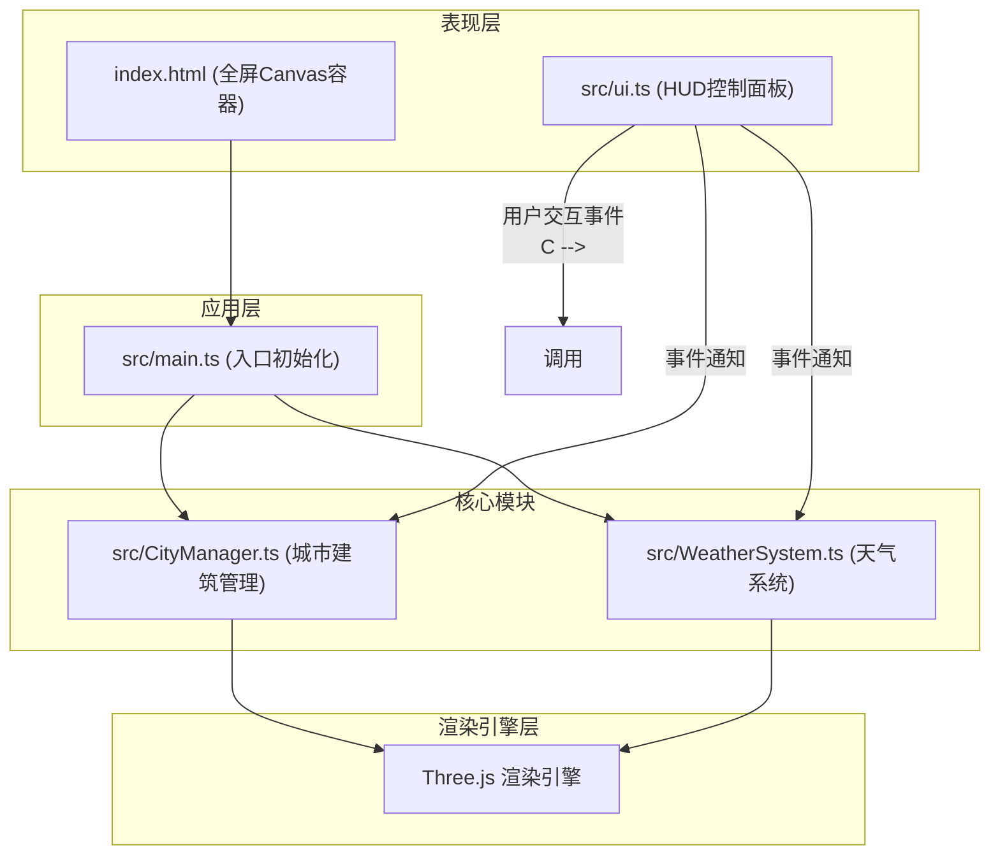
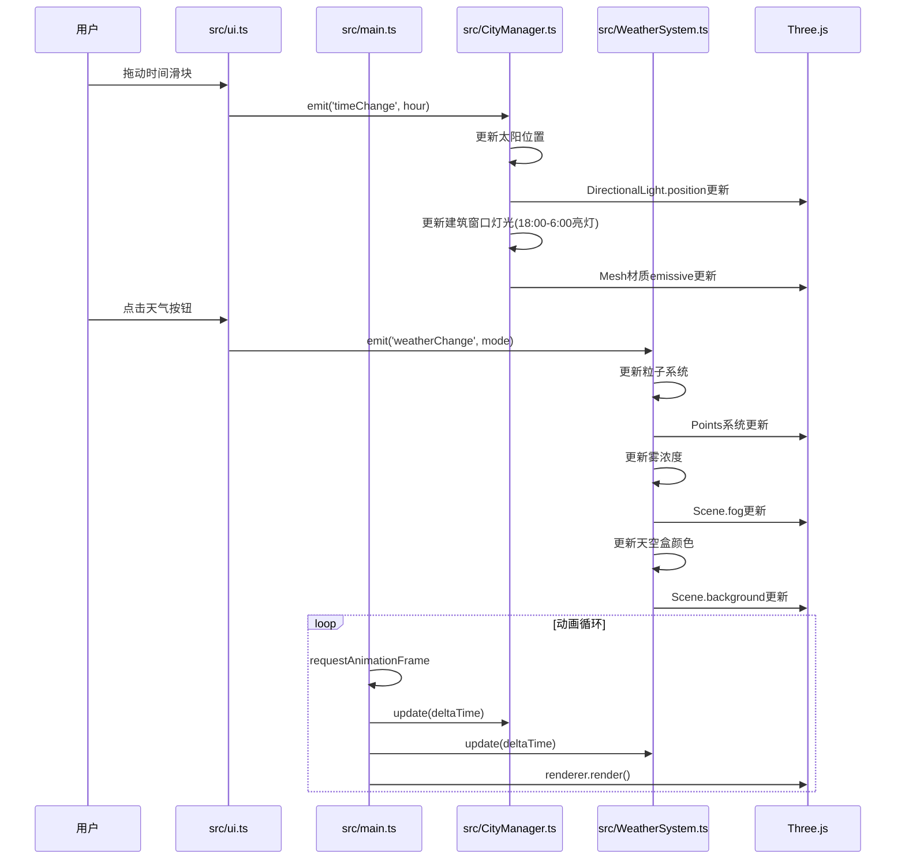

## 1. 架构设计



## 2. 技术栈说明

- **前端框架**: 原生TypeScript (无React/Vue，纯Three.js应用)
- **3D引擎**: three@^0.160.0
- **类型定义**: @types/three@^0.160.0
- **构建工具**: vite@^5.0.0
- **开发语言**: TypeScript@^5.0.0 (严格模式，ESNext)
- **初始化方式**: 手动创建项目结构（非React/Vue模板）

## 3. 文件结构与职责

| 文件路径 | 职责说明 | 输入 | 输出/调用关系 |
|-----------|----------|------|---------------|
| package.json | 项目依赖与脚本配置 | - | 启动脚本 "dev": "vite" |
| vite.config.js | Vite构建配置 | - | 基础构建配置 |
| tsconfig.json | TypeScript编译配置 | - | strict: true, target: ESNext |
| index.html | 入口页面，提供全屏canvas容器 | - | DOM容器 |
| src/main.ts | 入口：初始化场景、相机、渲染器，启动动画循环 | - | 调用CityManager和WeatherSystem |
| src/CityManager.ts | 生成城市建筑群，管理建筑材质和阴影 | 时钟时间 → 更新光照和阴影 | 数据流向：接收时钟时间 |
| src/WeatherSystem.ts | 管理雨/雪粒子系统、雾浓度、天空盒颜色 | 天气模式参数 → 更新粒子、雾和背景 | 数据流向：接收天气模式 |
| src/ui.ts | 渲染HUD控制面板，事件通知其他模块 | 用户交互 → 触发数据更新 | 通过事件Emitter通知CityManager和WeatherSystem |

## 4. 事件与数据流向



## 5. 数据模型

### 5.1 类型定义

```typescript
// 天气模式类型
type WeatherMode = 'sunny' | 'rain' | 'snow';

// 时间数据
interface TimeData {
  hour: number;           // 0-24小时
  isNight: boolean;    // 是否夜间
  sunPosition: { x: number; y: number; z: number };
  skyColor: string;
}

// 建筑数据
interface Building {
  mesh: THREE.Mesh;
  height: number;
  windows: Array<{
    mesh: THREE.Mesh;
    isLit: boolean;
  }>;
}

// 粒子数据
interface Particle {
  position: THREE.Vector3;
  velocity: THREE.Vector3;
  age: number;
  maxAge: number;
}
```

## 6. 性能优化策略

### 6.1 粒子管理
- 粒子总数限制：≤2000个
- 粒子生命周期：每帧检查age > maxAge，自动移除超龄粒子
- 使用BufferGeometry批量渲染粒子

### 6.2 渲染优化
- 启用阴影映射但限制阴影贴图尺寸适中 (1024x1024
- 建筑使用合并几何体减少draw call
- 雾效用于视锥剔除优化

### 6.3 帧率监控
- 使用performance.now()监控帧率
- 粒子数量根据帧率动态调整
