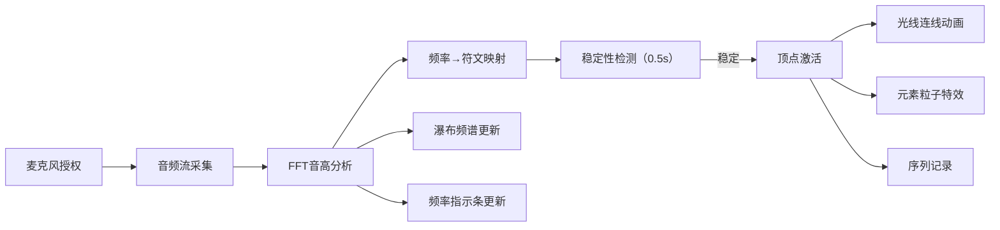

## 1. 产品概述

一款面向游戏设计师和音乐爱好者的交互式音高吟唱魔法法阵编辑器，玩家通过麦克风哼唱或吹口哨，系统将音频频率实时映射为五芒星法阵上的符文，音高变化决定法阵激活顺序和魔法效果。

- 核心价值：将声音交互与视觉艺术结合，提供沉浸式魔法吟唱体验
- 目标用户：游戏设计师、音乐创作者、互动艺术爱好者

## 2. 核心功能

### 2.1 功能模块

1. **主画布区域**：五芒星法阵渲染、顶点符文显示、光线连线动画、粒子特效
2. **音频采集与分析**：麦克风授权、实时音高检测、频率到符文映射
3. **吟唱序列系统**：激活顺序记录、历史轨迹展示、序列回放
4. **频谱可视化**：瀑布频谱图、实时频率指示条

### 2.2 页面详情

| 页面名称 | 模块名称 | 功能描述 |
|-----------|-------------|---------------------|
| 主应用页 | 五芒星法阵 | Canvas绘制法阵，5个顶点对应5种元素符文（火/冰/雷/治愈/护盾），支持激活状态高亮 |
| 主应用页 | 音高检测 | Web Audio API采集麦克风，FFT分析获取主导音高，C4-B5范围均匀映射5个顶点 |
| 主应用页 | 光线连线 | 激活顶点间沿法阵外缘延展光线，20px/s速度，红→符文色渐变，拖尾效果 |
| 主应用页 | 粒子特效 | 5种元素粒子系统（橙色爆燃/蓝色雪晶/黄色闪电/绿色光点/紫色屏障），20-40个粒子，2-3s生命周期 |
| 主应用页 | 序列记录 | 记录激活顶点序列，右侧面板显示历史轨迹图，支持回放按钮重放光动画 |
| 主应用页 | 频谱可视化 | 800×60px瀑布频谱图（0-2000Hz），蓝→红颜色过渡，时间轴滚动更新 |

## 3. 核心流程

用户点击麦克风授权按钮 → 浏览器请求麦克风权限 → 获取音频流 → Web Audio API创建分析器 → 每帧FFT分析获取频率数据 → 检测主导音高 → 映射到对应符文顶点 → 音高稳定超过0.5秒（±5音分）→ 激活顶点并触发光线+粒子 → 记录到吟唱序列 → 实时更新频谱图和频率指示

## 4. 用户界面设计

### 4.1 设计风格

- **主色调**：深紫色渐变背景 `#1a0a2e`，营造神秘魔法氛围
- **辅助色**：
  - 火焰：橙色 `#ff6b35`
  - 冰霜：蓝色 `#4fc3f7`
  - 雷电：黄色 `#ffd93d`
  - 治愈：绿色 `#6bcb77`
  - 护盾：紫色 `#9b59b6`
- **法阵线条**：初始灰白色 `#8888aa`，激活后发光
- **字体**：使用衬线体增强魔法氛围，标题大号加粗，正文易读
- **图标**：Unicode符号 🔥❄️⚡💚🛡️ 作为元素符文
- **动画**：所有交互0.2秒缓动，激活顶点径向渐变发光，光线透明度拖尾衰减

### 4.2 页面设计概述

| 页面名称 | 模块名称 | UI元素 |
|-----------|-------------|-------------|
| 主应用页 | 五芒星法阵 | Canvas中央，正五边形布局，60px直径顶点圆，Unicode元素符号，激活时径向发光+投影 |
| 主应用页 | 频率指示条 | 右上角垂直条，实时显示当前音高位置和数值（小数点后1位） |
| 主应用页 | 麦克风按钮 | 底部中央，未授权时脉冲波纹提示，授权后显示"吟唱中"状态 |
| 主应用页 | 历史轨迹面板 | 右侧，小圆点按时间顺序连线展示激活序列，回放按钮 |
| 主应用页 | 瀑布频谱图 | 法阵下方，800×60px，半透明黑背景，圆角2px频谱条带 |

### 4.3 响应式设计

- 桌面端（≥768px）：Canvas尺寸 1000×700px，完整布局
- 移动端（<768px）：整体缩放80%，画布居中显示，历史轨迹面板可折叠

## 5. 性能约束

- 音频分析帧率 ≥ 30 FPS
- 40个粒子同时活跃时帧率 ≥ 40 FPS
- 光线动画流畅无卡顿
