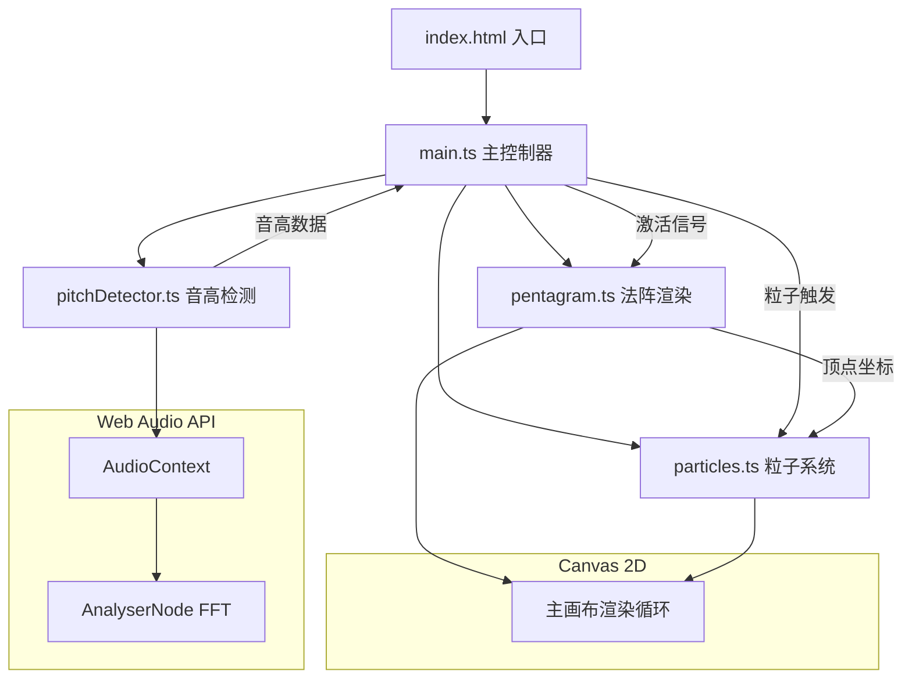

## 1. 架构设计



## 2. 技术描述

- **前端框架**：原生 TypeScript + Vite（用户指定无React/Vue，纯Canvas实现）
- **构建工具**：Vite 5.x
- **语言**：TypeScript 5.x（严格模式，目标ES2020，模块ESNext）
- **音频处理**：Web Audio API（AudioContext、AnalyserNode、getUserMedia）
- **图形渲染**：Canvas 2D API
- **无后端、无数据库**：纯前端单页应用

## 3. 文件结构与职责

```
auto102/
├── package.json          # 依赖：typescript、vite；脚本：npm run dev
├── index.html            # 入口页面：全屏Canvas、麦克风按钮、频率指示条
├── tsconfig.json         # TS配置：严格模式、ES2020、ESNext
├── vite.config.js        # Vite基础配置
└── src/
    ├── main.ts           # 主控制器：初始化、生命周期、事件绑定、数据流调度
    ├── pitchDetector.ts  # 音高检测：Web Audio FFT分析，输出频率+置信度
    ├── pentagram.ts      # 法阵渲染：五芒星绘制、顶点状态、光线连线
    └── particles.ts      # 粒子系统：5种元素粒子的创建/更新/销毁
```

### 文件调用关系与数据流

1. **main.ts** ←→ **pitchDetector.ts**
   - main.ts 调用 `PitchDetector.start()` 启动音频采集
   - pitchDetector.ts 每帧通过回调返回 `{ frequency: number, confidence: number }`
   - main.ts 接收后映射到符文索引，进行稳定性检测

2. **main.ts** → **pentagram.ts**
   - main.ts 调用 `pentagram.activateVertex(index)` 激活顶点
   - main.ts 调用 `pentagram.render(ctx, dt)` 每帧绘制
   - pentagram.ts 内部维护顶点状态、光线动画进度
   - pentagram.ts 暴露 `getVertexPosition(index)` 供粒子系统使用

3. **main.ts** → **particles.ts**
   - main.ts 调用 `particles.emit(type, x, y)` 触发粒子爆发
   - main.ts 调用 `particles.updateAndRender(ctx, dt)` 每帧更新绘制
   - particles.ts 内部维护粒子池

4. **main.ts** 内部数据流
   - 接收音频流 → FFT分析 → 音高值 → 频率→符文映射 → 稳定性计时 → 激活判定 → 通知法阵+粒子 → 记录序列

## 4. 核心数据模型

### 4.1 元素符文定义

```typescript
enum ElementType {
  FIRE = 'fire',       // 火焰 🔥
  ICE = 'ice',         // 冰霜 ❄️
  THUNDER = 'thunder', // 雷电 ⚡
  HEAL = 'heal',       // 治愈 💚
  SHIELD = 'shield'    // 护盾 🛡️
}

interface Rune {
  element: ElementType
  symbol: string       // Unicode符号
  color: string        // 主色（HEX）
  baseFreq: number     // 对应中心频率
}
```

### 4.2 顶点状态

```typescript
interface VertexState {
  index: number
  x: number
  y: number
  rune: Rune
  activated: boolean
  activateTime: number      // 激活时间戳
  glowIntensity: number     // 发光强度（0-1，缓动）
}
```

### 4.3 光线连线

```typescript
interface LightBeam {
  fromIndex: number
  toIndex: number
  progress: number          // 0-1 延展进度
  speed: number             // px/s
  startTime: number
}
```

### 4.4 粒子

```typescript
interface Particle {
  x: number
  y: number
  vx: number
  vy: number
  life: number              // 剩余生命
  maxLife: number
  size: number
  rotation: number
  rotationSpeed: number
  color: string
  type: ElementType
}
```

### 4.5 吟唱序列

```typescript
interface SequenceRecord {
  vertexIndex: number
  timestamp: number
  element: ElementType
}
```

## 5. 频率映射方案

- **范围**：C4 (261.63 Hz) ~ B5 (987.77 Hz)
- **映射方式**：均匀划分为5个频段，每个频段对应一个符文顶点
- **稳定判定**：频率落在目标频段 ±5 音分（约 ±0.3% 频率偏差）范围内持续 ≥ 500ms
- **音分换算**：1音分 = 2^(1/1200) ≈ 1.0005778 倍频率，5音分 ≈ ±0.29%

| 索引 | 元素 | 中心频率(Hz) | 频段范围(Hz) |
|------|------|-------------|-------------|
| 0 | 火焰🔥 | 322.3 | 261.6 - 383.0 |
| 1 | 冰霜❄️ | 444.2 | 383.0 - 505.4 |
| 2 | 雷电⚡ | 566.2 | 505.4 - 627.0 |
| 3 | 治愈💚 | 688.1 | 627.0 - 749.4 |
| 4 | 护盾🛡️ | 809.1 | 749.4 - 987.8 |

## 6. 性能优化策略

1. **音频分析**：FFT大小设为2048，使用 `getByteFrequencyData` 每帧调用一次，避免重复计算
2. **粒子池**：预分配粒子数组，复用对象，避免频繁GC
3. **Canvas渲染**：
   - 单画布分层绘制（法阵→光线→粒子→UI）
   - 使用 `requestAnimationFrame` 同步帧率
   - 离屏Canvas缓存静态法阵底图
4. **光线拖尾**：使用渐隐线代替多段线，减少绘制调用
5. **瀑布频谱**：使用 `putImageData` 批量写入像素，逐行滚动
