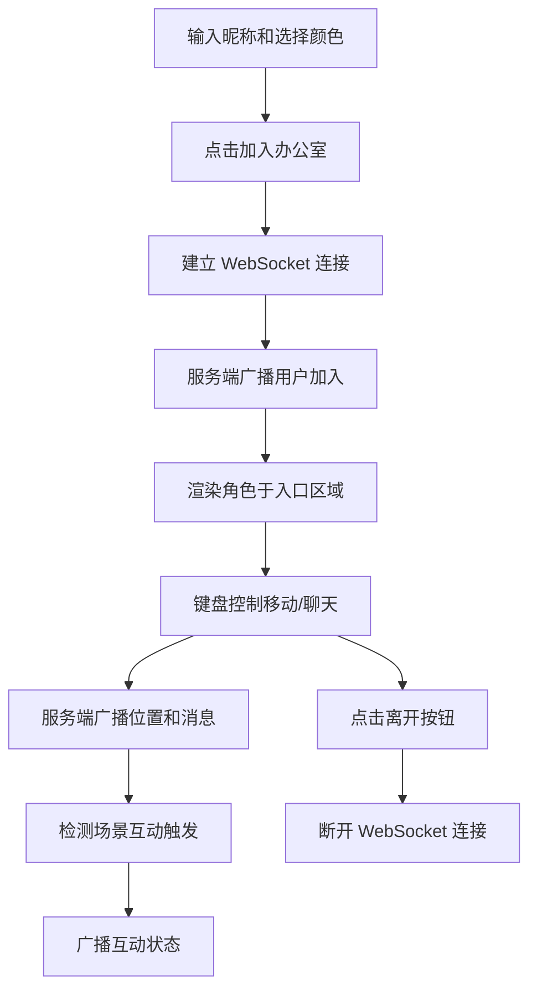

# 多人在线虚拟办公室协作看板 - 产品需求文档

## 1. 产品概述
为小型创业团队打造的远程协作虚拟办公室应用，让每个成员在网页上拥有像素风角色，可在共享 2D 空间内走动、交谈并触发互动，增强团队凝聚力与远程办公归属感。

## 2. 核心功能

### 2.1 用户角色
| 角色 | 注册方式 | 核心权限 |
|------|----------|----------|
| 团队成员 | 输入昵称加入 | 移动角色、发送聊天、触发场景互动、修改个人设置 |

### 2.2 功能模块
1. **入场页面**：昵称输入、角色颜色选择、加入按钮
2. **主场景页面**：Canvas 虚拟办公室、在线人员列表、工具栏
3. **设置面板**：昵称修改、角色颜色修改、离开确认

### 2.3 页面详情
| 页面名称 | 模块名称 | 功能描述 |
|----------|----------|----------|
| 入场页面 | 昵称输入框 | 最多 8 字符，深棕色文本框样式 |
| 入场页面 | 颜色选择器 | 8 种预设配色可选，高亮显示当前选中 |
| 入场页面 | 加入按钮 | 深绿色按钮，悬停变色，点击连接 WebSocket 并进入办公室 |
| 主场景 | Canvas 渲染 | 640x400 像素场景，采用离屏 Canvas 双缓冲优化 |
| 主场景 | 角色控制 | 方向键移动，空格键发送文本气泡 |
| 主场景 | 在线人数 | 右上角深色半透明标签显示，每秒刷新 |
| 主场景 | 咖啡机互动 | 两人同时在咖啡机区域触发咖啡动画和橙色光环 |
| 主场景 | 会议室互动 | 进入会议室时背景变暗，显示"正在开会"提示 |
| 工具栏 | 离开按钮 | 红色按钮，点击退出办公室 |
| 工具栏 | 截图按钮 | 蓝色按钮，截取 Canvas 并下载 |
| 工具栏 | 设置按钮 | 灰色按钮，打开设置模态框 |

## 3. 核心流程

用户输入昵称 → 选择角色颜色 → 点击加入 → 建立 WebSocket 连接 → 服务端分配用户 ID 并广播在线列表 → 客户端渲染像素角色于入口区域 → 用户通过键盘控制角色移动/聊天 → 服务端广播位置和消息更新 → 触发场景互动（咖啡机/会议室）→ 用户点击离开/关闭页面断开连接

## 4. 用户界面设计

### 4.1 设计风格
- 主色调：深色木质调 #3E2723（背景），搭配 8 种明亮角色配色
- 按钮风格：圆角 6px，悬停变色，点击缩放 0.95 倍过渡 0.1 秒
- 字体：使用系统字体栈，基础 16px
- 布局：桌面端左右居中显示 Canvas，移动端自适应竖屏布局
- 图标：使用 emoji 作为场景元素图标（咖啡杯、显示器等）

### 4.2 页面设计概览
| 页面名称 | 模块名称 | UI 元素 |
|----------|----------|---------|
| 入场页面 | 表单区域 | 居中卡片布局，深棕色背景，输入框和选择器垂直排列 |
| 主场景 | Canvas 容器 | 2px 深灰边框 #212121，上下 10px 内边距 |
| 主场景 | 信息栏 | 右上角深色半透明标签 #00000088，圆角 4px，白色文字 |
| 主场景 | 工具栏 | 高 40px，背景 #4E342E，按钮从左到右排列 |
| 设置模态框 | 遮罩层 | 半透明黑色背景，居中显示设置表单 |

### 4.3 响应式设计
- 桌面端：Canvas 640x400px 居中显示，工具栏位于 Canvas 下方
- 移动端（max-width: 768px 且 orientation:portrait）：Canvas 宽度适配屏幕，高度等比缩放，Canvas 和工具栏上下排列
- 所有尺寸基于 rem 单位（基准 16px）
- 使用 CSS 媒体查询适配

## 5. 性能约束
- Canvas 帧率稳定在 30fps 以上，连续 10 帧低于 25fps 自动降低角色细节
- WebSocket 移动广播频率限制：最多每秒 5 条
- 文本气泡每帧最多处理 10 条新消息
- 在线用户上限 20 人，延迟控制在 200ms 以内
