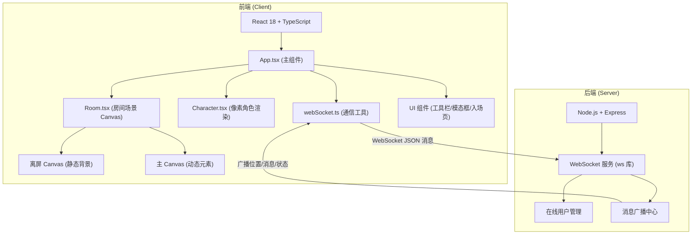
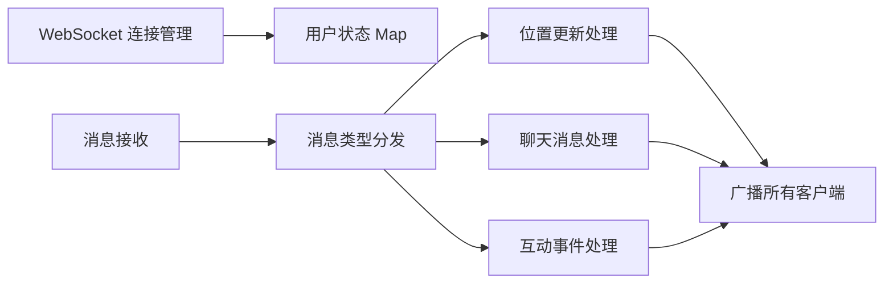

# 多人在线虚拟办公室协作看板 - 技术架构文档

## 1. 架构设计



## 2. 技术描述
- **前端框架**：React 18 + TypeScript
- **构建工具**：Vite 5.x
- **后端框架**：Express 4.x + ws (WebSocket 库)
- **渲染技术**：HTML5 Canvas 2D + 离屏 Canvas 双缓冲
- **状态管理**：React useState/useRef（轻量级场景，无需额外状态库）

## 3. 项目文件结构

```
auto105/
├── package.json              # 项目依赖和启动脚本
├── index.html                # HTML 入口文件
├── tsconfig.json             # TypeScript 严格模式配置
├── vite.config.js            # Vite 构建配置（含代理）
├── server.js                 # Express + WebSocket 后端服务
└── src/
    ├── App.tsx               # 主组件：状态管理、Canvas 初始化、WS 连接
    ├── main.tsx              # React 入口
    ├── Room.tsx              # 房间场景：静态背景绘制、碰撞检测
    ├── Character.tsx         # 像素角色：角色绘制、气泡渲染
    ├── webSocket.ts          # WebSocket 封装：连接、重连、消息收发
    └── types.ts              # 共享类型定义
```

**文件调用关系和数据流向：**
1. `server.js` ←→ `src/webSocket.ts`：双向 WebSocket 通信
2. `src/App.tsx` → 调用 `src/webSocket.ts` 收发消息
3. `src/App.tsx` → 将角色数据传递给 `src/Room.tsx` 和 `src/Character.tsx`
4. `src/Room.tsx` → 使用离屏 Canvas 绘制静态背景，接受角色数组更新动态层
5. `src/Character.tsx` → 被 `src/Room.tsx` 调用绘制单个角色

## 4. WebSocket 消息协议定义

```typescript
// 客户端 → 服务端
type ClientMessage =
  | { type: 'join'; name: string; color: string }
  | { type: 'move'; x: number; y: number }
  | { type: 'say'; text: string }
  | { type: 'updateProfile'; name: string; color: string };

// 服务端 → 客户端
type ServerMessage =
  | { type: 'init'; selfId: string; users: User[] }
  | { type: 'userJoin'; user: User }
  | { type: 'userLeave'; userId: string }
  | { type: 'userMove'; userId: string; x: number; y: number }
  | { type: 'userSay'; userId: string; text: string }
  | { type: 'coffeeInteraction'; userIds: string[] }
  | { type: 'meetingState'; active: boolean };

interface User {
  id: string;
  name: string;
  color: string;
  x: number;
  y: number;
  direction: 'left' | 'right';
  hasAura?: boolean;
  auraEndTime?: number;
}
```

## 5. 服务器架构



- **连接管理**：维护在线用户 Map，处理加入/离开事件
- **消息分发**：根据 type 字段路由到对应处理器
- **状态广播**：任何状态变更立即广播给所有连接客户端
- **互动检测**：服务端检测咖啡机区域和会议室区域状态

## 6. 数据模型与常量

### 6.1 房间布局常量
```typescript
const ROOM_WIDTH = 640;
const ROOM_HEIGHT = 400;
const WALL_THICKNESS = 10;

// 障碍物区域（AABB 碰撞检测）
const OBSTACLES = [
  { x: 40, y: 280, w: 40, h: 40, type: 'coffee' },      // 咖啡机
  { x: 480, y: 20, w: 120, h: 90, type: 'meeting' },     // 会议室
  { x: 120, y: 120, w: 30, h: 30, type: 'desk' },        // 工作位1
  { x: 220, y: 120, w: 30, h: 30, type: 'desk' },        // 工作位2
  { x: 320, y: 120, w: 30, h: 30, type: 'desk' },        // 工作位3
  { x: 420, y: 120, w: 30, h: 30, type: 'desk' },        // 工作位4
];

// 角色配色板
const COLOR_PALETTE = [
  '#F44336', '#E91E63', '#9C27B0', '#673AB7',
  '#3F51B5', '#2196F3', '#009688', '#4CAF50'
];
```

### 6.2 性能参数
```typescript
const MOVE_STEP = 6;           // 每帧移动像素
const MOVE_BROADCAST_INTERVAL = 200;  // 移动广播间隔 0.2s
const MAX_MOVE_BROADCAST_PER_SEC = 5; // 每秒最多移动广播
const BUBBLE_DURATION = 3000;  // 文本气泡持续 3s
const BUBBLE_MAX_CHAR = 30;    // 气泡最多字符
const AURA_DURATION = 5000;    // 橙色光环持续 5s
const LOW_FPS_THRESHOLD = 25;  // 低帧率阈值
const LOW_FPS_FRAMES = 10;     // 连续多少帧触发降级
```
