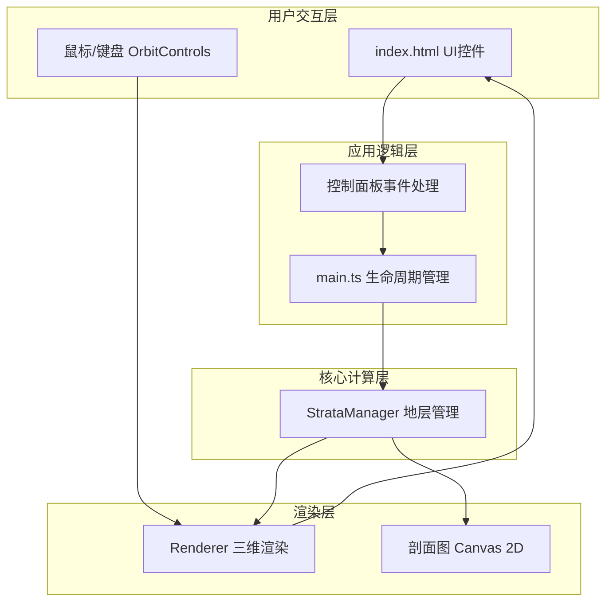

## 1. 架构设计



**文件调用关系与数据流向：**
- `index.html` → 用户操作滑块/旋钮/按钮 → 触发DOM事件
- DOM事件 → `main.ts`中的事件处理器 → 组装应力参数对象 `{ compression, uplift, shearAngle }`
- `main.ts` → 调用 `strataManager.update(params)` → 计算32768个顶点的新位置
- `strataManager` → 返回顶点/法线数据 → `renderer.updateMeshes(data)` 更新BufferGeometry
- `strataManager` → 返回剖面数据 → `renderer.updateProfile(data)` 绘制Canvas 2D
- `renderer` → 管理Three.js场景、相机、OrbitControls、材质、纹理

## 2. 技术选型

- 前端框架：**原生 TypeScript**（无React/Vue，用户明确要求Three.js直接操作DOM）
- 构建工具：**Vite**，启用ESM，快速开发热更新
- 3D渲染：**Three.js** rlatest + three/addons（OrbitControls等）
- 类型系统：**TypeScript 严格模式**，目标ES2020
- UI组件：**原生HTML/CSS**（毛玻璃面板、滑块、旋钮）+ Canvas 2D（剖面图、石纹纹理）
- 可选：**dat.gui**（如需要额外调试面板）

## 3. 文件结构

```
auto109/
├── package.json           # 项目依赖和脚本
├── vite.config.js         # Vite构建配置（ESM模式）
├── tsconfig.json          # TypeScript严格模式配置
├── index.html             # 入口页面（3D视口+控制面板+剖面图容器）
└── src/
    ├── main.ts            # 入口文件：场景初始化、生命周期、事件绑定
    ├── strataManager.ts   # 核心算法：应力→顶点位移计算，褶皱弯曲，断层错动
    └── renderer.ts        # 渲染模块：Three.js场景管理、几何体更新、UI绘制
```

## 4. 核心模块定义

### 4.1 StrataManager（地层管理器）

**职责**：管理岩层几何数据，根据应力参数计算变形后的顶点位置。

```typescript
// 应力参数
interface StressParams {
  compression: number;   // 0-100 水平挤压力
  uplift: number;        // 0-100 垂直抬升力
  shearAngle: number;    // 0-360 剪切力方向(度)
}

// 单层数据
interface StratumData {
  index: number;         // 0-7 (底→顶)
  color: string;         // 十六进制颜色
  baseY: number;         // 初始Y坐标
  vertices: Float32Array;   // 64×64×3 顶点数组
  normals: Float32Array;    // 64×64×3 法线数组
  hasFault: boolean;        // 是否包含断层
}

class StrataManager {
  // 初始化8层64x64网格
  constructor(strataCount = 8, gridSize = 64);
  // 根据应力参数更新所有顶点位置
  update(params: StressParams): StratumData[];
  // 获取剖面数据（用于2D绘制）
  getProfileData(): ProfileSample[];
  // 重置为初始状态
  reset(): void;
  // 检测是否应生成断层
  shouldShowFault(): boolean;
  // 获取断层平面参数 {strike, dip, position}
  getFaultPlane(): FaultPlane | null;
}
```

**变形算法**：
- **褶皱弯曲**：`displacementY = A * sin(2π * x / λ)`，其中振幅A与compression正相关，波长λ与compression负相关
- **垂直抬升**：整体Y轴偏移 = (uplift/100) * 4 - 2（范围-2到+2）
- **褶皱倾斜**：uplift > 50% 时，褶皱波函数叠加沿Z轴30°旋转分量
- **断层错动**：满足剪切条件时，在断层面两侧应用分段位移函数模拟错动
- **裂纹生成**：compression > 80% 时，在高曲率顶点附近随机生成短线段

### 4.2 Renderer（渲染器）

**职责**：管理Three.js渲染循环，更新几何体，绘制UI。

```typescript
class Renderer {
  constructor(container: HTMLElement, profileCanvas: HTMLCanvasElement);
  // 初始化场景、相机、灯光、控制器
  init(): void;
  // 创建/更新8层岩层Mesh
  updateMeshes(strataData: StratumData[]): void;
  // 创建/更新断层面
  updateFaultPlane(fault: FaultPlane | null): void;
  // 创建/更新裂纹线段
  updateCracks(show: boolean, threshold: number): void;
  // 绘制X-Z剖面图（Canvas 2D，限5FPS）
  updateProfile(data: ProfileSample[]): void;
  // 生成石纹噪声纹理
  generateStoneTexture(seed: number): THREE.CanvasTexture;
  // 启动渲染循环
  animate(): void;
  // 销毁资源
  dispose(): void;
}
```

## 5. 性能策略

- **顶点数据复用**：每层BufferGeometry创建一次，仅更新position属性（`needsUpdate = true`），避免重建几何体
- **帧率控制**：剖面图渲染限5FPS，使用时间戳节流；网格变形计算限15FPS
- **材质共享**：所有岩层共享同一着色器材质变体，仅color和map不同
- **断层面条件渲染**：不满足剪切条件时隐藏断层面Mesh而非销毁
- **纹理缓存**：8张石纹纹理一次性生成并缓存，Canvas尺寸256×256
- **事件节流**：滑块input事件使用RAF合并，避免每像素都触发完整重计算
