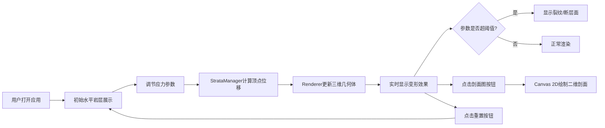

## 1. 产品概述

交互式三维地质褶皱与断层模拟器，为教育工作者提供直观的地质构造动态演示工具。学生可以通过实时调节应力参数，观察岩层在水平挤压、垂直抬升和剪切应力作用下逐渐变形、弯曲、断裂的完整过程，深刻理解向斜、背斜、正断层、逆断层和走滑断层的三维形成机制。

## 2. 核心功能

### 2.1 用户角色
| 角色 | 说明 | 核心权限 |
|------|------|----------|
| 教育工作者/学生 | 无需注册，直接使用 | 调整应力参数、观察变形过程、查看剖面图、重置场景 |

### 2.2 功能模块
1. **三维场景渲染模块**：8层彩色岩层的三维展示，支持旋转、平移、缩放
2. **应力控制面板模块**：水平挤压力滑块、垂直抬升力滑块、剪切应力方向旋钮、重置按钮
3. **地层变形计算模块**：基于应力参数实时计算岩层顶点位移，模拟褶皱弯曲和断层错动
4. **断层显示模块**：应力超阈值时显示半透明断层面，带走向和倾角标签
5. **二维剖面示意图模块**：右下角实时更新的 X-Z 平面剖面图（Canvas 2D 绘制）
6. **裂纹效果模块**：挤压力超80%时显示随机白色半透明裂纹线条

### 2.3 功能详情
| 模块 | 功能点 | 描述 |
|------|--------|------|
| 应力控制 | 水平挤压力滑块 | 0-100%，控制岩层沿X轴的压缩弯曲程度，波长线性减小，振幅增加 |
| 应力控制 | 垂直抬升力滑块 | 0-100%，控制地层Y轴整体抬升/沉降（-2到+2单位），>50%时褶皱轴向Z倾斜30° |
| 应力控制 | 剪切应力方向旋钮 | 0-360°，与岩层走向夹角45-135°时在波峰波谷生成断层面 |
| 应力控制 | 重置按钮 | 一键恢复岩层水平状态，所有参数归零 |
| 岩层渲染 | 8层彩色岩层 | 底部#8B4513（深棕）渐变到顶部#F5DEB3（小麦色），每层0.3单位厚，64x64网格 |
| 岩层渲染 | 石纹纹理 | Canvas生成256x256噪声纹理，亮暗区域交替，带微弱光泽反射 |
| 岩层渲染 | 间隙分隔 | 岩层间0.01单位黑色间隙线增强层次感 |
| 断层效果 | 断层面 | 半透明红色（#FF4444，α=0.3），厚度0.02，边缘脉动发光（0.2-0.4 α，1Hz） |
| 断层效果 | 参数标签 | 显示走向和倾角数值 |
| 裂纹效果 | 微裂纹 | 挤压力>80%时，顶点间随机白色半透明线条，长度0.1-0.3 |
| 剖面图 | 二维示意图 | Canvas 2D绘制X-Z平面8层颜色条带，标注褶皱/断层位置，5帧/秒更新 |
| 交互 | OrbitControls | 鼠标旋转、平移、缩放场景 |

## 3. 核心流程

用户打开应用 → 查看初始水平岩层 → 调节水平挤压力滑块（观察岩层弯曲形成褶皱）→ 调节垂直抬升力（观察整体抬升和褶皱倾斜）→ 调节剪切方向（观察断层面生成）→ 点击剖面图按钮查看二维示意 → 点击重置恢复初始状态

## 4. 用户界面设计

### 4.1 设计风格
- 主色调：深空渐变背景 #1A1A2E → #0F0F1A
- 辅助色：岩层棕色系渐变 #8B4513 → #F5DEB3
- 强调色：控制面板紫色系 #2A2A3E / #4A4A5E / #8A8AFE
- 警示色：断层红色 #FF4444
- 按钮/控件：圆角矩形，毛玻璃半透明效果
- 字体：无衬线现代字体，数值标签12px #B0B0C0

### 4.2 页面布局
| 区域 | 模块 | UI元素 |
|------|------|--------|
| 全屏 | 3D视口 | Three.js渲染的岩层场景，渐变背景，OrbitControls交互 |
| 左下角 | 应力控制面板 | 半透明毛玻璃面板，三个控件（2滑块+1旋钮），数值实时显示，重置按钮 |
| 右下角 | 剖面示意图 | Canvas 2D绘制的X-Z剖面图，显示8层地层和断层标记 |

### 4.3 响应式
- 桌面优先，全屏自适应浏览器窗口大小
- 控制面板固定左下角，剖面图固定右下角，随窗口缩放保持位置
- 旋钮外圈刻度每30度一个标记，滑块支持悬停高亮

### 4.4 3D场景指引
- 环境：深灰到黑色渐变背景，营造专业地质分析氛围
- 光照：环境光 + 方向光，方向光产生微弱阴影增强立体感
- 相机：PerspectiveCamera，初始位置俯视45°，OrbitControls限制合理范围
- 后期：岩层MeshPhongMaterial带微弱光泽，断层面透明+边缘脉动发光动画
