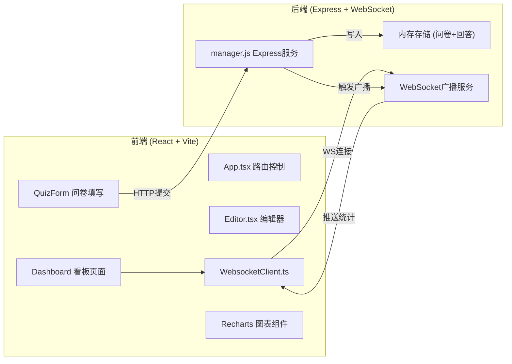
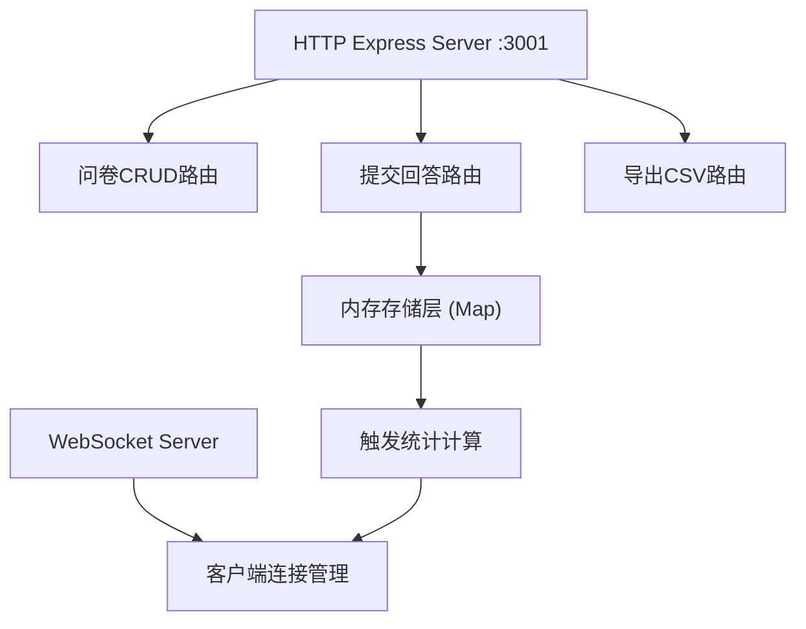
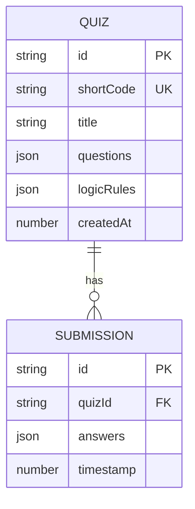

## 1. 架构设计



## 2. 技术说明

- **前端**: React 18 + TypeScript + Vite 5
- **图表库**: Recharts 2（条形图、环形图、直方图）
- **后端**: Express 4 + ws (WebSocket)
- **数据导出**: csv-stringify
- **存储**: 纯内存存储（无数据库）
- **构建工具**: Vite 5，代理 /api 和 /ws 到后端端口 3001

## 3. 路由定义

| 路由 | 用途 |
|-----|-----|
| / | 问卷编辑器首页 |
| /dashboard/:quizId | 数据看板页面 |
| /quiz/:shortCode | 问卷填写页面 |

## 4. API 定义

```typescript
// 题目类型
type QuestionType = 'text_single' | 'text_multi' | 'single_choice' | 'multi_choice' | 'rating' | 'sort';

interface Question {
  id: string;
  type: QuestionType;
  title: string;
  required: boolean;
  options?: string[];        // 单选/多选/排序题
  maxLength?: number;        // 文本题字符限制
  maxSelect?: number;        // 多选题数量限制
  sortItems?: string[];      // 排序题选项（最多10项）
}

interface LogicRule {
  id: string;
  sourceQuestionId: string;
  condition: {
    type: 'equals' | 'not_equals' | 'less_than' | 'greater_than';
    value: string | number;
  };
  targetQuestionId: string | 'END';
}

interface Quiz {
  id: string;
  shortCode: string;
  title: string;
  questions: Question[];
  logicRules: LogicRule[];
  createdAt: number;
}

interface Answer {
  quizId: string;
  questionId: string;
  value: string | string[] | number;
}

interface Submission {
  id: string;
  quizId: string;
  answers: Answer[];
  timestamp: number;
}

// REST API
POST   /api/quizzes              创建问卷
GET    /api/quizzes/:id          获取问卷详情
GET    /api/quizzes/short/:code  通过短码获取问卷
POST   /api/submissions          提交问卷回答
GET    /api/submissions/export   导出CSV（支持 startDate/endDate 查询参数）

// WebSocket 消息
// 客户端 -> 服务端
{ type: 'subscribe', quizId: string }

// 服务端 -> 客户端
{
  type: 'stats_update',
  data: {
    totalSubmissions: number;
    questionStats: {
      [questionId: string]: {
        counts: Record<string, number>;
        percentages: Record<string, number>;
        average?: number;        // 评分题
        distribution?: number[];  // 评分题分布
      }
    }
  }
}
```

## 5. 服务端架构



## 6. 数据模型

### 6.1 数据模型定义



### 6.2 内存存储结构

```javascript
// 内存中的数据结构
const quizzes = new Map();        // id -> Quiz
const quizzesByCode = new Map();  // shortCode -> Quiz
const submissions = new Map();    // quizId -> Submission[]
```

## 7. 文件结构

```
.
├── package.json              # 前后端依赖与启动脚本
├── index.html                # Vite HTML入口
├── tsconfig.json             # TypeScript配置
├── vite.config.js            # Vite配置（代理）
├── server/
│   └── manager.js            # Express + WebSocket服务
└── src/
    ├── App.tsx               # 主路由组件
    ├── Editor.tsx            # 问卷编辑器组件
    ├── WebsocketClient.ts    # WebSocket客户端
    ├── components/           # 子组件
    │   ├── Toolbar.tsx       # 题型工具栏
    │   ├── PreviewCanvas.tsx # 预览画布
    │   ├── LogicEditor.tsx   # 逻辑跳转编辑器
    │   ├── Dashboard.tsx     # 数据看板
    │   ├── QuizForm.tsx      # 问卷填写页
    │   └── charts/           # 图表组件
    ├── types/
    │   └── index.ts          # TypeScript类型定义
    └── utils/
        └── helpers.ts        # 工具函数
```
