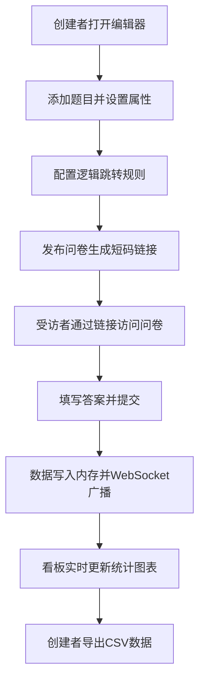

## 1. 产品概述

交互式在线调查问卷创建与发布平台，解决传统表单工具缺乏实时数据可视化反馈和动态问题逻辑跳转的痛点。面向需要收集结构化反馈数据并实时分析的用户群体。

- 核心价值：所见即所得的问卷编辑、灵活的逻辑跳转、实时数据看板与一键导出
- 目标用户：市场调研人员、产品经理、教育工作者、企业HR

## 2. 核心功能

### 2.1 用户角色

| 角色 | 注册方式 | 核心权限 |
|------|---------|---------|
| 问卷创建者 | 无需注册，直接使用 | 创建/编辑/发布问卷、查看实时统计、导出数据 |
| 问卷受访者 | 无需注册，通过链接访问 | 填写并提交问卷 |

### 2.2 功能模块

1. **问卷编辑器页面**：题型工具栏、实时预览画布、逻辑跳转编辑器
2. **数据看板页面**：实时统计图表（总提交数、条形图、环形图、直方图）、CSV导出
3. **问卷填写页面**：问卷展示、答案填写、提交反馈

### 2.3 页面详情

| 页面名称 | 模块名称 | 功能描述 |
|---------|---------|---------|
| 问卷编辑器 | 题型工具栏 | 5种题型（单行文本、多行文本、单选、多选、评分条、拖拽排序），图标+文字展示，固定宽度200px |
| 问卷编辑器 | 实时预览画布 | 响应式布局（最小600px），纵向滚动，所见即所得预览问卷样式 |
| 问卷编辑器 | 逻辑跳转编辑器 | 可折叠面板，拖拽连线展示跳转关系，支持条件判断跳转 |
| 数据看板 | 实时统计区 | 总提交数显示，每0.5秒刷新一次 |
| 数据看板 | 图表展示区 | 条形图（悬停tooltip）、环形图（选项占比）、直方图（评分分布） |
| 数据看板 | 数据导出区 | 按时间范围筛选，CSV格式下载原始回答数据 |
| 问卷填写页 | 问卷展示区 | 根据逻辑跳转动态显示题目，支持评分和拖拽排序交互 |
| 问卷填写页 | 提交反馈 | 淡入绿色提示条，3秒自动消失 |

## 3. 核心流程

## 4. 用户界面设计

### 4.1 设计风格

- **主色调**：#2C3E50（深蓝灰）作为标题/导航色，#3498DB（亮蓝）作为强调/按钮色
- **背景**：白色主体，浅灰色分隔线
- **布局**：卡片式布局，清晰的视觉层级
- **按钮**：圆角设计，悬停上浮效果（transform: translateY(-2px)），过渡动画0.2s
- **字体**：系统无衬线字体，标题18px加粗，正文14px，辅助文字12px
- **图标风格**：简洁线性图标，统一视觉风格

### 4.2 页面设计概览

| 页面名称 | 模块名称 | UI元素 |
|---------|---------|--------|
| 问卷编辑器 | 题型工具栏 | 深蓝灰背景(#2C3E50)，白色图标+文字，悬停亮蓝高亮(#3498DB) |
| 问卷编辑器 | 预览画布 | 白色卡片，浅灰边框，题目卡片带阴影，拖拽时半透明阴影 |
| 问卷编辑器 | 逻辑面板 | 可折叠侧边面板，连线图可视化，节点可拖拽 |
| 数据看板 | 统计卡片 | 大数字展示，亮蓝强调色，淡入动画 |
| 数据看板 | 图表区 | Recharts图表，tooltip 0.2s淡入，流畅动画(≥30FPS) |
| 问卷填写页 | 提示条 | 绿色背景(#27AE60)，3秒自动消失，淡入淡出效果 |

### 4.3 响应式设计

- 桌面端优先设计，编辑器三栏布局
- 预览画布最小宽度600px，保证问卷可读性
- 逻辑面板可折叠，在小屏设备上默认折叠
- 触摸设备优化拖拽交互

### 4.4 动效规范

- 页面加载：3秒内可开始编辑
- 按钮悬停：上浮2px，阴影增强，0.2s过渡
- 数据更新：图表平滑过渡动画
- 提交反馈：淡入绿色提示条，持续3秒
- 图表tooltip：0.2s淡入动画
