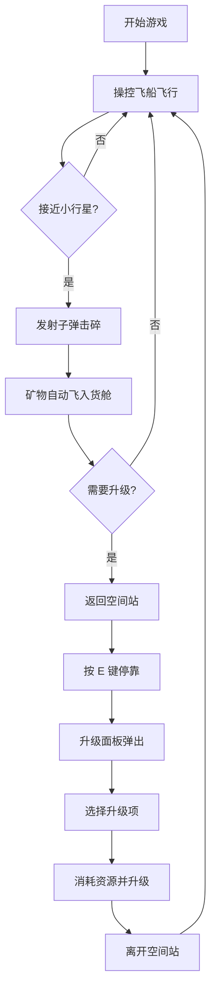

## 1. 产品概述

一款基于 Canvas 的 2D 像素风格太空资源采集与飞船升级模拟器。玩家操控采矿飞船在随机生成的小行星带中采集矿物，并返回空间站进行飞船升级，不断深入更危险的区域获取高价值资源。

- **目标用户**：休闲游戏爱好者，策略与操作结合游戏的玩家
- **核心价值**：提供操控乐趣与策略深度的太空采矿体验，通过资源管理和升级决策驱动游戏循环

## 2. 核心功能

### 2.1 用户角色

| 角色 | 注册方式 | 核心权限 |
|------|---------|----------|
| 玩家 | 无需注册，直接游玩 | 操控飞船、采集矿物、升级飞船 |

### 2.2 功能模块

1. **主游戏场景**：飞船控制、小行星带、空间站、HUD 显示
2. **飞船系统**：移动、射击、燃料消耗、护甲、货舱管理
3. **小行星系统**：随机生成、击碎分裂、矿物掉落
4. **空间站系统**：停靠检测、升级菜单、矿物出售
5. **升级面板**：护甲、引擎、货舱、武器四大升级选项
6. **性能监控**：帧率显示、动态资源调整

### 2.3 页面详情

| 页面名称 | 模块名称 | 功能描述 |
|---------|---------|----------|
| 主游戏界面 | Canvas 游戏区域 | 800x600 像素游戏画布，星空背景 |
| 主游戏界面 | 左上 HUD 状态栏 | 燃料条、护甲条、货舱容量、矿物储量、帧率显示 |
| 主游戏界面 | 右上累计统计 | 采集矿物总数排行榜式显示 |
| 主游戏界面 | 右侧升级面板 | 停靠后淡入显示，包含四项升级按钮 |

## 3. 核心流程

玩家进入游戏后，操控飞船（WASD 移动，空格射击）在小行星带中飞行，击碎小行星采集矿物。当资源积累到一定程度，返回空间站（按 E 键停靠），使用矿物升级飞船部件（护甲、引擎、货舱、武器），然后前往更危险的外围区域获取高价值资源，形成"采集-升级-深入"的循环。

## 4. 用户界面设计

### 4.1 设计风格

- **主色调**：深邃星空黑 `#000011` 为背景，绿色 `#00FF00` 为 HUD 文字色
- **矿物颜色**：铁矿石 `#8B4513`、银矿石 `#C0C0C0`、金矿石 `#FFD700`、星钻 `#00BFFF`
- **按钮风格**：深灰色 `#2A2A2A` 背景，悬停亮灰色高亮
- **字体**：16px 像素风格字体，整体复古像素风
- **布局**：Canvas 居中，HUD 左上、统计右上、升级面板右侧浮层
- **动效**：尾焰随燃料量变化、星空闪烁、空间站呼吸灯、升级面板淡入放大

### 4.2 页面设计概览

| 页面名称 | 模块名称 | UI 元素 |
|---------|---------|---------|
| 主游戏界面 | Canvas 区域 | 深空背景、闪烁星点、像素飞船、旋转小行星、六边形空间站、粒子特效、红色脉冲波纹 |
| 主游戏界面 | HUD 状态栏 | 半透明黑色圆角矩形背景、燃料条（绿→红渐变）、护甲条（蓝→白渐变）、货舱文字、4 种矿物图标及数量、帧率显示 |
| 主游戏界面 | 累计统计 | 右上区域，排行榜式累计采集总量 |
| 主游戏界面 | 升级面板 | 200x400 像素、深灰背景、白色文字、4 个升级按钮、资源不足红色提示、方波蜂鸣音效 |

### 4.3 响应式设计

桌面端优先，固定 800x600 游戏画布，无移动端适配需求。

## 4.4 性能优化策略

- 使用 `requestAnimationFrame` 驱动游戏主循环
- 帧率低于 50FPS 时自动减少小行星数量（每次减少 3 颗）
- 所有对象更新在单帧内完成
- HUD 帧率实时显示，低于 45FPS 时变红警示
